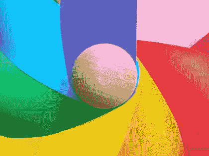
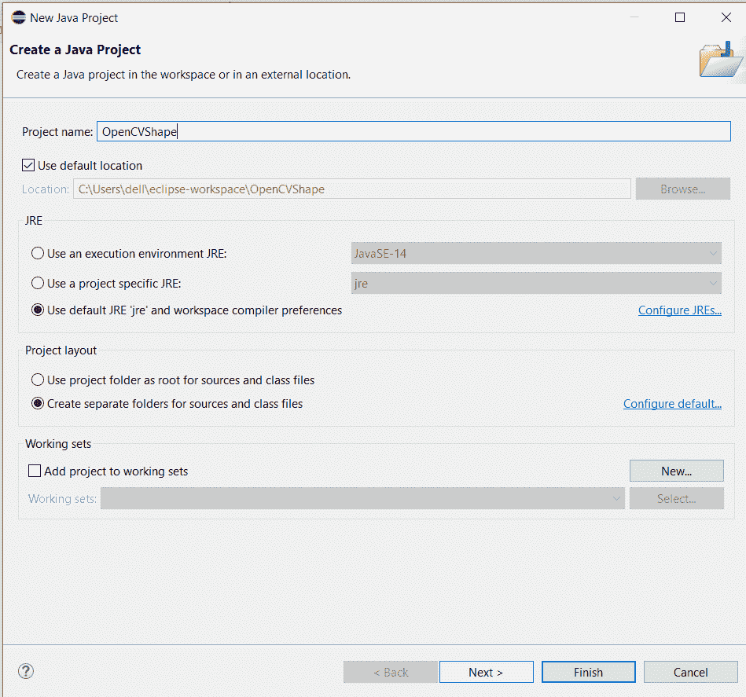
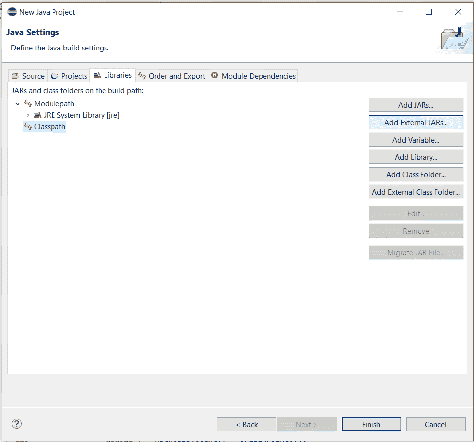
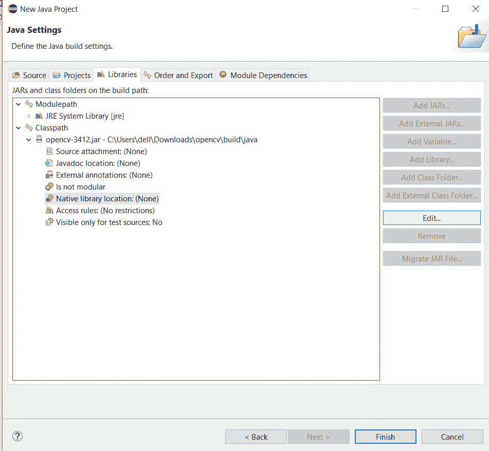
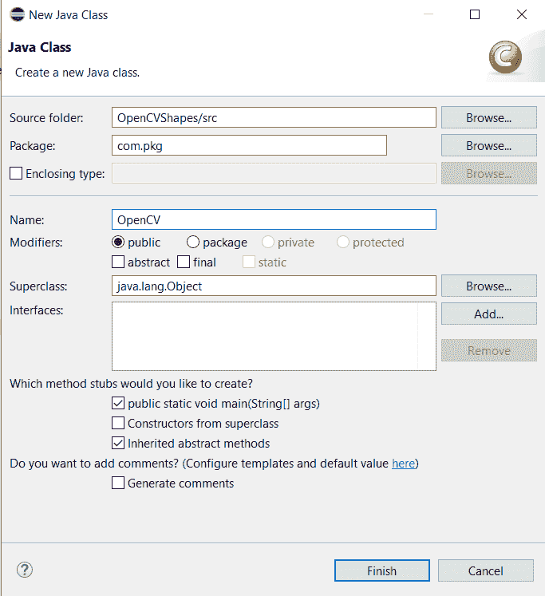
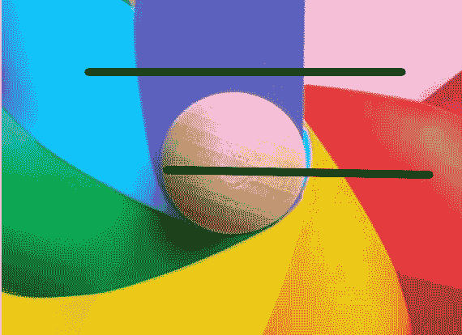

# 在 OpenCV 中绘制图像几何形状的 Java 程序

> 原文:[https://www . geesforgeks . org/Java-program-to-draw-geometric-shapes-on-images-in-opencv/](https://www.geeksforgeeks.org/java-program-to-draw-geometric-shapes-on-images-in-opencv/)

Java 中的 *OpenCV* 库包含一个名为**Improc***的类，该类提供了各种方法，如 *resize()* 、[*wrap 仿射()*](https://www.geeksforgeeks.org/image-translation-using-opencv-python/) 、 *filter2D* 来处理输入图像。我们将在这里使用 *javax.swing* 包。*****javax . swing***包为 java swing API 提供类，如 *JButton、JTextField、JTextArea、JRadioButton、JCheckbox、JMenu* 、*jcolorcooser*、等。这里涉及到的 java 概念是 Swing 类和抽象窗口工具包，如下所述:***

***[**【摇摆类】**](https://www.geeksforgeeks.org/java-swing-jcolorchooser-class/) **:** 这里我将解释一下 *javax.swing* 包的所有类，这些类将在后面的程序中使用:***

*   ****javax.swing.ImageIcon* :类 *ImageIcon* 是从图像绘制图标的图标界面的实现。***
*   ***类 *JFrame* 是一种继承了 java 的容器。JFrame 的工作方式类似于主窗口，其中添加了标签、按钮、文本字段等组件来创建图形用户界面***
*   ****javax.swing.JLabel* :类 *JLabel* 用于显示短字符串或图像图标。***
*   ****javax.swing.JMenu* :类 *JMenu* 用于下拉菜单组件，从菜单栏中显示。***
*   ****javax.swing.JMenuBa* r:类 *JMenuBar* 用于在窗口或框架上显示菜单栏。它可能有几个菜单。***
*   ****javax . swing . JMenuItem*:*JMenuItem*类表示菜单中的实际项目。菜单中的所有项目都应该从类*或其子类*中派生出来。***

> ***我们还需要在程序中使用*抽象窗口工具包(AWT)* 。它是 Java 基础类的一部分。我在这里简单描述一下 *AWT* 。***

***[***抽象窗口工具包***](https://www.geeksforgeeks.org/awt-full-form/) *(AWT)* 是一个用于创建图形用户界面的 Java 包。 *AWT* 的特点包括:***

*   ***一组本机接口组件***
*   ***一个健壮的事件处理模型***
*   ***图形和图像工具，包括形状、颜色和字体类***
*   ***布局管理器，用于不依赖于特定窗口大小或屏幕分辨率的灵活窗口布局***
*   ***数据传输类，用于通过本机平台剪贴板进行剪切和粘贴***

*****程序:**在 *OpenCV* 中在图像上绘制几何形状的步骤***

1.  ***创建一个项目并添加 *OpenCV* 库***
2.  ***创建包***
3.  ***创建一个类***
4.  ***创建一个名为“图像”的文件夹，并放置一个*。jpg* 或*。png* 文件在里面。***
5.  ***在 java 文件中编写以下代码。***

*****样本输入图像:*****

******

*****步骤 1:** 创建一个项目并添加 *OpenCV* 库***

*   ***点击文件>新建> Java 项目。***
*   ***为您的项目命名，并在如下图所示的 *JRE* 和*项目布局*选项下勾选必要的选项。在这里，我已经将这个项目命名为 OpenCVShape。***
*   ***标记选项后，单击下一步。***

******

*   ***之后，转到同一对话框中的“库”选项。单击类路径->添加外部罐子。***
*   ***从本地机器添加 *opencv.jar* 文件或者可以下载 *opencv.jar* 文件。***

******

*   ***添加完 jar 文件后，展开*类路径*选项，点击*原生库位置:(无)*，点击*编辑*。***

******

*   ***选择*外部文件夹……*浏览选择包含 OpenCV 库的文件夹(如 Windows 下的 C:\opencv\build\java\x64)。点击完成。***

*****第二步**:创建包***

*   ***右键点击 *src* 。转到新建→包。***
*   ***将出现一个对话框。将包裹名称输入 *com.pkg* ，点击*完成*。***

*****第三步**:创建类***

*   ***右击 com.pkg .转到新建→类。***
*   ***将出现一个对话框。键入类的名称。我把它命名为 OpenCVShape。***
*   ***勾选必要的选项，点击*完成*。***

******

*****第四步**:创建一个名为“images”的文件夹，放一个*。jpg* 或*。png* 文件在里面。***

*   ***右键**–**点击项目名称(在本例中为 OpenCVShape)。转到新建- >文件夹。键入文件夹的名称(图片)并点击*确定*。***
*   ***放一张扩展名为*的图片。jpg* 或*。png* 在这个文件夹里。***

*****第五步**:在 java 文件中编写以下代码***

***一**实现:**计算上述步骤，得到不同的几何形状，如下例所示:***

1.  ***线条***
2.  ***长方形***
3.  ***环***
4.  ***省略***

*****例 1:画线*****

## ***Java 语言(一种计算机语言，尤用于创建网站)***

```
***// Java Program using openCV to draw lines

package com.pkg;

// Importing abstract windows toolkit classes
import java.awt.EventQueue;
import java.awt.Point;
import java.awt.event.ActionEvent;
import java.awt.event.ActionListener;
import java.awt.event.MouseAdapter;
import java.awt.event.MouseEvent;
import java.awt.event.MouseMotionListener;

// Importing Swing classes 
import javax.swing.ImageIcon;
import javax.swing.JFrame;
import javax.swing.JLabel;
import javax.swing.JMenu;
import javax.swing.JMenuBar;
import javax.swing.JMenuItem;

// Importing OpenCV modules
import org.opencv.core.Core;
import org.opencv.core.Mat;
import org.opencv.core.MatOfByte;
import org.opencv.core.Scalar;
import org.opencv.core.Size;
import org.opencv.imgcodecs.Imgcodecs;
import org.opencv.imgproc.Imgproc;

public class OpenCVShapes extends JFrame {

    Mat image;
    Mat tempImage;

    JLabel imageView;

    // Menu for save image
    private JMenuBar mb;
    private JMenu menu;
    private JMenuItem saveMenuItem;

    private Point originPoint;
    public OpenCVShapes()
    {
        // Loading image from local directory 
        image = Imgcodecs.imread("images/sample_image.png");

        // Method to view setup
        setUpView();

        // Loading image to jlabel
        loadImage(image);

        // Setting iframe property
        setSize(image.width(), image.height());
        setLocationRelativeTo(null);
        setDefaultCloseOperation(JFrame.EXIT_ON_CLOSE);
        setVisible(true);
    }

  // Method to load image 
    private void loadImage(Mat img)
    {
        final MatOfByte mof = new MatOfByte();
        Imgcodecs.imencode(".png", img, mof);

        final byte[] imageData = mof.toArray();

        // Change image byte to image icon
        final ImageIcon icon = new ImageIcon(imageData);

      // Add icon to jlabel
        imageView.setIcon(icon);
    }

    private void setUpView()
    {
        setLayout(null);

        imageView = newJLabel();
        imageView.setBounds(0, 20, image.width(),
                            image.height());

        // Add mouse listener
        imageView.addMouseListener(new MouseAdapter() {
            @Override public void mousePressed(MouseEvent e)
            {
                super.mousePressed(e);

                // Storing location of mouse pressed
                originPoint = new Point(e.getX(), e.getY());
            }

            @Override
            public void mouseReleased(MouseEvent e)
            {
                super.mouseReleased(e);
                // when mouse release replace tempimage to
                // image
                image = tempImage.clone();
            }
        });

        // Adding another event mousemotionlstener
        imageView.addMouseMotionListener(
            new MouseMotionListener() {

                @Override
                public void mouseMoved(MouseEvent e)
                {
                    // TODO Auto-generate method stub
                }

                @Override
                public void mouseDragged(MouseEvent e)
                {
                    // Create temp image for drawing
                    tempImage = image.clone();
                    final Point point
                        = new Point(e.getX(), e.getY());

                    // NOW, DRAWING SHAPES

                    // 1\. Drawing line

                  // Color in bgr format
                    Imgproc.line(
                        tempImage, originPoint, point,
                        new Scalar(0, 0, 0),
                        5); 

                    loadImage(tempImage);
                }
            });

        add(imageView);

        // Adding menu
        mb = new JMenuBar();
        menu = new JMenu("file");
        saveMenuItem = new JMenuItem("save");
        menu.add(saveMenuItem);
        mb.add(menu);

        mb.setBounds(0, 0, image.width(), 20);
        add(mb);

        saveMenuItem.addActionListener(
            new ActionListener() {
                @Override
                public void actionPerformed(ActionEvent e)
                {
                    // TODO Auto-generated method stub
                    Imgcodecs.imwrite("images/ind1.png",
                                      image);
                }
            });
    }

    private JLabel newJLabel()
    {
        // TODO Auto-generated method stub
        return null;
    }

  // Main driver method
    public static void main(String[] args)
    {
        // Loading library
        System.loadLibrary(Core.NATIVE_LIBRARY_NAME);
        EventQueue.invokeLater(new Runnable() {
            @Override public void run()
            {
                new OpenCVShapes();
            }
        });
    }
}***
```

*****输出:*****

******

*****例 2:** **绘制矩形*****

## ***Java 语言(一种计算机语言，尤用于创建网站)***

```
***// Java Program using openCV to draw rectangles

package com.pkg;

import java.awt.EventQueue;
import java.awt.Point;
import java.awt.event.ActionEvent;
import java.awt.event.ActionListener;
import java.awt.event.MouseAdapter;
import java.awt.event.MouseEvent;
import java.awt.event.MouseMotionListener;

import javax.swing.ImageIcon;
import javax.swing.JFrame;
import javax.swing.JLabel;
import javax.swing.JMenu;
import javax.swing.JMenuBar;
import javax.swing.JMenuItem;

import org.opencv.core.Core;
import org.opencv.core.Mat;
import org.opencv.core.MatOfByte;
import org.opencv.core.Scalar;
import org.opencv.core.Size;
import org.opencv.imgcodecs.Imgcodecs;
import org.opencv.imgproc.Imgproc;

public class OpenCVShapes extends JFrame {

    Mat image;
    Mat tempImage;

    JLabel imageView;

    // menu for save image
    private JMenuBar mb;
    private JMenu menu;
    private JMenuItem saveMenuItem;

    private Point originPoint;
    public OpenCVShapes()
    {
        // load image
        image = Imgcodecs.imread("images/sample_image.png");

        // view setup
        setUpView();

        // load image to jlabel
        loadImage(image);

        // set iframe property
        setSize(image.width(), image.height());
        setLocationRelativeTo(null);
        setDefaultCloseOperation(JFrame.EXIT_ON_CLOSE);
        setVisible(true);
    }

    private void loadImage(Mat img)
    {
        final MatOfByte mof = new MatOfByte();
        Imgcodecs.imencode(".png", img, mof);

        final byte[] imageData = mof.toArray();

        // change image byte to image icon
        final ImageIcon icon = new ImageIcon(imageData);
        // add icon to jlabel
        imageView.setIcon(icon);
    }

    private void setUpView()
    {
        setLayout(null);

        imageView = newJLabel();
        imageView.setBounds(0, 20, image.width(),
                            image.height());

        // add mouse listener
        imageView.addMouseListener(new MouseAdapter() {
            @Override public void mousePressed(MouseEvent e)
            {
                super.mousePressed(e);
                // store location of mouse pressed
                originPoint = new Point(e.getX(), e.getY());
            }

            @Override
            public void mouseReleased(MouseEvent e)
            {
                super.mouseReleased(e);
                // when mouse release replace tempimage to
                // image
                image = tempImage.clone();
            }
        });

        // add another event mousemotionlstener
        imageView.addMouseMotionListener(
            new MouseMotionListener() {
                @Override
                public void mouseMoved(MouseEvent e)
                {
                    // TODO Auto-generate method stub
                }

                @Override
                public void mouseDragged(MouseEvent e)
                {
                    // create temp image for drawing
                    tempImage = image.clone();
                    final Point point
                        = new Point(e.getX(), e.getY());

                    // here we will draw shapes

                    // draw rectangle
                    Imgproc.rectangle(
                        tempImage, originPoint, point,
                        new Scalar(255, 0, 0), 5);

                    loadImage(tempImage);
                }
            });

        add(imageView);

        // add menu
        mb = new JMenuBar();
        menu = new JMenu("file");
        saveMenuItem = new JMenuItem("save");
        menu.add(saveMenuItem);
        mb.add(menu);

        mb.setBounds(0, 0, image.width(), 20);
        add(mb);

        saveMenuItem.addActionListener(
            new ActionListener() {
                @Override
                public void actionPerformed(ActionEvent e)
                {
                    // TODO Auto-generated method stub
                    Imgcodecs.imwrite("images/ind1.png",
                                      image);
                }
            });
    }

    private JLabel newJLabel()
    {
        // TODO Auto-generated method stub
        return null;
    }

  // main driver method
    public static void main(String[] args)
    {
        // Loading library
        System.loadLibrary(Core.NATIVE_LIBRARY_NAME);
        EventQueue.invokeLater(new Runnable() {
            @Override public void run()
            {
                new OpenCVShapes();
            }
        });
    }
}***
```