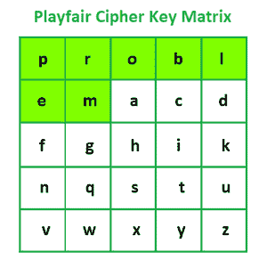
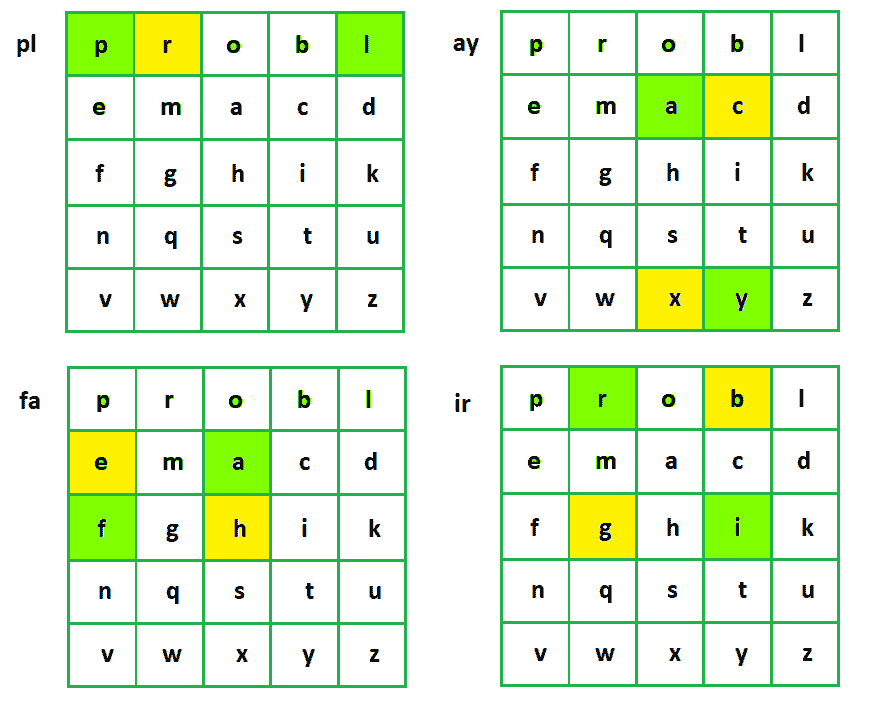

# 使用 Playfair 密码编码消息的 Java 程序

> 原文:[https://www . geesforgeks . org/Java-program-to-enode-a-message-use-Playfair-cipher/](https://www.geeksforgeeks.org/java-program-to-enode-a-message-using-playfair-cipher/)

[Playfair 密码](https://www.geeksforgeeks.org/playfair-cipher-with-examples/)是传统密码中的一种，属于替代密码的范畴。在 Playfair Cipher 中，与传统密码不同，我们加密一对字母(有向图)，而不是一个字母。在 Playfair 密码中，最初会创建一个密钥表。密钥表是一个由字母组成的 5×5 矩阵，用作加密明文的密钥。25 个字母中的每一个都必须是唯一的，表中省略了一个字母(通常是“j”)，因为我们只需要 25 个字母，而不是 26 个。如果明文包含“j”，则用“I”代替。

【Playfair 密码的流程:

1.  明文信息被分成两个字母对(有向图)。如果明文有奇数个字符，在末尾附加“z”使消息长度为偶数。
2.  识别明文中并排放置的任何双字母，并用“x”替换第二个出现的字母，例如“hello”->“he LX lo”。
3.  现在，找到 5×5 键表中的字母。
4.  使用以下规则加密明文:
    *   如果字母出现在表格的同一行，则分别用它们右边的字母替换它们(如果原始对中的一个字母在该行的右边，则绕到该行的左边)。
    *   如果字母出现在表格的同一列上，则分别用紧接在下方的字母替换它们(如果原始对中的字母在列的底部，则环绕到列的顶部)
    *   如果字母不在同一行或同一列，请用它们自己行中的字母替换它们，但要与另一个字母在同一列中。

Playfair 密码的解密过程与加密过程相同，但应用方式相反。接收者拥有相同的密钥，并且可以创建相同的密钥表，他使用它来解密使用该密钥生成的密文消息。

**示例:**


playfair 密码的输入



游戏公平密码密钥矩阵



使用 Playfair 密码生成密文

## Java 语言(一种计算机语言，尤用于创建网站)

```java
// Java Program to Enode a Message Using Playfair Cipher

import java.io.*;
import java.util.*;

class Playfair {
    String key;
    String plainText;
    char[][] matrix = new char[5][5];

    public Playfair(String key, String plainText)
    {
        // convert all the characters to lowercase
        this.key = key.toLowerCase();

        this.plainText = plainText.toLowerCase();
    }

    // function to remove duplicate characters from the key
    public void cleanPlayFairKey()
    {
        LinkedHashSet<Character> set
            = new LinkedHashSet<Character>();

        String newKey = "";

        for (int i = 0; i < key.length(); i++)
            set.add(key.charAt(i));

        Iterator<Character> it = set.iterator();

        while (it.hasNext())
            newKey += (Character)it.next();

        key = newKey;
    }

    // function to generate playfair cipher key table
    public void generateCipherKey()
    {
        Set<Character> set = new HashSet<Character>();

        for (int i = 0; i < key.length(); i++)
        {
            if (key.charAt(i) == 'j')
                continue;
            set.add(key.charAt(i));
        }

        // remove repeated characters from the cipher key
        String tempKey = new String(key);

        for (int i = 0; i < 26; i++) 
        {
            char ch = (char)(i + 97);
            if (ch == 'j')
                continue;

            if (!set.contains(ch))
                tempKey += ch;
        }

        // create cipher key table
        for (int i = 0, idx = 0; i < 5; i++)
            for (int j = 0; j < 5; j++)
                matrix[i][j] = tempKey.charAt(idx++);

        System.out.println("Playfair Cipher Key Matrix:");

        for (int i = 0; i < 5; i++)
            System.out.println(Arrays.toString(matrix[i]));
    }

    // function to preprocess plaintext
    public String formatPlainText()
    {
        String message = "";
        int len = plainText.length();

        for (int i = 0; i < len; i++)
        {
            // if plaintext contains the character 'j',
            // replace it with 'i'
            if (plainText.charAt(i) == 'j')
                message += 'i';
            else
                message += plainText.charAt(i);
        }

        // if two consecutive characters are same, then
        // insert character 'x' in between them
        for (int i = 0; i < message.length(); i += 2) 
        {
            if (message.charAt(i) == message.charAt(i + 1))
                message = message.substring(0, i + 1) + 'x'
                          + message.substring(i + 1);
        }

        // make the plaintext of even length
        if (len % 2 == 1)
            message += 'x'; // dummy character

        return message;
    }

    // function to group every two characters
    public String[] formPairs(String message)
    {
        int len = message.length();
        String[] pairs = new String[len / 2];

        for (int i = 0, cnt = 0; i < len / 2; i++)
            pairs[i] = message.substring(cnt, cnt += 2);

        return pairs;
    }

    // function to get position of character in key table
    public int[] getCharPos(char ch)
    {
        int[] keyPos = new int[2];

        for (int i = 0; i < 5; i++) 
        {
            for (int j = 0; j < 5; j++)
            {

                if (matrix[i][j] == ch)
                {
                    keyPos[0] = i;
                    keyPos[1] = j;
                    break;
                }
            }
        }
        return keyPos;
    }

    public String encryptMessage()
    {
        String message = formatPlainText();
        String[] msgPairs = formPairs(message);
        String encText = "";

        for (int i = 0; i < msgPairs.length; i++) 
        {
            char ch1 = msgPairs[i].charAt(0);
            char ch2 = msgPairs[i].charAt(1);
            int[] ch1Pos = getCharPos(ch1);
            int[] ch2Pos = getCharPos(ch2);

            // if both the characters are in the same row
            if (ch1Pos[0] == ch2Pos[0]) {
                ch1Pos[1] = (ch1Pos[1] + 1) % 5;
                ch2Pos[1] = (ch2Pos[1] + 1) % 5;
            }

            // if both the characters are in the same column
            else if (ch1Pos[1] == ch2Pos[1])
            {
                ch1Pos[0] = (ch1Pos[0] + 1) % 5;
                ch2Pos[0] = (ch2Pos[0] + 1) % 5;
            }

            // if both the characters are in different rows
            // and columns
            else {
                int temp = ch1Pos[1];
                ch1Pos[1] = ch2Pos[1];
                ch2Pos[1] = temp;
            }

            // get the corresponding cipher characters from
            // the key matrix
            encText = encText + matrix[ch1Pos[0]][ch1Pos[1]]
                      + matrix[ch2Pos[0]][ch2Pos[1]];
        }

        return encText;
    }
}

public class GFG {
    public static void main(String[] args)
    {
        System.out.println("Example-1\n");

        String key1 = "Problem";
        String plainText1 = "Playfair";

        System.out.println("Key: " + key1);
        System.out.println("PlainText: " + plainText1);

        Playfair pfc1 = new Playfair(key1, plainText1);
        pfc1.cleanPlayFairKey();
        pfc1.generateCipherKey();

        String encText1 = pfc1.encryptMessage();
        System.out.println("Cipher Text is: " + encText1);

        System.out.println("\nExample-2\n");

        String key2 = "Problem";
        String plainText2 = "Hello";

        System.out.println("Key: " + key2);
        System.out.println("PlainText: " + plainText2);

        Playfair pfc2 = new Playfair(key2, plainText2);
        pfc2.cleanPlayFairKey();
        pfc2.generateCipherKey();

        String encText2 = pfc2.encryptMessage();
        System.out.println("Cipher Text is: " + encText2);
    }
}
```

**Output**

```java
Example-1

Key: Problem
PlainText: Playfair
Playfair Cipher Key Matrix:
[p, r, o, b, l]
[e, m, a, c, d]
[f, g, h, i, k]
[n, q, s, t, u]
[v, w, x, y, z]
Cipher Text is: rpcxhegb

Example-2

Key: Problem
PlainText: Hello
Playfair Cipher Key Matrix:
[p, r, o, b, l]
[e, m, a, c, d]
[f, g, h, i, k]
[n, q, s, t, u]
[v, w, x, y, z]
Cipher Text is: faozpb
```