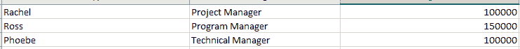
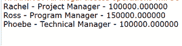

# 从 Excel 表格中提取内容的 Java 程序

> 原文:[https://www . geesforgeks . org/Java-程序-从 excel 表中提取内容/](https://www.geeksforgeeks.org/java-program-to-extract-content-from-a-excel-sheet/)

电子表格是表示像表格一样的数据的更简单的方式，并且能够以表格格式给出数据的可视化表示。在本文中，让我们看看如何通过 java 提取 Excel 工作表的内容。这里出现了两种情况，即程序中是否考虑了 Maven。讨论这两个问题是更好地理解该计划的先决条件。

[Apache POI](https://www.geeksforgeeks.org/apache-poi-introduction/) API 基础知识在继续之前至关重要，因此在使用 Apache POI 时需要用到的两个主要前缀如下:

1.  [HSSF](https://www.geeksforgeeks.org/apache-poi-introduction/) :表示该应用编程接口用于使用 Excel 2003 及更早版本。
2.  [XSSF](https://www.geeksforgeeks.org/apache-poi-getting-started/) :表示应用编程接口用于使用 Excel 2007 及更高版本。

以下 4 个界面很重要，也是必不可少的

*   工作簿:Excel 工作簿的高级表示。 [HSSFWorkbook](https://www.geeksforgeeks.org/apache-poi-getting-started/) 和 [XSSFWorkbook](https://www.geeksforgeeks.org/apache-poi-getting-started/) 。
*   工作表:Excel 工作表的高级表示。典型的实现类是 XSSFSheet 和 *XSSFSheet* 。
*   行:电子表格中行的高**–**级别表示。[高速](https://www.geeksforgeeks.org/reading-writing-data-excel-file-using-apache-poi/)和[高速](https://www.geeksforgeeks.org/how-to-set-direction-to-the-text-in-cell-using-java/)是两个具体的类。
*   单元格:一行中单元格的高级表示。 *HSSFCell* 和 *XSSFCell* 是典型的实现类。

**案例 1:** [Maven](https://www.geeksforgeeks.org/introduction-apache-maven-build-automation-tool-java-projects/) java 项目，其中依赖关系如下

*   所有 Maven 项目都将 pom.xml 作为主文件。
*   在这里，我们需要添加依赖项。
*   **pom.xml** 文件内容 Excel 格式确实有点不同，如下所示:
*   建议指定最新版本。(这里使用的 Maven 项目示例是 3.11)

**为 Excel 2003 格式**

```
<dependency>
   <groupId>org.apache.poi</groupId>
   <artifactId>poi</artifactId>
   <version>VERSION</version>
</dependency>
```

**为 Excel 2007 格式**

```
<dependency>
   <groupId>org.apache.poi</groupId>
   <artifactId>poi-ooxml</artifactId>
   <version>VERSION</version>
</dependency>
```

**案例二:**非 Maven Java 项目。

为了满足需求，迫切需要在构建路径中添加 jar 文件，以便提取内容。为此，[下载](https://poi.apache.org/download.html)最新发布的 Apache POI 库。

从中提取内容

**Excel 2003 格式**

```
poi-VERSION.jar is enough.
```

**Excel 2007 格式:**

```
poi-ooxml-VERSION.jar
poi-ooxml-schemas-VERSION.jar
xmlbeans-VERSION.jar
```

**程序:**用 Apache POI 读取 Excel 文件，并举例说明。目标是从给定的 Excel 文件中读取内容，并在“输出”窗口中显示 Excel 文件的内容。

**步骤 1:** 这里我们使用的是 POJO 类，其字段数量与附件 Excel 文件中给出的相等。Excel 文件有 3 列，因此在 POJO 类中有 3 个字段。示例 Excel 文件内容如下所示。拥有一个 POJO(普通旧 java 对象)类来进行这类操作总是更好。由于有 3 个列值，并且详细信息与一名员工相关，因此我们有一个员工类。

***样本输入图像:***



Empname、EmpDesignation、薪资是列

**示例:**

## Java 语言(一种计算机语言，尤用于创建网站)

```
// Java Program in which a Class is declared and
// its methods are defined

// Class
class Employee {

    // Member variable of Employee Class
    // Name, Designation and Salary
    private String employeeName;
    private String employeeDesignation;
    private double salary;

    // Constructor of Employee class
    public Employee() {}

    // Method 1
    public String toString()
    {
        return String.format("%s - %s - %f", employeeName,
                             employeeDesignation, salary);
    }

    // method 2
    // To get name of an employee
    public String getEmployeeName()
    {

        // Return the name of the employee
        return employeeName;
    }

    // Method - 3
    // To set employee name
    public void setEmployeeName(String employeeName)
    {

        // This keyword refer to the current
        // method or constructor itself
        // Hence, same employee name can be set
        // through this method
        this.employeeName = employeeName;
    }

    // Method - 4
    // To get already assigned designation of
    // the employee over which method is invoked
    public String getEmployeeDesignation()
    {

        // Return the designation of the employee
        // over which the function is called
        return employeeDesignation;
    }

    // Method - 5
    // To assign a designation to an employee
    public void
    setEmployeeDesignation(String employeeDesignation)
    {

        // This keyword refer to the current
        // method or constructor itself
        this.employeeDesignation = employeeDesignation;
    }

    // Method - 6
    // To get salary of an employee
    public double getSalary()
    {

        // Return the salary of the employee for which
        // the function is invoked
        return salary;
    }

    // Method - 7
    // To set salary of the existing employee with
    // assigned name and designation
    public void setSalary(double salary)
    {
        this.salary = salary;
    }
}
```

**第二步:**根据不同的数据类型如 String、Number(适合整数、double、float 等)、Boolean，我们需要有一个方法来获取 Excel 的单元格值

**示例:**

## Java 语言(一种计算机语言，尤用于创建网站)

```
// Java Program to get the cell value
// of the corresponding cells

// Method
// To get the cell value
private Object getCellValue(Cell cell)
{

    // Now either do-while or switch can be used
    // to display menu/user's choice

    // Switch case is used here for illustration
    // Switch case to get the users choice
    switch (cell.getCellType()) {

        // Case 1
        // If cell contents are string
    case Cell.CELL_TYPE_STRING:
        return cell.getStringCellValue();

        // Case 2
        // If cell contents are Boolean
    case Cell.CELL_TYPE_BOOLEAN:
        return cell.getBooleanCellValue();

        // Case 3
        // If cell contents are Numeric which includes
        // int, float , double etc
    case Cell.CELL_TYPE_NUMERIC:
        return cell.getNumericCellValue();
    }

    // Case 4
    // Default case
    // If cell contents are neither
    // string nor Boolean nor Numeric,
    // simply nothing is returned
    return null;
}
```

**第三步:**提取 Excel 文件内容的方法。我们需要正确指定文件的位置。否则**、**将以[结束，异常](https://www.geeksforgeeks.org/scanner-ioexception-method-in-java-with-examples/)

**示例:**

## Java 语言(一种计算机语言，尤用于创建网站)

```
// Java Program to get the Excel file name
// as an argument

public List<Employee>
readDataFromExcelFile(String excelFilePath)
    throws IOException
{
    // Creating an List object of Employee type
    // Note: User defined type
    List<Employee> listEmployees
        = new ArrayList<Employee>();

    FileInputStream inputStream
        = new FileInputStream(new File(excelFilePath));

    // As used 'xlsx' file is used so XSSFWorkbook will be
    // used
    Workbook workbook = new XSSFWorkbook(inputStream);

    // Read the first sheet and if the contents are in
    // different sheets specifying the correct index
    Sheet firstSheet = workbook.getSheetAt(0);

    // Iterators to traverse over
    Iterator<Row> iterator = firstSheet.iterator();

    // Condition check using hasNext() method which holds
    // true till there is single element remaining in List

    while (iterator.hasNext()) {
        // Get a row in sheet
        Row nextRow = iterator.next();
        // This is for a Row's cells
        Iterator<Cell> cellIterator
            = nextRow.cellIterator();
        // We are taking Employee as reference.
        Employee emp = new Employee();
        // Iterate over the cells
        while (cellIterator.hasNext()) {
            Cell nextCell = cellIterator.next();

            // Switch case variable to
            // get the columnIndex
            int columnIndex = nextCell.getColumnIndex();

            // Depends upon the cell contents we need to
            // typecast

            // Switch-case
            switch (columnIndex) {

                // Case 1
            case 0:
                // First column is alpha and hence
                // it is typecasted to String
                emp.setEmployeeName(
                    (String)getCellValue(nextCell));
                // Break keyword to directly terminate
                // if this case is hit
                break;

                // Case 2
            case 1:
                // Second  column is alpha and hence
                // it is typecasted to String
                emp.setEmployeeDesignation(
                    (String)getCellValue(nextCell));
                // Break keyword to directly terminate
                // if this case is hit
                break;

                // Case 3
            case 2:
                // Third  column is double value and
                // hence it is typecasted to Double
                emp.setSalary(
                    (Double)getCellValue(nextCell));
                break;

                // Note: If additional cells are present
                // then
                // they should be specified further down,
                // and POJO class should accommodate those
                // cell values
            }
        }
        // Adding up to the list
        listEmployees.add(emp);
    }

    // Closing the workbook and inputstream
    // as it free up the space in memory
    workbook.close();
    inputStream.close();

    // Return all the employees present in List
    // object of Employee type
    return listEmployees;
}
```

**第 4 步:**在主程序中整合第 1 步到第 3 步的概念

## Java 语言(一种计算机语言，尤用于创建网站)

```
// Main driver method
public static void main(String[] args)
{
    // Detecting the file type
    GetContentFromExcelSheets getContentFromExcelSheets
        = new GetContentFromExcelSheets();
    // Creating an List object of Employee type
    // in main() method
    List<Employee> extractedEmployeeData
        = new ArrayList<Employee>();

    // Try block to check if any exception/s occurs
    try {
        // excelFileContents.xlsx location need to be
        // specified correctly or else IOException will be
        // thrown. If file is available in that location, it
        // gets the data and stored in a list variable
        extractedEmployeeData
            = getContentFromExcelSheets
                  .readDataFromExcelFile(
                      "excelFileContents.xlsx");
    }

    // Catch block to handle the exceptions if occurred
    catch (IOException e) {

        // Print the line number and exception
        // in the program
        e.printStackTrace();
    }

    // As there are possibility of data in multiple cells,
    // it is always a good approach to follow a POJO pattern
    // and get a row value in specified POJO As all data is
    // collected in a list, we can iterate and display as
    // below
    for (int i = 0; i < extractedEmployeeData.size(); i++) {

        // Print and display the employees data to the
        //  console using toString() method to the user
        System.out.println(
            extractedEmployeeData.get(i).toString());
    }
}
```

**输出:**对于我们的示例，我们只有 3 行数据



**实施:**

**示例:**

## Java 语言(一种计算机语言，尤用于创建网站)

```
// Java Program to Extract Content from a Excel sheet

// As we are reading the excel file, java.io package is
// compulsorily required
import java.io.File;
import java.io.FileInputStream;
import java.io.IOException;
import java.util.ArrayList;
import java.util.Iterator;
import java.util.List;

// Below imports are required to access Apache POI
// The usermodel package maps HSSF low level structures to
// familiar workbook/sheet model
// org.apache.poi.hssf.usermodel
// But we are using higher excel formats hence,
// org.apache.poi.ss.usermodel is used To determine the type
// of cell content
import org.apache.poi.ss.usermodel.Cell;

// each and every row of excel is taken and stored in this
// row format
import org.apache.poi.ss.usermodel.Row;

// excel sheet is read in this sheet format
import org.apache.poi.ss.usermodel.Sheet;

// excel Workbook is read in this Workbook format
import org.apache.poi.ss.usermodel.Workbook;

// XSSFWorkbook denotes the API is for working with Excel
// 2007 and later.
import org.apache.poi.xssf.usermodel.XSSFWorkbook;

// POJO class having 3 fields matching with the given excel
// file
class Employee {
    private String employeeName;
    private String employeeDesignation;
    private double salary;
    // All 3 fields getter, setter methods should be there
    public Employee() {}

    public String toString()
    {
        return String.format("%s - %s - %f", employeeName,
                             employeeDesignation, salary);
    }

    public String getEmployeeName() { return employeeName; }

    public void setEmployeeName(String employeeName)
    {
        this.employeeName = employeeName;
    }

    public String getEmployeeDesignation()
    {
        return employeeDesignation;
    }

    public void
    setEmployeeDesignation(String employeeDesignation)
    {
        this.employeeDesignation = employeeDesignation;
    }

    public double getSalary() { return salary; }

    public void setSalary(double d) { this.salary = d; }
}
// class to assign the cell value once it is getting done to
// read from excel sheet It can be String/Boolean/Numeric
public class GetContentFromExcelSheets {
    private Object getCellValue(Cell cell)
    {
        switch (cell.getCellType()) {
        case Cell.CELL_TYPE_STRING:
            return cell.getStringCellValue();

        case Cell.CELL_TYPE_BOOLEAN:
            return cell.getBooleanCellValue();

        case Cell.CELL_TYPE_NUMERIC:
            return cell.getNumericCellValue();
        }

        return null;
    }
    // Read the excel sheet contents and get the contents in
    // a list
    public List<Employee>
    readBooksFromExcelFile(String excelFilePath)
        throws IOException
    {
        List<Employee> listEmployees
            = new ArrayList<Employee>();
        FileInputStream inputStream
            = new FileInputStream(new File(excelFilePath));

        Workbook workbook = new XSSFWorkbook(inputStream);
        Sheet firstSheet = workbook.getSheetAt(0);
        Iterator<Row> iterator = firstSheet.iterator();

        while (iterator.hasNext()) {
            Row nextRow = iterator.next();
            Iterator<Cell> cellIterator
                = nextRow.cellIterator();
            Employee emp = new Employee();

            while (cellIterator.hasNext()) {
                Cell nextCell = cellIterator.next();
                int columnIndex = nextCell.getColumnIndex();

                switch (columnIndex) {
                case 1:
                    emp.setEmployeeName(
                        (String)getCellValue(nextCell));
                    break;
                case 2:
                    emp.setEmployeeDesignation(
                        (String)getCellValue(nextCell));
                    break;
                case 3:
                    emp.setSalary(Double.valueOf(
                        (String)getCellValue(nextCell)));
                    break;
                }
            }
            listEmployees.add(emp);
        }

        ((FileInputStream)workbook).close();
        inputStream.close();

        return listEmployees;
    }

    // Main program
    public static void main(String[] args)
    {
        // detecting the file type
        GetContentFromExcelSheets getContentFromExcelSheets
            = new GetContentFromExcelSheets();
        List<Employee> extractedEmployeeData
            = new ArrayList<Employee>();
        try {
            extractedEmployeeData
                = getContentFromExcelSheets
                      .readBooksFromExcelFile(
                          "excelFileContents.xlsx");
        }
        catch (IOException e) {
            // TODO Auto-generated catch block
            e.printStackTrace();
        }
        System.out.println(extractedEmployeeData);
    }
}
```

> **结论:** Apache POI 为提取 Excel 文件内容提供了较好的实现。在编码中，根据单元数量中数据的可用性，我们需要有 POJO 类属性，并且我们还需要在“*readdataromexcelfile”*方法中指定 coll 数据。我们也可以按照我们的要求格式化双数据。