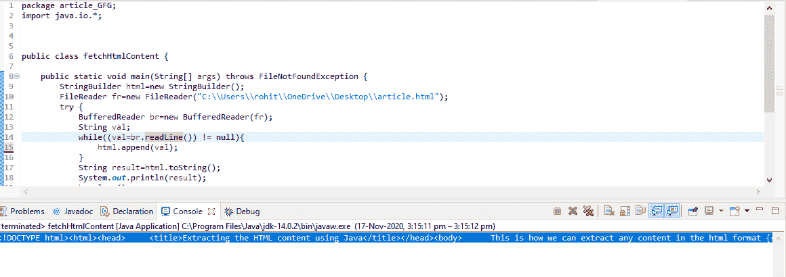

# 从 HTML 文档中提取内容的 Java 程序

> 原文:[https://www . geesforgeks . org/Java-程序-从 html 文档中提取内容/](https://www.geeksforgeeks.org/java-program-to-extract-content-from-a-html-document/)

HTML 是 web 的核心，你在互联网上看到的所有页面都是 HTML，无论是 JavaScript、JSP、PHP、ASP 还是其他任何 web 技术动态生成的。您的浏览器实际上解析 HTML 并为您呈现它，但是如果我们需要解析一个 HTML 文档并找到一些元素、标签、属性或检查特定元素是否存在。在 java 中，我们可以提取 HTML 内容并解析 HTML 文档。

**接近:**

1.  使用 [*文件阅读器*](https://www.geeksforgeeks.org/file-handling-java-using-filewriter-filereader/)
2.  使用[T1T3】](https://www.geeksforgeeks.org/download-web-page-using-java/)

**方法 1:** 该库称为文件阅读器，它提供了读取任何文件的方法，而不考虑任何扩展名。将 HTML 行附加到字符串生成器的方法如下:

1.  使用文件读取器从源文件夹读取文件，并进一步
2.  将每一行追加到字符串生成器中。
3.  当 HTML 文档中没有剩余内容时，使用功能 [***关闭打开的文件()***](https://www.geeksforgeeks.org/java-io-bufferedreader-class-java/) ***。***
4.  打印出字符串。

**实施:**

## Java 语言(一种计算机语言，尤用于创建网站)

```
// Java Program to Extract Content from a HTML document

// Importing input/output java libraries
import java.io.*;

public class GFG {

    // Main driver method
    public static void main(String[] args)
        throws FileNotFoundException
    {

        /* Constructing String Builder to
        append the string into the html */
        StringBuilder html = new StringBuilder();

        // Reading html file on local directory
        FileReader fr = new FileReader(
            "C:\\Users\\rohit\\OneDrive\\Desktop\\article.html");

        // Try block to check exceptions
        try {

            // Initialization of the buffered Reader to get
            // the String append to the String Builder
            BufferedReader br = new BufferedReader(fr);

            String val;

            // Reading the String till we get the null
            // string and appending to the string
            while ((val = br.readLine()) != null) {
                html.append(val);
            }

            // AtLast converting into the string
            String result = html.toString();
            System.out.println(result);

            // Closing the file after all the completion of
            // Extracting
            br.close();
        }

        // Catch block to handle exceptions
        catch (Exception ex) {

            /* Exception of not finding the location and
            string reading termination the function
            br.close(); */
            System.out.println(ex.getMessage());
        }
    }
}
```

**输出:**



**方法 2:** 使用 Url.openStream()

*   调用[***url . openstream()***](https://www.geeksforgeeks.org/download-web-page-using-java/)**函数，该函数启动新的 TCP 连接到 URL 提供给它的服务器。**
*   **现在，在服务器发回包含信息的 HTTP 响应后，HTTP gets Request 被发送到连接。**
*   **该信息以字节的形式存在，然后使用[*InputStreamReader()*](https://www.geeksforgeeks.org/inputstreamreader-class-in-java/)和 [*openStream()*](https://www.geeksforgeeks.org/download-web-page-using-java/) 方法读取该信息，并将数据返回给程序。**

```
BufferedReader br = new BufferedReader(new InputStreamReader(URL.openStream()));
```

*   **首先，我们打开 URL 使用**[*openStream()*](https://www.geeksforgeeks.org/download-web-page-using-java/)**来获取信息。信息以字节的形式包含在网址中，如果连接正常(表示显示 200)，则向网址发送 HTTP 请求以获取内容。******
*   ****然后使用**[*inputStreamReader()*](https://www.geeksforgeeks.org/inputstreamreader-class-in-java/)以字节形式收集信息******
*   ******现在运行循环来打印信息，因为需求是在控制台中打印信息。******

```
****while ((val = br.readLine()) != null)   // condition
 {    
   System.out.println(val);             // execution if condition is true
  }****
```

********实施:********

## ****Java 语言(一种计算机语言，尤用于创建网站)****

```
**// Java Program to Extract Content from a HTML document

// Importing java generic class
import java.io.*;
import java.util.*;
// Importing java URL class
import java.net.URL;

public class GFG {

    // Man driver method
    public static void main(String[] args)
        throws FileNotFoundException
    {

        // Try block to check exceptions
        try {
            String val;

            // Constructing the URL connection
            // by defining the URL constructors
            URL URL = new URL(
                "file:///C:/Users/rohit/OneDrive/Desktop/article.html");

            // Reading the HTML content from the .HTML File
            BufferedReader br = new BufferedReader(
                new InputStreamReader(URL.openStream()));

            /* Catching the string and  if found any null
             character break the String */
            while ((val = br.readLine()) != null) {
                System.out.println(val);
            }

            // Closing the file
            br.close();
        }

        // Catch block to handle exceptions
        catch (Exception ex) {

            // No file found
            System.out.println(ex.getMessage());
        }
    }
}**
```

******输出:******

********