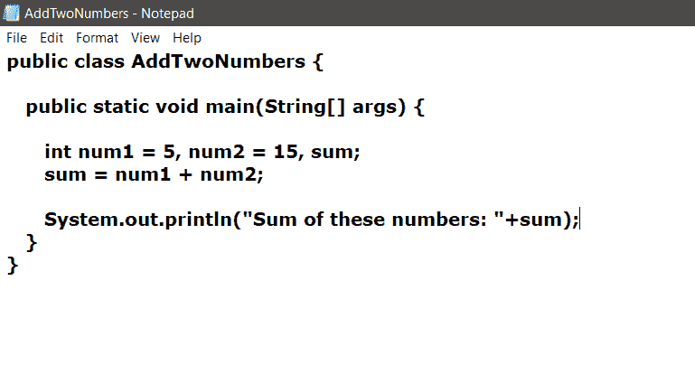

# 从 Java 中提取内容的 Java 程序。类文件

> 原文:[https://www . geesforgeks . org/Java-program-to-extract-content-from-a-javas-class-file/](https://www.geeksforgeeks.org/java-program-to-extract-content-from-a-javas-class-file/)

在本文中，我们将使用 **Apache Tika** 库提取 [Java 类](https://www.geeksforgeeks.org/java-class-file/)文件的内容。Apache Tika 用于文档类型检测和从各种文件格式中提取内容。它使用各种文档分析器和文档类型检测技术来检测和提取数据。它为解析不同的文件格式提供了一个通用的应用编程接口。所有这些解析器库都封装在一个名为 parser 接口的接口中。

下表描述了解决方案中使用的重要方法:

<figure class="table">

| 

**方法**

 | 

**描述**

 |
| --- | --- |
| *BodyContentHandler()* | 它创建一个内容处理程序，将 XHTML 正文字符事件写入内部字符串缓冲区。 |
| *元数据()* | 它构建新的空元数据。 |
| 剖析内容() | 它创建了一个解析上下文对象，用于将上下文信息传递给 Tika 解析器。 |
| *解析()* | 实例化解析器对象，并调用解析方法。 |

</figure>

**示例:**提取 Java 类文件格式内容的 Java 代码

## Java 语言(一种计算机语言，尤用于创建网站)

```java
// Java program to extract the
// contents of Java class file
// format

import java.io.File;
import java.io.FileInputStream;
import java.io.IOException;

// importing Apache Tika libraries
import org.apache.tika.exception.TikaException;
import org.apache.tika.metadata.Metadata;
import org.apache.tika.parser.AutoDetectParser;
import org.apache.tika.parser.ParseContext;
import org.apache.tika.parser.Parser;
import org.apache.tika.sax.BodyContentHandler;

import org.xml.sax.SAXException;

public class ParserExtraction {

    public static void main(final String[] args)
        throws IOException, SAXException, TikaException
    {
        // create a File object
        File f = new File("AddTwoNumbers.java");

        // parse method parameters
        Parser parser = new AutoDetectParser();

        // instantiate BodyContentHandle
        BodyContentHandler handler
            = new BodyContentHandler();

        // Creates the Metadata object
        Metadata metadata = new Metadata();

        FileInputStream inputstream
            = new FileInputStream(f);

        // creates a parse context object
        ParseContext context = new ParseContext();

        // parsing the file
        parser.parse(inputstream, handler, metadata,
                     context);

          // display the file content
        System.out.println("File content : "
                           + Handler.toString());
    }
}
```

### **输入:**



add two numbers . Java

**输出:**

```java
File content :  public class AddTwoNumbers {

  public static void main(String[] args) {

     int num1 = 5, num2 = 15, sum;
     sum = num1 + num2;

     System.out.println("Sum of these numbers: "+sum);
  }
}

```