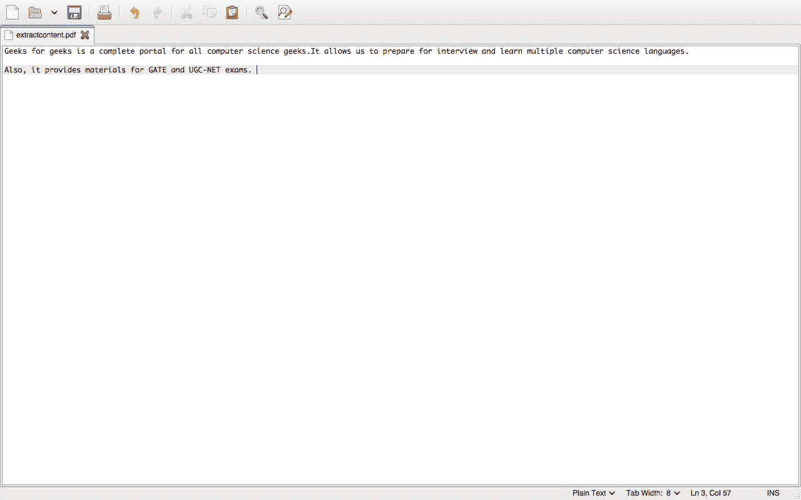

# 从 PDF 中提取内容的 Java 程序

> 原文:[https://www . geesforgeks . org/Java-program-to-extract-content-from-a-pdf/](https://www.geeksforgeeks.org/java-program-to-extract-content-from-a-pdf/)

使用了 Java 类< file using the [Apache Tika](https://www.geeksforgeeks.org/java-program-to-extract-content-from-a-javas-class-file/) <库。对于文档类型检测和从各种文件格式中提取内容，它使用各种文档分析器和文档类型检测技术来检测和提取数据。它为解析不同的文件格式提供了一个通用的应用编程接口。所有这些解析器库都封装在一个名为 parser 接口的接口中。

Java 支持多个内置的类和包来提取和访问 PDF 文档中的内容。以下类别用于提取内容:

> **BodyContentHandler 是一个**内置类，它为文本创建一个处理程序，该处理程序编写这些 XHTML 正文字符事件，并将它们存储在内部字符串缓冲区中。它是从 Java 中的父类 ContentHandlerDecorator 继承而来的。可以使用父类提供的方法 ContentHandlerDecorreator . ToString()检索指定的文本。
> 
> **PDFParser** Java 提供了一个内置的包，里面提供了一个类 PDFParser，解析 PDF 文档的内容。它提取存储在段落、字符串和表格中的 PDF 文档的内容(不调用表格边界)。如果密码被指定为参数，它也可以用来解析加密的文档。
> 
> **ParseContext:** 这个类是 Java package org . Apache . tika . parser 的一个组件，用来解析上下文并传递给 Tika 解析器。

**程序:**

1.  创建一个[内容处理程序](https://www.geeksforgeeks.org/java-program-to-extract-content-from-a-javas-class-file/)。
2.  在系统的本地目录中创建一个 PDF 文件。
3.  现在，创建一个[文件输入流](https://www.geeksforgeeks.org/java-io-fileinputstream-class-java/)，其路径与上面创建的 PDF 文件相同。
4.  使用 PDF 文档的元数据类型对象创建内容解析器。
5.  现在使用 PDF 解析器类解析 PDF 文档。
6.  打印如上创建的 PDF 文档的内容，以说明上述 PDF 中内容的提取。

**实现:**下面的 Java 程序用来说明从 PDF 文档中提取内容。

## Java 语言(一种计算机语言，尤用于创建网站)

```
// Java Program to Extract Content from a PDF

// Importing java input/output classes
import java.io.File;
import java.io.FileInputStream;
// Importing Apache POI classes
import org.apache.tika.metadata.Metadata;
import org.apache.tika.parser.ParseContext;
import org.apache.tika.parser.pdf.PDFParser;
import org.apache.tika.sax.BodyContentHandler;

// Class
public class GFG {

    // Main driver method
    public static void main(String[] args) throws Exception
    {

        // Create a content handler
        BodyContentHandler contenthandler
            = new BodyContentHandler();

        // Create a file in local directory
        File f = new File("C:/extractcontent.pdf");

        // Create a file input stream
        // on specified path with the created file
        FileInputStream fstream = new FileInputStream(f);

        // Create an object of type Metadata to use
        Metadata data = new Metadata();

        // Create a context parser for the pdf document
        ParseContext context = new ParseContext();

        // PDF document can be parsed using the PDFparser
        // class
        PDFParser pdfparser = new PDFParser();

        // Method parse invoked on PDFParser class
        pdfparser.parse(fstream, contenthandler, data,
                        context);

        // Printing the contents of the pdf document
        // using toString() method in java
        System.out.println("Extracting contents :"
                           + contenthandler.toString());
    }
}
```

**输出:**以下是本地目录下文件的内容制作如下:

