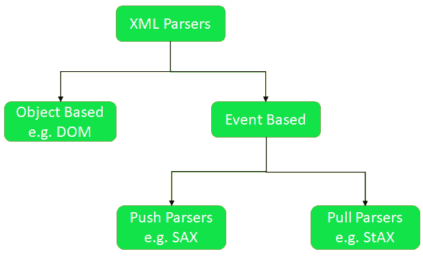

# 从 XML 文档中提取内容的 Java 程序

> 原文:[https://www . geesforgeks . org/Java-程序-从 xml 文档中提取内容/](https://www.geeksforgeeks.org/java-program-to-extract-content-from-a-xml-document/)

XML 文件包含标签之间的数据，因此与 docx 和 txt 等其他文件格式相比，读取数据非常复杂。解析 XML 文件有两种类型的解析器:

*   基于对象的(例如，分布式对象模型)
*   基于事件(例如 [SAX](https://www.geeksforgeeks.org/java-sax-library/) 、 [StAX](https://www.geeksforgeeks.org/stax-xml-parser-java/) )



在本文中，我们将讨论如何使用 Java DOM 解析器和 Java SAX 解析器解析 XML。

**Java DOM 解析器:** DOM 代表文档对象模型。DOM 应用编程接口提供了读取和写入 XML 文件的类。DOM 读取整个文档。它在读取小到中等大小的 XML 文件时非常有用。它是一个基于树的解析器，与 SAX 相比有点慢，并且在加载到内存中时占用更多空间。我们可以使用 DOM API 插入和删除节点。

我们必须遵循下面的过程来从 Java 的 XML 文件中提取数据。

*   **实例化 XML 文件:**
*   **获取根节点:**我们可以使用 getDocumentElement()获取根节点和 XML 文件的元素。
*   **获取所有节点:**在使用 getElementByTagName()时，以给定的标记名返回文档顺序中所有元素的节点列表，这些元素包含在文档中。
*   **通过文本值获取节点:**我们可以使用 getElementByTextValue()方法，以便通过节点的值来搜索节点。
*   **通过属性值获取节点:**我们可以使用 getElementByTagName()方法和 getAttribute()方法。

现在让我们看一个使用 Java DOM Parser 从 XML 中提取数据的例子。

创建一个**。xml** 文件，在这种情况下，我们已经创建了 Gfg.xml

## 可扩展标记语言

```java
<?xml version="1.0"?>  
<class>  
    <geek>  
        <id>1</id>  
        <username>geek1</username>   
        <EnrolledCourse>D.S.A</EnrolledCourse>
        <mode>online self paced</mode>
        <duration>Lifetime</duration>  
    </geek>  

    <geek>  
        <id>2</id>  
        <username>geek2</username>  
        <EnrolledCourse>System Design</EnrolledCourse>  
        <mode>online live course</mode>
        <duration>10 Lectures</duration>  
    </geek>  

    <geek>  
        <id>3</id>  
        <username>geek3</username>  
        <EnrolledCourse>Compitative Programming</EnrolledCourse> 
        <mode>online live course</mode> 
        <duration>8 weeks</duration>  
    </geek>  

    <geek>  
        <id>4</id>  
        <username>geek4</username>  
        <EnrolledCourse>Complete Interview Preparation</EnrolledCourse> 
        <mode>online self paced</mode> 
        <duration>Lifetime</duration>  
    </geek>  

</class>
```

现在为 java DOM 解析器创建一个 Java 文件。在这种情况下，GfgXmlExtractor.java

## Java 语言(一种计算机语言，尤用于创建网站)

```java
import javax.xml.parsers.DocumentBuilderFactory;
import javax.xml.parsers.DocumentBuilder;
import org.w3c.dom.Document;
import org.w3c.dom.NodeList;
import org.w3c.dom.Node;
import org.w3c.dom.Element;
import java.io.File;
public class GfgXmlExtractor {
    public static void main(String argv[])
    {
        try {
            // creating a constructor of file class and
            // parsing an XML file
            File file = new File(
                "F:\\geeksforgeeks_contributions\\gfg.xml");

            // Defines a factory API that enables
            // applications to obtain a parser that produces
            // DOM object trees from XML documents.
            DocumentBuilderFactory dbf
                = DocumentBuilderFactory.newInstance();

            // we are creating an object of builder to parse
            // the  xml file.
            DocumentBuilder db = dbf.newDocumentBuilder();
            Document doc = db.parse(file);

            /*here normalize method Puts all Text nodes in
            the full depth of the sub-tree underneath this
            Node, including attribute nodes, into a "normal"
            form where only structure separates
            Text nodes, i.e., there are neither adjacent
            Text nodes nor empty Text nodes. */
            doc.getDocumentElement().normalize();
            System.out.println(
                "Root element: "
                + doc.getDocumentElement().getNodeName());

            // Here nodeList contains all the nodes with
            // name geek.
            NodeList nodeList
                = doc.getElementsByTagName("geek");

            // Iterate through all the nodes in NodeList
            // using for loop.
            for (int i = 0; i < nodeList.getLength(); ++i) {
                Node node = nodeList.item(i);
                System.out.println("\nNode Name :"
                                   + node.getNodeName());
                if (node.getNodeType()
                    == Node.ELEMENT_NODE) {
                    Element tElement = (Element)node;
                    System.out.println(
                        "User id: "
                        + tElement
                              .getElementsByTagName("id")
                              .item(0)
                              .getTextContent());
                    System.out.println(
                        "User Name: "
                        + tElement
                              .getElementsByTagName(
                                  "username")
                              .item(0)
                              .getTextContent());
                    System.out.println(
                        "Enrolled Course: "
                        + tElement
                              .getElementsByTagName(
                                  "EnrolledCourse")
                              .item(0)
                              .getTextContent());
                    System.out.println(
                        "Mode: "
                        + tElement
                              .getElementsByTagName("mode")
                              .item(0)
                              .getTextContent());
                    System.out.println(
                        "Duration: "
                        + tElement
                              .getElementsByTagName(
                                  "duration")
                              .item(0)
                              .getTextContent());
                }
            }
        }

        // This exception block catches all the exception
        // raised.
        // For example if we try to access a element by a
        // TagName that is not there in the XML etc.
        catch (Exception e) {
            System.out.println(e);
        }
    }
}
```

**输出**

```java
Root element: class

Node Name :geek
User id: 1
User Name: geek1
Enrolled Course: D.S.A
Mode: online self paced
Duration: Lifetime

Node Name :geek
User id: 2
User Name: geek2
Enrolled Course: System Design
Mode: online live course
Duration: 10 Lectures

Node Name :geek
User id: 3
User Name: geek3
Enrolled Course: Compitative Programming
Mode: online live course
Duration: 8 weeks

Node Name :geek
User id: 4
User Name: geek4
Enrolled Course: Complete Interview Preparation
Mode: online self paced
Duration: Lifetime

```

**方法二** : Java SAX 解析器

java 中的 SAX Parser 提供了解析 XML 文档的 API。SAX 解析器与 DOM 解析器有很大的不同，因为它没有将完整的 XML 加载到内存中，也没有顺序读取 XML 文档。在 SAX 中，解析由 **ContentHandler** 接口完成，这个接口由 **DefaultHandler** 类实现。

现在让我们看一个使用 Java SAX Parser 从 XML 中提取数据的例子。

为 SAX 解析器创建一个 java 文件。在这种情况下，我们创造了 GfgSaxXmlExtractor.java

## Java 语言(一种计算机语言，尤用于创建网站)

```java
import javax.xml.parsers.SAXParser;
import javax.xml.parsers.SAXParserFactory;
import org.xml.sax.Attributes;
import org.xml.sax.SAXException;
import org.xml.sax.helpers.DefaultHandler;
public class GfgSaxXmlParser {
    public static void main(String args[])
    {
        try {
            /*SAXParserFactory is  a factory API that
            enables applications to configure and obtain a
            SAX based parser to parse XML documents. */
            SAXParserFactory factory
                = SAXParserFactory.newInstance();

            // Creating a new instance of a SAXParser using
            // the currently configured factory parameters.
            SAXParser saxParser = factory.newSAXParser();

            // DefaultHandler is Default base class for SAX2
            // event handlers.
            DefaultHandler handler = new DefaultHandler() {
                boolean id = false;
                boolean username = false;
                boolean EnrolledCourse = false;
                boolean mode = false;
                boolean duration = false;

                // Receive notification of the start of an
                // element. parser starts parsing a element
                // inside the document
                public void startElement(
                    String uri, String localName,
                    String qName, Attributes attributes)
                    throws SAXException
                {

                    if (qName.equalsIgnoreCase("Id")) {
                        id = true;
                    }
                    if (qName.equalsIgnoreCase(
                            "username")) {
                        username = true;
                    }
                    if (qName.equalsIgnoreCase(
                            "EnrolledCourse")) {
                        EnrolledCourse = true;
                    }
                    if (qName.equalsIgnoreCase("mode")) {
                        mode = true;
                    }
                    if (qName.equalsIgnoreCase(
                            "duration")) {
                        duration = true;
                    }
                }

                // Receive notification of character data
                // inside an element, reads the text value of
                // the currently parsed element
                public void characters(char ch[], int start,
                                       int length)
                    throws SAXException
                {
                    if (id) {
                        System.out.println(
                            "ID : "
                            + new String(ch, start,
                                         length));
                        id = false;
                    }
                    if (username) {
                        System.out.println(
                            "User Name: "
                            + new String(ch, start,
                                         length));
                        username = false;
                    }
                    if (EnrolledCourse) {
                        System.out.println(
                            "Enrolled Course: "
                            + new String(ch, start,
                                         length));
                        EnrolledCourse = false;
                    }
                    if (mode) {
                        System.out.println(
                            "mode: "
                            + new String(ch, start,
                                         length));
                        mode = false;
                    }
                    if (duration) {
                        System.out.println(
                            "duration : "
                            + new String(ch, start,
                                         length));
                        duration = false;
                    }
                }
            };

            /*Parse the content described by the giving
             Uniform Resource
             Identifier (URI) as XML using the specified
             DefaultHandler. */
            saxParser.parse(
                "F:\\geeksforgeeks_contributions\\gfg.xml",
                handler);
        }
        catch (Exception e) {
            System.out.println(e);
        }
    }
}
```

**输出**

```java
ID : 1
User Name: geek1
Enrolled Course: D.S.A
mode: online self paced
duration : Lifetime
ID : 2
User Name: geek2
Enrolled Course: System Design
mode: online live course
duration : 10 Lectures
ID : 3
User Name: geek3
Enrolled Course: Compitative Programming
mode: online live course
duration : 8 weeks
ID : 4
User Name: geek4
Enrolled Course: Complete Interview Preparation
mode: online self paced
duration : Lifetime

```