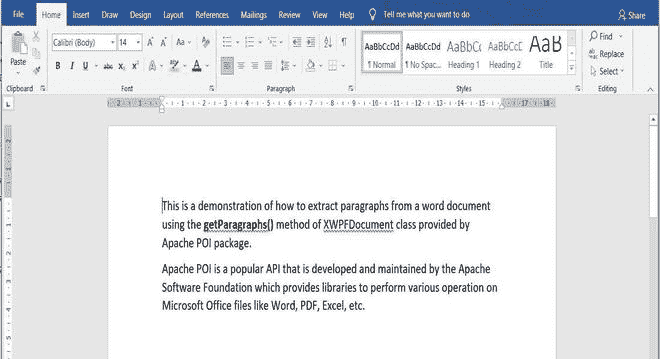
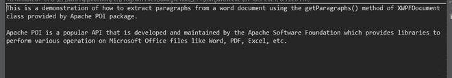

# 从 Word 文档中提取段落的 Java 程序

> 原文:[https://www . geesforgeks . org/Java-程序-从单词文档中提取段落/](https://www.geeksforgeeks.org/java-program-to-extract-paragraphs-from-a-word-document/)

文章演示了如何使用 [Apache POI](https://www.geeksforgeeks.org/apache-poi-introduction/) 包提供的[xwpfddocument](https://www.geeksforgeeks.org/java-program-to-write-a-paragraph-in-a-word-document/)类的**get 段落()**方法从 word 文档中提取段落。Apache POI 是由 Apache 软件基金会开发和维护的一个项目，它提供了一些库，可以使用 java 对 Microsoft office 文件执行大量操作。

要从 word 文件中提取段落，基本要求是导入以下 Apache 库。

> **then-ooxml . jar**

#### **接近**

1.  制定 word 文档的路径
2.  为 word 文档创建一个[文件输入流](https://www.geeksforgeeks.org/java-io-fileinputstream-class-java/)和[xfdocument](https://www.geeksforgeeks.org/java-program-to-write-a-paragraph-in-a-word-document/)对象。
3.  使用**GetPages()**方法检索段落列表。
4.  遍历段落列表进行打印。

#### **实施**

*   **第一步:**获取 word 文档所在的当前工作目录的路径。
*   **步骤 2:** 使用上述指定路径创建文件对象。
*   **步骤 3:** 为 word 文档创建文档对象。
*   **第四步:**使用 getParagraphs()方法从 word 文件中检索段落列表。
*   **步骤 5:** 遍历段落列表
*   **第 6 步:**打印段落
*   **步骤 7:** 关闭连接

#### **样本输入**

Word 文档的内容如下:



#### **实施**

**例**

## Java 语言(一种计算机语言，尤用于创建网站)

```
// Java program to extract paragraphs from a Word Document

// Importing IO package for basic file handling
import java.io.*;
import java.util.List;
// Importing Apache POI package
import org.apache.poi.xwpf.usermodel.XWPFDocument;
import org.apache.poi.xwpf.usermodel.XWPFParagraph;

// Main class to extract paragraphs from word document
public class GFG {

    // Main driver method
    public static void main(String[] args) throws Exception
    {

        // Step 1: Getting path of the current working
        // directory where the word document is located
        String path = System.getProperty("user.dir");
        path = path + File.separator + "WordFile.docx";

        // Step 2: Creating a file object with the above
        // specified path.
        FileInputStream fin = new FileInputStream(path);

        // Step 3: Creating a document object for the word
        // document.
        XWPFDocument document = new XWPFDocument(fin);

        // Step 4: Using the getParagraphs() method to
        // retrieve the list of paragraphs from the word
        // file.
        List<XWPFParagraph> paragraphs
            = document.getParagraphs();

        // Step 5: Iterating through the list of paragraphs
        for (XWPFParagraph para : paragraphs) {

            // Step 6: Printing the paragraphs
            System.out.println(para.getText() + "\n");
        }

        // Step 7: Closing the connections
        document.close();
    }
}
```

#### **输出**

