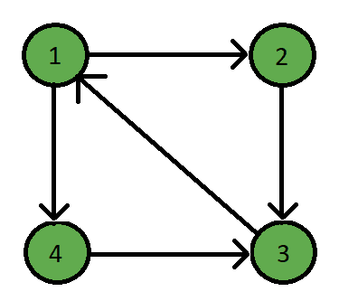
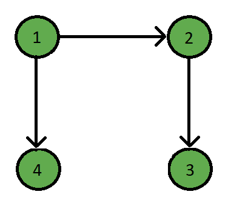

# 在图中寻找良好反馈边集的 Java 程序

> 原文:[https://www . geesforgeks . org/Java-program-to-find-good-feedback-edge-set-in-a-graph/](https://www.geeksforgeeks.org/java-program-to-find-a-good-feedback-edge-set-in-a-graph/)

反馈边集是有向图 g 的 F ⊆ E 所在的一组边，它的每个圈必须包含至少一条来自 f 的边。

简而言之，反馈边集是一组边，这些边从图中移除后，图就成了有向无环图。

**示例:**

> **输入:**
> 
> 
> 
> **输出:**
> 
> 反馈边集:(3 -> 1 ) ( 4 -> 3)
> 
> **说明:**
> 
> 
> 
> 很明显，两条边 3 -> 1 和 4 -> 3 会使图无环。

**进场:**

一个反馈边集可以用简单的 BFS 算法找到，但是如果给定的图是一个 DAG，那么就没有边集。

1.  检查给定的图是否已经是有向无环图，并移除所有的汇点。
2.  返回修改后的图形并运行 BFS。
3.  运行 BFS 时标记访问的顶点。
4.  如果标记的顶点再次被访问，则打印出该边作为反馈边。

**代码:**

## Java 语言(一种计算机语言，尤用于创建网站)

```
// Java Program to find a good feedback
// edge set in a graph

import java.util.*;

class Graph
{
    // Map for storing graph in adj list
    private Map<Integer, List<Integer>> adjacencyList;

    // Graph Constructor
    public Graph(int v)
    {
        // Create adj List
        adjacencyList = new HashMap<Integer, List<Integer>>();

        // Create empty adj list for each vertex
        for (int i = 1; i <= v; i++)
        {
            adjacencyList.put(i, new LinkedList<Integer>());
        }
    }

    // Adding new edge
    public void setEdge(int src, int dest)
    {
        List<Integer> neighbours = adjacencyList.get(src);
        neighbours.add(dest);
    }

    // Function for checking DAG
    // and removing sink vertex
    public Graph checkAcyclic()
    {
        Integer count = 0;

        // Iterator for all the vertices
        Iterator<Integer> nodes  = this.adjacencyList.keySet().iterator();
        Integer size = this.adjacencyList.size() - 1;

        // Traverse till the last node
        while (nodes.hasNext())
        {
            Integer i = nodes.next();

            // Get the neighbours of the selected vertex
            List<Integer> adjList = this.adjacencyList.get(i);

            // If the given graph is DAG
            if (count == size)
            {
                return this;
            }

            // If it's a sink vertex
            if (adjList.size() == 0)
            {
                count++;
                Iterator<Integer> neighbour
                  = this.adjacencyList.keySet().iterator();

                // Remove all edges from that vertex
                while (neighbour.hasNext())
                {
                    Integer j = neighbour.next();
                    List<Integer> edges  = this.adjacencyList.get(j);

                    if (edges.contains(i))
                    {
                        edges.remove(i);
                    }
                }

                // Remove the vertex from the graph
                this.adjacencyList.remove(i);

                nodes = this.adjacencyList.keySet().iterator();
            }
        }
        // Return the modified graph
        return this;
    }

    // Function to find the
    // feedback edge set
    public boolean getFeedbackEdgeSet()
    {
        int v=this.adjacencyList.size();
        boolean flag = false;

        // Array to mark the visited vertices
        int[] visited = new int[v + 1];

        // Iterator for all the vertices
        Iterator<Integer> nodes
          = this.adjacencyList.keySet().iterator();

        // Traverse till the last node
        while (nodes.hasNext())
        {
            Integer i = nodes.next();

            // Get the neighbours of the vertex
            List<Integer> neighbours = this.adjacencyList.get(i);

            visited[i] = 1;
            if (neighbours.size() != 0)
            {
                for (int j = 0; j < neighbours.size(); j++)
                {
                    // If the vertex is already visited
                    if (visited[neighbours.get(j)] == 1)
                    {
                        // Mark flag to true denoting
                        // the given graph is not DAG
                        flag = true;

                        System.out.print("( "+i+" -> "+
                                         neighbours.get(j)+" ) ");
                    }

                    // Mark if not visited yet
                    else
                    {
                        visited[neighbours.get(j)] = 1;
                    }
                }
            }
        }
        return flag;
    }
}

// Driver Code
public class GFG
{
    public static void main(String args[])
    {
        // Number of vertices and edges
        int v = 4;
        int e = 5;

        // Initialize new Graph
        Graph g = new Graph(v);

        // Edges
        g.setEdge(1,2);
        g.setEdge(2,3);
        g.setEdge(4,3);
        g.setEdge(1,4);
        g.setEdge(3,1);

        // Run the function
        g = g.checkAcyclic();

        System.out.print("Feedback Edge Set: ");

        if (g.getFeedbackEdgeSet() == false)
        {
            System.out.println("None");
        }
    }
}
```

**Output**

```
Feedback Edge Set: ( 3 -> 1 ) ( 4 -> 3 ) 
```

**时间复杂度:** O(E*V)，其中 E 为边数，V 为顶点数。