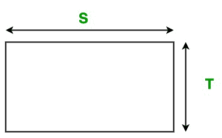

# Java 程序使用方法重载寻找矩形区域

> 原文:[https://www . geesforgeks . org/Java-程序查找矩形区域-使用方法-重载/](https://www.geeksforgeeks.org/java-program-to-find-area-of-rectangle-using-method-overloading/)

一个**长方形**是一个简单的平面图形。 它有四条边和四个直角。在 a 矩形中，所有四条边的长度都不相等，就像 a 正方形一样，彼此相对的边具有相等的长度，并且矩形的两条对角线都具有相等的长度。

[方法 o 重载](https://www.geeksforgeeks.org/overloading-in-java/) 允许不同的方法具有相同的名称，但是不同的签名，其中签名可以因输入参数的数量或输入参数的类型或两者而不同。

在本文、中，我们将学习如何使用、方法重载来查找矩形的面积。

#### 矩形的面积

矩形的面积是其*长度*和宽度/宽度的乘积 。我们可以简单的使用下面的公式来计算矩形的面积



**公式:**

```
Area of the rectangle: A = S * T
```

这里，S 是矩形的长度，T 是矩形的宽度/宽度。

以下是上述方法的实现:

## Java 语言(一种计算机语言，尤用于创建网站)

```
// Java program to find the area of
// the rectangle using Method Overloading
import java.io.*;

class Rectangle {

    // Overloaded Area() function to
    // calculate the area of the rectangle
    // It takes two double parameters
    void Area(double S, double T)
    {
        System.out.println("Area of the rectangle: "
                           + S * T);
    }

    // Overloaded Area() function to
    // calculate the area of the rectangle.
    // It takes two float parameters
    void Area(int S, int T)
    {
        System.out.println("Area of the rectangle: "
                           + S * T);
    }
}

class GFG {

    // Driver code
    public static void main(String[] args)
    {

        // Creating object of Rectangle class
        Rectangle obj = new Rectangle();

        // Calling function
        obj.Area(20, 10);
        obj.Area(10.5, 5.5);
    }
}
```

**Output**

```
Area of the rectangle: 200
Area of the rectangle: 57.75

```

**时间复杂度:** O(1)