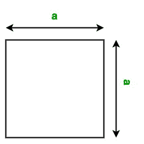

# Java 程序用方法重载求正方形面积

> 原文:[https://www . geeksforgeeks . org/Java-程序查找使用方法的正方形区域-重载/](https://www.geeksforgeeks.org/java-program-to-find-area-of-square-using-method-overloading/)

一个**正方形**是一个平面上简单的平面形状，由四个角上的四个点定义。它有四条等长的边和四个直角的角。

**方法重载:** [方法 o 重载](https://www.geeksforgeeks.org/overloading-in-java/) 允许不同的方法具有相同的名称，但签名不同，其中签名可能因输入参数的数量或输入参数的类型、或两者而异。

在本文、中，我们将学习如何使用的方法重载来查找正方形的面积。

#### 广场面积

广场的面积是其*边* 边的平方。我们可以简单的用下面的公式计算正方形的面积



**公式:**

> 广场面积:A = A<sup>2</sup>T3

这里，a 是正方形的边。

以下是上述方法的实现:

**例 1:**

展示了 Area()函数的方法重载，该函数具有不同数据类型(float、int、double)的正方形边的不同参数

## Java 语言(一种计算机语言，尤用于创建网站)

```
// Java program to find the area of
// the square using Method Overloading
// of parameters with different datatype
// of sides

import java.io.*;

class Square {

    // Overloaded Area() function to
    // calculate the area of the square
    // It takes one double parameter
    void Area(double side)
    {
        System.out.println("Area of the Square: "
                           + side * side);
    }

    // Overloaded Area() function to
    // calculate the area of the square
    // It takes one float parameter
    void Area(float side)
    {
        System.out.println("Area of the Square: "
                           + side * side);
    }
}

class GFG {

    // Driver code
    public static void main(String[] args)
    {

        // Creating object of square class
        Square obj = new Square();

        // Calling function
        obj.Area(10);
        obj.Area(3.2);
    }
}
```

**Output**

```
Area of the Square: 100.0
Area of the Square: 10.240000000000002

```

**例 2:**

显示 Area()函数的方法重载，该函数返回不同图形的区域，如(正方形、圆形、矩形)

## Java 语言(一种计算机语言，尤用于创建网站)

```
// Java program to find the area of
// the multiple shapes
// using Method Overloading

import java.io.*;

class Shape {

    static final double PI = Math.PI;

    // Overloaded Area() function to
    // calculate the area of the square
    // It takes one float parameter
    void Area(float a)
    {
        float A = a * a;
        System.out.println("Area of the Square: " + A);
    }

    // Overloaded Area() function to
    // calculate the area of the circle
    // It takes one double parameter
    void Area(double a)
    {
        double A = PI * a * a;
        System.out.println("Area of the Circle: " + A);
    }

    // Overloaded Area() function to
    // calculate the area of the rectangle
    // It takes two int parameters
    void Area(int a, int b)
    {
        int A = a * b;
        System.out.println("Area of the Rectangle: " + A);
    }
}

class GFG {

    // Driver code
    public static void main(String[] args)
    {

        // Creating object of Shape class
        Shape obj = new Shape();

        // Calling function
        obj.Area(10.5);
        obj.Area(3);
        obj.Area(5, 4);
    }
}
```

**Output**

```
Area of the Circle: 346.36059005827474
Area of the Square: 9.0
Area of the Rectangle: 20

```