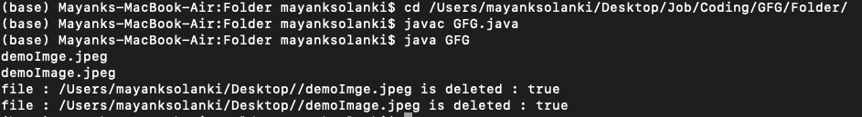

# 基于扩展名查找/删除文件的 Java 程序

> 原文:[https://www . geesforgeks . org/Java-program-to-find-delete-files-based-on-extensions/](https://www.geeksforgeeks.org/java-program-to-find-delete-files-based-on-extensions/)

我们可以在 Java 中使用 FilenameFilter 覆盖 accept(文件目录，字符串名称)方法来执行文件过滤操作。**文件名界面**有一个接受()的方法。它检查给定的文件是否应该包含在文件列表中。我们可以通过实现这个方法来检查传递的目录中的每个文件。如果文件具有所需的扩展名，则包含该文件，否则将被丢弃。

**语法:**

```java
accept(File dir, String name)
```

现在接下来要做的是如何将文件包含在给定扩展名的列表中，为此有一个 *File.list()* 方法，该方法采用 FilenameFilter 实例。该列表返回一个字符串数组，命名由满足指定过滤器的抽象路径名表示的目录中的文件和目录。所以让我们详细讨论这个功能，以便在处理文件时更好地理解。

***列表()*** 方法是[文件类](https://www.geeksforgeeks.org/File-class-in-java/)的一部分。函数返回一个字符串数组，表示给定抽象路径名中的文件，如果路径名是目录，则返回 null。该函数是一个重载函数。其中一个函数没有任何参数，另一个函数将 FilenameFilter 对象作为参数，如下所述

**功能签名:**

```java
public String[] list()
public String[] list(FilenameFilter f)
```

**函数语法:**

```java
file.list()
file.list(filter)
```

**参数:**函数是一个重载函数。其中一个函数没有任何参数，另一个函数以[文件名称过滤器](https://www.geeksforgeeks.org/file-listfiles-method-in-java-with-examples/) **对象**为参数

**返回值:**函数返回字符串数组，如果文件对象是文件，则返回空值。

**异常:**如果不允许函数对文件进行写访问，这个方法抛出[安全异常](https://www.geeksforgeeks.org/why-does-canvas-todataurl-throws-a-security-exception/)。

**程序:**

我们将遵循两个步骤来删除基于扩展名的文件:

1.  实现 FileNameFilter 接口以列出具有给定扩展名的文件。
2.  使用 [*delete()*](https://www.geeksforgeeks.org/files-delete-method-in-java-with-examples/) 方法迭代这些文件以将其删除。

**示例:**

## Java 语言(一种计算机语言，尤用于创建网站)

```java
// Java Program to find/delete files based on extensions

// Importing input output classes
import java.io.*;

// Class 1
// Main class
// To check for a file
class GFG {

    // Member variables of this class

    // File directory
    private static final String FILE_DIRECTORY
        = "/Users/mayanksolanki/Desktop/";
    // File extension
    private static final String FILE_EXTENSION = ".jpeg";

    // Method of this class
    public void deleteFile(String folder, String extension)
    {

        // Creating filter with given extension by
        // creating an object of FileExtFilter
        FileExtFilter filter = new FileExtFilter(extension);

        // Now, creating an object of FIle  class
        File direction = new File(folder);

        // Cresting an array if strings to
        // list out all the file name
        // using the list() with .txt extension
        String[] list = direction.list(filter);

        // Iterating over the array of strings
        // using basic length() method
        for (int i = 0; i < list.length; i++) {
            // printing the elements
            System.out.println(list[i]);
        }

        // Base condition check when array of strinfg is
        // empty Then simply return
        if (list.length == 0)
            return;

        File fileDelete;

        // Now looking for the file  in the
        for (String file : list) {

            String temp = new StringBuffer(FILE_DIRECTORY)
                              .append(File.separator)
                              .append(file)
                              .toString();

            // Storing the file
            fileDelete = new File(temp);

            // Checking whether the file is deleted
            boolean isdeleted = fileDelete.delete();

            // Print true if file is deleted
            System.out.println("file : " + temp
                               + " is deleted : "
                               + isdeleted);
        }
    }

    // Method 2
    // Main driver method
    public static void main(String args[])
    {

        // Calling the deleteFile() method over the file
        // FileCheker() method to check existence for the
        // file

        // Delete the file with FILE_EXTENSION from
        // FILE_DIRECTORY using the deleteFile() method s
        // created above
        new GFG().deleteFile(FILE_DIRECTORY, FILE_EXTENSION);
    }
}

// Class 2
// Helper class
// Which in itself is implementing FilenameFilter Interface
class FileExtFilter implements FilenameFilter {

    // Extension
    private String extension;

    // Comparator
    public FileExtFilter(String extension)
    {

        // This keyword refers to current object itself
        this.extension = extension;
    }

    public boolean accept(File directory, String name)
    {

        // Returning the file name along with the file
        // extension type
        return (name.endsWith(extension));
    }
}
```

**输出:**

