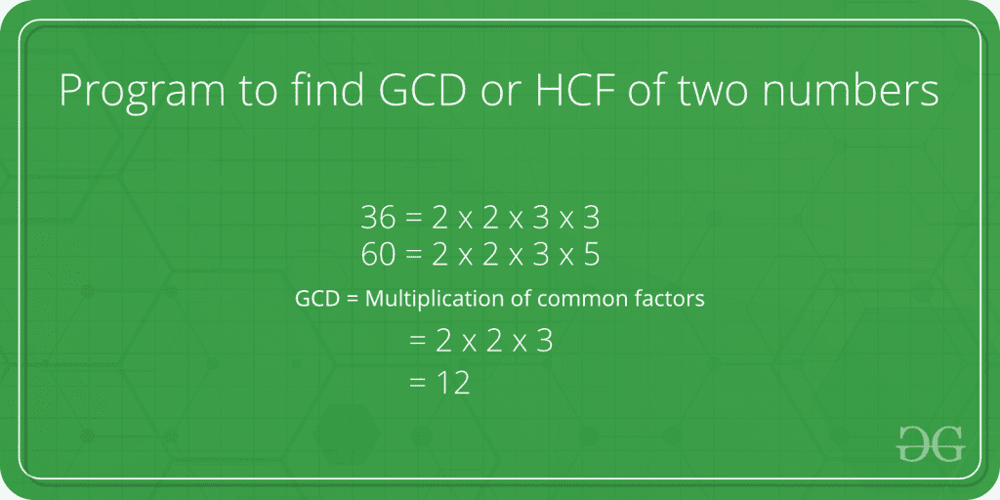

# Java 程序求两个数的 GCD 或 HCF

> 原文:[https://www . geesforgeks . org/Java-program-to-find-gcd-or-hcf-of-two-numbers/](https://www.geeksforgeeks.org/java-program-to-find-gcd-or-hcf-of-two-numbers/)

GCD(即最大公约数)或 HCF(即最高公因数)是可以将两个给定数字相除的最大数字。



**示例:**

```
HCF of 10 and 20 is 10, and HCF of 9 and 21 is 3.
```

因此，首先找出两个指定数字的所有质因数，然后找出两个给定数字中存在的所有质因数的交集。最后，返回相交元素的乘积。

**注意:** *两个规定数字的 GCD* 如果从大的数字中减去小的数字不会改变。

**例 1:**

## Java 语言(一种计算机语言，尤用于创建网站)

```
// Java program to find GCD of two numbers
class GFG {
    // Gcd of x and y using recursive function
    static int GCD(int x, int y)
    {
        // Everything is divisible by 0
        if (x == 0)
            return y;
        if (y == 0)
            return x;

        // Both the numbers are equal
        if (x == y)
            return x;

        // x is greater
        if (x > y)
            return GCD(x - y, y);
        return GCD(x, y - x);
    }

    // The Driver method
    public static void main(String[] args)
    {
        int x = 100, y = 88;
        System.out.println("GCD of " + x + " and " + y
                           + " is " + GCD(x, y));
    }
}
```

**Output**

```
GCD of 100 and 88 is 4

```

同样，你可以找到任意两个给定数字的 GCD 或 HCF。

一个**有效的解决方案**是利用[欧几里德算法](https://www.geeksforgeeks.org/euclidean-algorithms-basic-and-extended/)中的模算子，这是应用于本主题的最重要的算法。

**例 2:**

## Java 语言(一种计算机语言，尤用于创建网站)

```
// Java program to find GCD of two 
// numbers using Euclidean algorithm
class geeksforgeeks {
    // Function to return gcd of x and y
    // recursively
    static int GCD(int x, int y)
    {
        if (y == 0)
            return x;
        return GCD(y, x % y);
    }

    // The Driver code
    public static void main(String[] args)
    {
        int x = 47, y = 91;
        System.out.println("The GCD of " + x + " and " + y
                           + " is: " + GCD(x, y));
    }
}
```

**Output**

```
The GCD of 47 and 91 is: 1

```