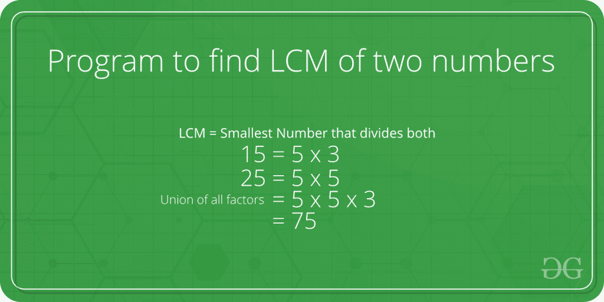

# 寻找两个数 LCM 的 Java 程序

> 原文:[https://www . geesforgeks . org/Java-program-to-find-LCM-of-two-numbers/](https://www.geeksforgeeks.org/java-program-to-find-lcm-of-two-numbers/)

LCM(即最小公倍数)是两个指定数中最大的一个，可以被两个给定数除。



**示例:**

```
LCM of 15 and 25 is 75, and LCM of 3 and 7 is 21.
```

因此，首先找出两个指定数的所有质因数，然后找出两个给定数中存在的所有质因数的并集。最后，返回联合元素的乘积。

下面给出的计算两个数字“u”和“v”的 LCM 的公式给出了一个有效的解决方案。

```
u x v = LCM(u, v) * GCD (u, v)
LCM(u, v) = (u x v) / GCD(u, v)
```

**注:** *GCD* 为最大公约数。

## Java 语言(一种计算机语言，尤用于创建网站)

```
// Java program to find LCM of two numbers.
class gfg {
    // Gcd of u and v using recursive method
    static int GCD(int u, int v)
    {
        if (u == 0)
            return v;
        return GCD(v % u, u);
    }

    // LCM of two numbers
    static int LCM(int u, int v)
    {
        return (u / GCD(u, v)) * v;
    }

    // The Driver method
    public static void main(String[] args)
    {
        int u = 25, v = 15;
        System.out.println("LCM of " + u + " and " + v
                           + " is " + LCM(u, v));
    }
}
```

**Output**

```
LCM of 25 and 15 is 75
```

同样，你可以找到任意两个给定数字的 LCM。