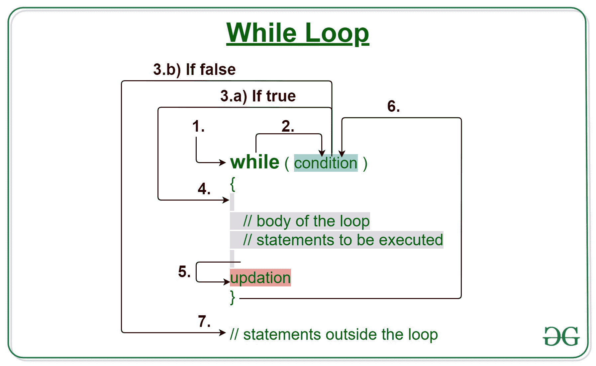

# 使用 While 循环寻找自然数和的 Java 程序

> 原文:[https://www . geesforgeks . org/Java-程序查找自然数之和-使用 while-loop/](https://www.geeksforgeeks.org/java-program-to-find-sum-of-natural-numbers-using-while-loop/)

[当循环](https://www.geeksforgeeks.org/java-while-loop-with-examples/)开始时，事先没有确凿的证据表明一个循环要执行多少次。这是主要原因，因为对要计算的总数没有严格的严格限制。在考虑循环的情况下，通过简单地运行程序，使用遵循硬编码输出的测试条件来显示输出的情况。



**语法:**

```
while (test_expression)
{
   // statements

  update_expression;
}
```

**Sum:** 从‘1’到‘n’的自然数之和可以用数学方法写出来，其中 n 代表用户输入的或待求值的数字个数。利用数学归纳法原理，上述公式等于:

```
1 + 2 + 3 + 4 + 5 + ...+ (n-2) + (n-1) + n = [n(n+1)]/2
```

**说明:**假设要计算 10 个自然数的和，那么通过上面的公式 55 应该是输出。

```
Input      : 5
Processing :  1 + 2 + 3+ 4 + 5 
Output     : 15
```

**方法:**使用While 循环，在 While 语句中将条件作为参数传递，该语句称为“测试条件”。

1.  **测试表达式:**在这个表达式中，我们要测试条件。如果条件评估为真，那么我们将执行循环体并更新表达式。否则，我们将退出 while 循环。
    T3】例: i ≤ 10
2.  **更新表达式**:执行循环体后，该表达式将循环变量递增/递减某个值。
    **例:**i++；

**使用 while 循环求自然数之和的算法:**如下

*   初始化 n=10，sum=0，I = 1；//其中 n 是直到用户想要求和为止的数字
*   如果要处理的自然数满足测试条件，则计算以下步骤，如果失败，则显示当前总和作为最终总和。
*   当测试条件适用于最终总和时，更新当前总和。
*   递增变量以移动到下一个自然数，如果测试条件成立，则更新现有总和。
*   显示总和
*   结束的

**实施:**

## Java 语言(一种计算机语言，尤用于创建网站)

```
// Java program to show sum of natural numbers
// using the while loop

import java.util.*;

class GFG {

    public static void main(String[] args)
    {
        int n = 10, sum = 0, i = 1;

        /* While loop*/

        // Test condition
        while (i <= n) {

            /* Statements to execute */

            // Update the current sum till
            // test condition holds true
            sum = sum + i;

            // Increment the variable counter
            // or jumping to next natural number
            i++;
        }

        // Print the sum
        System.out.println(
            "Sum of natural numbers using while loop is:"
            + " " + sum);
    }
}
```

**Output**

```
Sum of natural numbers using while loop is: 55
```