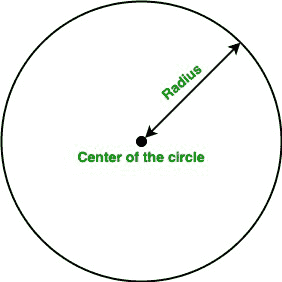

# 给定半径求圆面积的 Java 程序

> 原文:[https://www . geesforgeks . org/Java-program-to-find-给定半径的圆面积/](https://www.geeksforgeeks.org/java-program-to-find-the-area-of-a-circle-given-the-radius/)

一个**圆**是一个简单的形状，由平面上与一个称为圆心的点等距的所有点组成。在这篇文章中，我们将学习如何找到圆的面积。

**术语:**

*   **面积:**表示二维图形或形状在平面上的范围的量称为面积。
*   **半径:**从圆心到圆的任意一点的线段称为半径。
*   **直径:**端点位于圆上并穿过圆心的线段称为圆的直径。它也被称为圆上任意两点之间的最大距离。

**圆的面积**

圆的面积是圆半径的平方和圆周率的乘积。我们可以简单地用下面的公式计算圆的面积:

*   **使用圆的半径:**



**公式:**

> 圆的面积:A = π * r <sup>2</sup>

这里，r 是圆的半径。

> **注:**Java 中 PI 的值是 3.1415926535897

下面是上述方法的实现:

**示例:**

## Java 语言(一种计算机语言，尤用于创建网站)

```
// Java program to find
// the area of the circle

import java.io.*;

class GFG {

    static final double PI = Math.PI;

    // Function to calculate the
    // area of the circle
    static double Area(double r) { return PI * r * r; }

    // Driver code
    public static void main(String[] args)
    {

        // Radius
        double r = 5;

        // Calling Area function
        System.out.println("Area of the circle is :"
                           + Area(r));
    }
}
```

**Output**

```
Area of the circle is :78.53981633974483
```