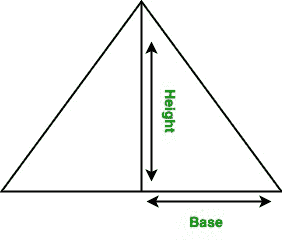
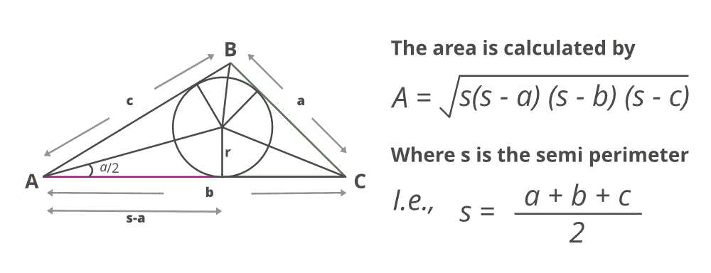

# 寻找三角形面积的 Java 程序

> 原文:[https://www . geesforgeks . org/Java-program-to-find-the-area-of-a-triangle/](https://www.geeksforgeeks.org/java-program-to-find-the-area-of-a-triangle/)

三角形是多边形。它有三条边和三个顶点，每个顶点都有一个角度。它是一个封闭的二维形状。在这篇文章、中我们将学习如何找到三角形的面积。

有两种可能，而T2T4T6 三角形的面积根据情况计算

*   **使用三角形的高度和底部**
*   **使用三角形的 3 条边**

**情况 1:** 当给定三角形的高度和底边时，则三角形的面积为其底边和高度乘积的 的一半。



**公式:**

> 三角形面积:面积=(高×底)/2

**实施例 1:** 使用基底和高度评估面积

## Java 语言(一种计算机语言，尤用于创建网站)

```java
// Java program to find the
// area of the triangle

// Importing java libraries
import java.io.*;

class GFG {

    // Function to calculate the
    // area of the triangle
    static double area(double h, double b)
    {
        // Function returning the value that is
        // area of a triangle
        return (h * b) / 2;
    }

    // Main driver code
    public static void main(String[] args)
    {
        // Custom inputs- height and base values

        // Height of the triangle
        double h = 10;

        // Base of the triangle
        double b = 5;

        // Calling area function and
        // printing value corresponding area
        System.out.println("Area of the triangle: "
                           + area(h, b));
    }
}
```

**输出:**

```java
Area of the triangle: 25.0
```

**情况 2:三角形的三条边给定时**

现在假设我们只知道边，那么上面的公式就不能应用了。面积将使用三角形的尺寸来计算。这个公式俗称  **苍鹭的公式。**



**算法:**

1.  计算三角形的半周长。
2.  具有 3 个值的半米的乘积，其中这些剩余值是从计算的半周长以上的边的差值。
3.  从计算中得到的上述值给出了三角形的面积。

**例 2:**

## Java 语言(一种计算机语言，尤用于创建网站)

```java
// Java program to find the area of
// the triangle using Heron’s formula

// Importing java libraries
import java.io.*;

class GFG {

    // Function to calculate the area where parameters
    // passed are three sides of a triangle
    static float area(float r, float s, float t)
    {
        // Condition check over sides of triangle
        if (r < 0 || s < 0 || t < 0 || (r + s <= t)
            || r + t <= s || s + t <= r)

        // Length of sides must be positive and sum of
        // any two sides must be smaller than third side

        {
            // print message if condition fails
            System.out.println("Not a valid input");
            System.exit(0);
        }

        /*else*/

        // Finding Semi perimeter of the triangle
        // using formula
        float S = (r + s + t) / 2;

        // Finding the area of the triangle
        float A = (float)Math.sqrt(S * (S - r) * (S - s)
                                   * (S - t));

        // return area value
        return A;
    }

    // Main driver code
    public static void main(String[] args)
    {
        // custom inputs of sides of values

        // Sides of the triangle
        float r = 5.0f;
        float s = 6.0f;
        float t = 7.0f;

        // Calling area function and
        // printing the area of triangle
        System.out.println("Area of the triangle: "
                           + area(r, s, t));
    }
}
```

**输出:**

```java
Area of the triangle: 14.6969385
```