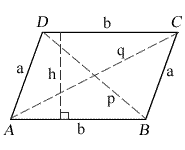

# 求平行四边形面积的 Java 程序

> 原文:[https://www . geeksforgeeks . org/Java-程序查找平行四边形面积/](https://www.geeksforgeeks.org/java-program-to-find-the-area-of-parallelogram/)

一个[平行四边形](https://en.wikipedia.org/wiki/Parallelogram)是一种特殊类型的四边形，它有相等且平行的对边。平行四边形的对角线以 90 度平分。图形的面积可以在几何图形中定义为平面形状所占据的空间。图形的面积是覆盖封闭图形表面的单位正方形的数量。利用它的底部和高度，可以计算出平行四边形的面积。除此之外，如果已知平行边的长度以及边之间的任何角度，也可以计算平行四边形的面积。



**方法 1:使用边的平行四边形区域。**

假设 a 和 b 是平行四边形平行边的集合，h 是高度，那么根据边的长度和高度，它的面积公式如下:

> 面积=底部×高度
> 
> 面积= b × h

**示例:**

```java
Input : base = 4, height = 6
Output: area = 24

Input : base = 10, height = 15
Output: area = 150
```

**进场:**

1.  取两个输入作为平行四边形的底和高。
2.  应用平行四边形面积公式计算面积。
3.  打印区域。

下面是上述方法的实现:

## Java 语言(一种计算机语言，尤用于创建网站)

```java
// Java Program to Find the Area of Parallelogram

import java.io.*;

class GFG {
    public static void main(String[] args)
    {
        double base = 30.00;
        double height = 40.25;

        // formula for calculating the area
        double area_parallelogram = base * height;

        // displaying the area
        System.out.println("Area of the parallelogram = "
                           + area_parallelogram);
    }
}
```

**Output**

```java
Area of the parallelogram = 1207.5
```

**方法 2:无高度的平行四边形面积。**

如果我们不知道平行四边形的高度，那么我们可以用三角学的概念来求面积。

> 面积= ab sina_x)

其中 a 和 b 是平行边的长度，x 是平行四边形边之间的角度。

**示例:**

```java
Input : length = 4, breadth = 6, angle(in degrees) = 30
Output: area = 11.999999999999998

Input : length = 5, breadth = 8, angle(in degrees) = 45
Output: area = 28.2842712474619
```

**进场:**

1.  取三个输入作为平行四边形的边长、宽度和边间的角度。
2.  应用梯形面积公式计算面积。
3.  打印区域。

下面是上述方法的实现:

## Java 语言(一种计算机语言，尤用于创建网站)

```java
// Java Program to Find the Area of Parallelogram

import java.io.*;

    class GFG {
    public static void main(String[] args)
    {
        double length = 10.00;
        double breadth = 16.00;
        int angle = 60;
        double sin_x = Math.sin(Math.toRadians(angle));

        // formula for calculating the area
        double area_parallelogram
            = length * breadth * sin_x;

        // displaying the area
        System.out.println("Area of the parallelogram = "
                           + area_parallelogram);
    }
}
```

**Output**

```java
Area of the parallelogram = 138.56406460551017
```