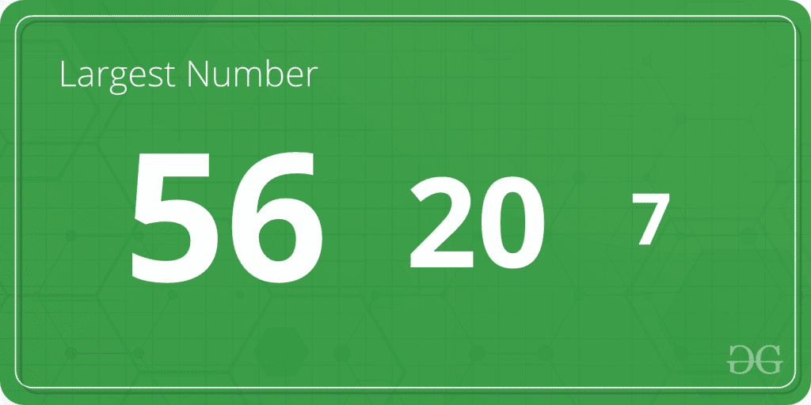
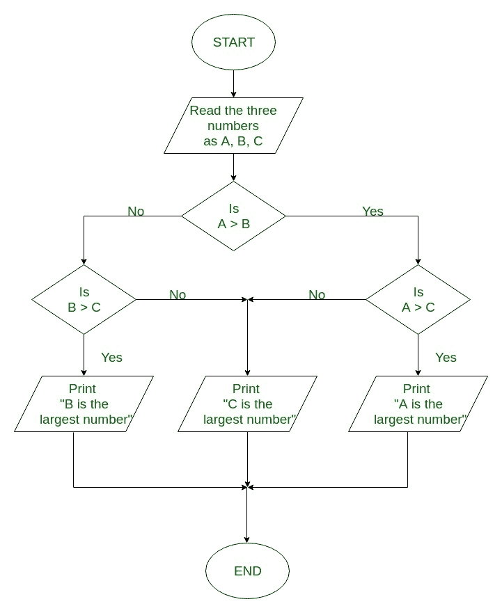

# Java 程序求三个数中最大的

> 原文:[https://www . geesforgeks . org/Java-program-to-find-三个数字中最大的/](https://www.geeksforgeeks.org/java-program-to-find-the-largest-of-three-numbers/)

**问题陈述:**给定三个数字 x、y 和 z，目的是得到这三个数字中最大的一个。



**示例:**

```
Input: x = 7, y = 20, z = 56
Output: 56                    // value stored in variable z
```

**3 个数字中最大值的流程图:**



**求三个数中最大值的算法:**

```
1\. Start
2\. Read the three numbers to be compared, as A, B and C
3\. Check if A is greater than B.

  3.1 If true, then check if A is greater than C
         If true, print 'A' as the greatest number
          If false, print 'C' as the greatest number

  3.2 If false, then check if B is greater than C
        If true, print 'B' as the greatest number
        If false, print 'C' as the greatest number
4\. End
```

**接近:**

*   **使用三元运算符**
*   **使用 if-else**

**方法 1:** **使用三元运算符**

条件运算符的语法:

```
ans = (conditional expression) ? execute if true : execute if false
```

*   如果条件为真，则在冒号前执行语句
*   如果条件为假，那么在冒号 so 之后执行一个语句

```
largest = z > (x>y ? x:y) ? z:((x>y) ? x:y);
```

插图:

```
x = 5, y= 10, z = 3

largest  = 3>(5>10 ? 5:10) ? 3: ((5>10) ? 5:10);
largest  = 3>10 ? 3 : 10
largest  = 10
```

## Java 语言(一种计算机语言，尤用于创建网站)

```
// Java Program to Find the Biggest of 3 Numbers

// Importing generic Classes/Files
import java.io.*;

class GFG {

    // Function to find the biggest of three numbers
    static int biggestOfThree(int x, int y, int z)
    {

        return z > (x > y ? x : y) ? z : ((x > y) ? x : y);
    }

    // Main driver function
    public static void main(String[] args)
    {

        // Declaring variables for 3 numbers
        int a, b, c;

        // Variable holding the largest number
        int largest;
        a = 5;
        b = 10;
        c = 3;
        // Calling the above function in main
        largest = biggestOfThree(a, b, c);

        // Printing the largest number
        System.out.println(largest
                           + " is the largest number.");
    }
}
```

**Output**

```
10 is the largest number.
```