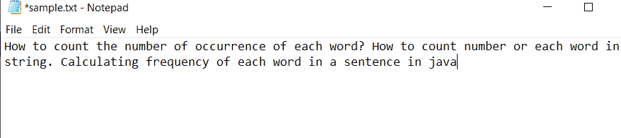
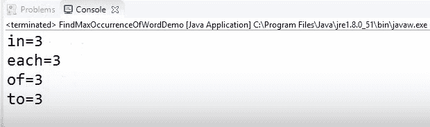

# 查找文本文件中重复次数最多的单词的 Java 程序

> 原文:[https://www . geesforgeks . org/Java-program-to-find-在文本文件中重复最多的单词/](https://www.geeksforgeeks.org/java-program-to-find-the-most-repeated-word-in-a-text-file/)

[*地图*](https://www.geeksforgeeks.org/java-util-hashmap-in-java/) 和 [*地图。*将使用输入界面](https://www.geeksforgeeks.org/map-entry-interface-java-example/)，因为映射界面将唯一键映射到值。键是用于在以后检索值的对象。地图。入口界面使您能够使用地图入口。此外，我们将使用 HashMap 类来存储“键/值”对中的项目，并通过另一种类型的索引来访问它们。

插图:

> 假设示例文本文件的内容如下:
> 
> **输入:**包含任意单词序列的文本文件
> 
> “如何统计每个单词的出现次数？如何计数字符串中的数字或每个单词？用 java 计算一个句子中每个单词的出现频率。
> 
> **输出:**出现次数最多的单词列表
> 
> ```
> in = 3
> each = 3
> of = 3
> to = 3
> ```

**实现:**样本文件输入图像如下:



**例**

## Java 语言(一种计算机语言，尤用于创建网站)

```
// Java Program to Find the
// Most Repeated Word in a Text File

// Importing File classes
import java.io.File;
import java.io.FileNotFoundException;
// Importing Map and HashMap class from
// java.util package
import java.util.HashMap;
import java.util.Map;
import java.util.Map.Entry;
// Importing Scanne class to
// take input from the user
import java.util.Scanner;

// Class
// To find maximum occurrences
public class GFG {

    // Method 1 - getWords()
    // Reading out words from the file and
    // maping key value pair corresponding to
    // each different word
    static void getWords(String fileName,
                         Map<String, Integer> words)
        throws FileNotFoundException
    {
        // Creating a Scanner class object
        Scanner file = new Scanner(new File(fileName));

        // Condition check using hasNext() method which
        // holds true till there is word being read from the
        // file.
      // As the end of file content,condition violates
        while (file.hasNext()) {

            // Reading word using next() method
            String word = file.next();

            // Frequency count variable
            Integer count = words.get(word);

            // If the same word is repeating
            if (count != null) {

                // Incrementing corresponding count by unity
                // every time it repeats
              // while reading from the file
                count++;
            }
            else

                // If word never occurred after occurring
                // once, set count as unity
                count = 1;
            words.put(word, count);
        }

        // Close the file and free up the resources
        file.close();
    }

    // Method 2 - getMaxOccurrence()
    // To get maximum occurred Word
    static int getMaxOccurance(Map<String, Integer> words)
    {
        // Initially set maximum count as unity
        int max = 1;

        // Iterating over above Map using for-each loop
        for (Entry<String, Integer> word :
             words.entrySet()) {

            // Condition check
            // Update current max value  with the value
            // exceeding unity in Map while traversing
            if (word.getValue() > max) {
                max = word.getValue();
            }
        }

        // Return the maximum value from the Map
        return max;
    }

    // Method 3
    // Main driver method
    public static void main(String[] args)
        throws FileNotFoundException
    {
        // Creating an object of type Map
        // Declaring object of String and Integer types
        Map<String, Integer> words
            = new HashMap<String, Integer>();

        // Retrieving the path as parameter to Method1()
        // above to get the file to be read
        getWords("C:\\Users\\dell\\sample.txt", words);

        // Variable holding the maximum
        // repeated word count in a file
        int max = getMaxOccurance(words);

        // Traversing using fo-each loop
        // Creating a set out of same elements
        // contained in a HashMap
        for (Entry<String, Integer> word :
             words.entrySet()) {

            // Comparing values using geValue() method
            if (word.getValue() == max) {

                // Print and display word-count pair
                System.out.println(word);
            }
        }
    }
```

**输出:**

