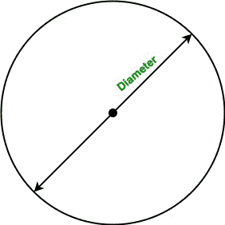

# 寻找圆周长的 Java 程序

> 原文:[https://www . geesforgeks . org/Java-program-to-find-a-circle-of-a-circle/](https://www.geeksforgeeks.org/java-program-to-find-the-perimeter-of-a-circle/)

一个**圆**是一个简单的形状，由平面上与一个称为圆心的点等距的所有点组成。在这篇文章中，我们将学习如何找到圆的面积。

**术语:**

*   **周长:**一个测量量或圆的边界。它基本上是一个封闭图形周围的距离。
*   **半径:**从圆心到圆的任意一点的线段称为半径。
*   **直径:**端点位于圆上并穿过圆心的线段称为圆的直径。它也被称为圆上任意两点之间的最大距离。

**圆的周长:**

*   **使用圆的半径:**


**公式:**

> 圆的周长:P =2 * π * r

这里，r 是圆的半径。

*   **使用圆的直径:**



**公式:**

> 圆的周长:A = π * d

**注:**Java 中 PI 的值是 3.1415926535897

**例 1:**

## Java 语言(一种计算机语言，尤用于创建网站)

```java
// Java program to find
// the perimeter of the circle
// using radius

import java.io.*;

class GFG {

    static final double PI = Math.PI;

    // Function to calculate the
    // perimeter of the circle
    static double Perimeter(double r) 
    { 
      return 2 * PI * r; 
    }

    // Driver code
    public static void main(String[] args)
    {

        // Radius
        double r = 5;

        // Calling Perimeter function
        System.out.println("Perimeter of the circle is :"
                           + Perimeter(r));
    }
}
```

**Output**

```java
Perimeter of the circle is :31.41592653589793

```

**例 2:**

## Java 语言(一种计算机语言，尤用于创建网站)

```java
// Java program to find
// the area of the circle
// Using Diameter

import java.io.*;

class GFG {

    static final double PI = Math.PI;

    // Function to calculate the
    // perimeter of the circle
    // using Diameter
    static double Perimeter(double D)
    {
        return PI * D;
    }

    // Driver code
    public static void main(String[] args)
    {

        // Diameter
        double D = 20;

        // Calling Perimeter function
        System.out.println("Perimeter of the circle is :"
                           + Perimeter(D));
    }
}
```

**Output**

```java
Perimeter of the circle is :62.83185307179586

```