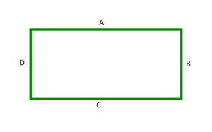

# 寻找矩形周长的 Java 程序

> 原文:[https://www . geeksforgeeks . org/Java-program-to-find-a-period-of-a-a-rectangle/](https://www.geeksforgeeks.org/java-program-to-find-the-perimeter-of-a-rectangle/)

A **矩形**是四个直角(90°)的四边形。在矩形中，相对的边是相等的。四边相等的长方形叫做**正方形**。矩形也可以称为直角平行四边形。



矩形

在上面的矩形中，边 **A** 和 **C** 相等，边 **B** 和 **D** 相等。

矩形的**周长**是其所有四条边的总长度。它可以简单地用它的四个边来计算。

```java
Perimeter of rectangle ABCD = A+B+C+D
```

由于矩形中相对的边相等，它可以计算为其一边的两倍和其相邻边的两倍之和。

```java
Perimeter of rectangle ABCD = 2A + 2B = 2(A+B)
```

**程序**

## Java 语言(一种计算机语言，尤用于创建网站)

```java
// Java program to find the perimeter of a Rectangle

import java.io.*;

class GFG {

    // Method to calculate the perimeter of the rectangle
    // with given length and breadth
    static void perimeter(int length, int breadth)
    {
        // Calculate the 'perimeter' using the formula
        int perimeter = 2 * (length + breadth);

        System.out.println("The perimeter of the given rectangle of length "
            + length + " and breadth " + breadth + " = "
            + perimeter);
    }

    // Driver method
    public static void main(String[] args)
    {
        // Initialize a variable length that stores length of
        // the given rectangle
        int length = 10;

        // Initialize a variable breadth that stores breadth
        // of the given rectangle
        int breadth = 20;

        // Call the perimeter method on these length and
        // breadth
        perimeter(length, breadth);
    }
}
```

**Output**

```java
The perimeter of the given rectangle of length 10 and breadth 20 = 60
```