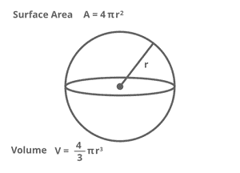

# Java 程序求球体体积和表面积

> 原文:[https://www . geesforgeks . org/Java-program-to-find-volume-and-surface-area-of-sphere/](https://www.geeksforgeeks.org/java-program-to-find-the-volume-and-surface-area-of-sphere/)

球体是三维空间中的几何对象，是球的表面。球体在数学上被定义为一组点，这些点在三维空间中距离给定点的半径相同。



**示例:**

```
Input:     radius = 5
Output:    Surface Area ≈ 314.16
           Volume ≈ 523.6

Input :    radius = 3
Output:    Surface Area ≈ 113.1
           Volume ≈ 113.1
```

> 球体的表面积= 4*3.14*(r*r)
> 
> 球体的体积= (4/3)*3.14*(r*r*r)

**<u>算法</u>**

1.  r 的初始值为 5.0，表面积为 0.0，体积为 0.0
2.  使用以下公式计算球体的表面积和体积
3.  表面积=4*3.14(r*r)
4.  体积=(4/3)3.14(r*r*r)
5.  显示表面积和体积

**<u>执行:</u>**

## Java 语言(一种计算机语言，尤用于创建网站)

```
// Java Program to Find the Volume and Surface Area of
// Sphere
class surfaceareaandvolume {
    public static void main(String[] args)
    {
        double r = 5.0, surfacearea = 0.0, volume = 0.0;
        surfacearea = 4 * 3.14 * (r * r);
        volume = ((double)4 / 3) * 3.14 * (r * r * r);

        System.out.println("surfacearea of sphere ="
                           + surfacearea);

        System.out.println("volume of sphere =" + volume);
    }
}
```

**Output**

```
surfacearea of sphere =314.0
volume of sphere =523.3333333333334
```

**时间复杂度:** O(1)

**空间复杂度:** O(1)