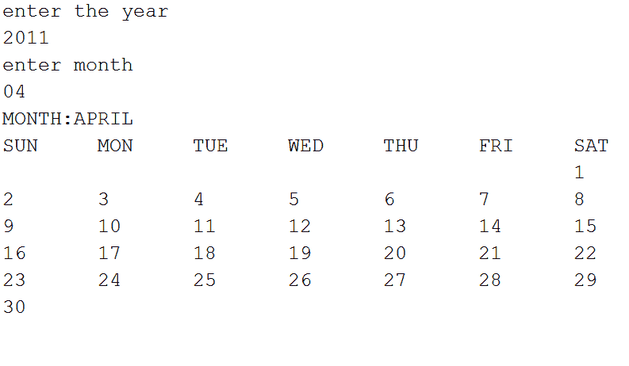
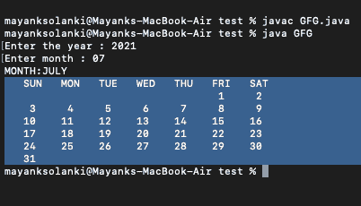

# Java 程序生成无日历的任意年份日历. get()函数

> 原文:[https://www . geesforgeks . org/Java-无日历获取功能的任意年份日历生成程序/](https://www.geeksforgeeks.org/java-program-to-generate-calendar-of-any-year-without-calendar-get-function/)

Java 程序用于生成任何期望的年和月的日历，让我们首先通过一个插图**定额**，然后再进入逻辑和程序部分。

> 插图:
> 
> 假设用户想要获得 2011 年 4 月的日历。然后，他需要输入整数形式的年份和月份，输出将以适当的格式返回相应年份的月份日历。



**程序:**

**第一步:**以年和月作为用户的整数输入

**步骤 2:** 按照适当的顺序，创建 2 个数组，一个用于存储天数，另一个用于存储月数。

```java
String day[]   = { "SUN","MON","TUE","WED","THU","FRI","SAT" } ;  
String month[] = { "JANUARY","FEBRUARY","MARCH","APRIL","MAY","JUNE","JULY","AUGUST","SEPTEMBER","OCTOBER","NOVEMBER","DECEMBER" } ; 
```

**第 3 步:**初始化一个计数器变量和三个变量，日、月和年各为 1，以及一个单独的数组，用于存储可以找到月份的不同天数组合。31，30，29

```java
int ar[] = { 31,29,31,30,31,30,31,31,30,31,30,31 } ;
```

**第 4 步:**检查闰年条件，重新初始化上述数组的值。

```java
if(y%4==0&&y%100!=0||y%100==0)
ar[1]=29;                       // if the year is a leap year then store 29 for the month of february
else  
ar[1]=28;                       // else 28 
```

**步骤 5:** 当月计数达到 12 时增加年计数，当日计数达到大于相应索引的数组中的值时增加月计数

**第 6 步:**打印结果。

**实施:**

**例**

## Java 语言(一种计算机语言，尤用于创建网站)

```java
// Java Program to Generate Desired Calendar
// Without calendar.get() function or
// Inputting the Year and the Month

// Importing required classes
import java.io.*;
import java.util.Scanner;

// Main class
public class GFG {

    // Main driver method
    public static void main(String a[])
    {

        // Reading input by creating object of Scanner class
        Scanner sc = new Scanner(System.in);

        // Display message only
        System.out.print("Enter the year : ");

        // Reading integer input value
        int yy = sc.nextInt();

        // Display message only
        System.out.print("Enter month : ");

        // Reading integer input value
        int mm = sc.nextInt();

        int d = 1;
        int m = 1;
        int y = 1;
        int dy = 1;

        // Storing data and months as input
        String day[] = { "SUN", "MON", "TUE", "WED",
                         "THU", "FRI", "SAT" };
        String month[]
            = { "JANUARY", "FEBRUARY", "MARCH",
                "APRIL",   "MAY",      "JUNE",
                "JULY",    "AUGUST",   "SEPTEMBER",
                "OCTOBER", "NOVEMBER", "DECEMBER" };

        // Custom array as input
        int ar[] = { 31, 29, 31, 30, 31, 30,
                     31, 31, 30, 31, 30, 31 };

        // Till condition holds true
        while (true) {

            if (d == 1 && m == mm && y == yy) {
                break;
            }

            if (y % 4 == 0 && y % 100 != 0
                || y % 100 == 0) {
                ar[1] = 29;
            }

            else {
                ar[1] = 28;
            }
            dy++;
            d++;

            if (d > ar[m - 1]) {
                m++;
                d = 1;
            }

            if (m > 12) {
                m = 1;
                y++;
            }

            if (dy == 7) {
                dy = 0;
            }
        }

        int c = dy;

        if (y % 4 == 0 && y % 100 != 0 || y % 400 == 0) {
            ar[1] = 29;
        }
        else {
            ar[1] = 28;
        }

        // Print the desired month of input year
        System.out.println("MONTH:" + month[mm - 1]);

        for (int k = 0; k < 7; k++) {
            System.out.print("   " + day[k]);
        }

        System.out.println();

        for (int j = 1; j <= (ar[mm - 1] + dy); j++) {
            if (j > 6) {
                dy = dy % 6;
            }
        }

        int spaces = dy;
        if (spaces < 0)
            spaces = 6;

        // Printing the calendar
        for (int i = 0; i < spaces; i++)
            System.out.print("      ");
        for (int i = 1; i <= ar[mm - 1]; i++) {
            System.out.printf(" %4d ", i);

            if (((i + spaces) % 7 == 0)
                || (i == ar[mm - 1]))
                System.out.println();
        }
    }
}
```

**输出:**

