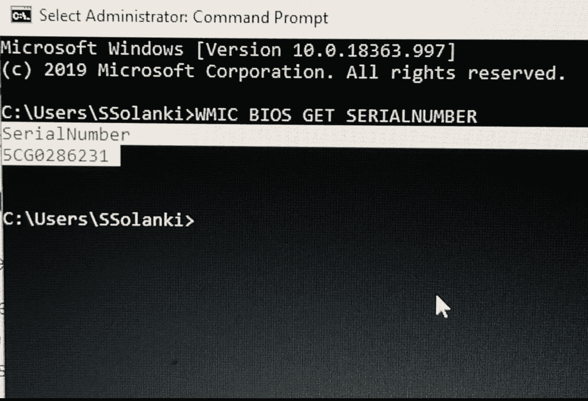
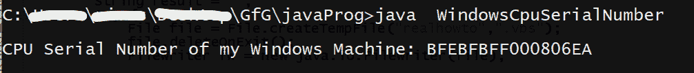
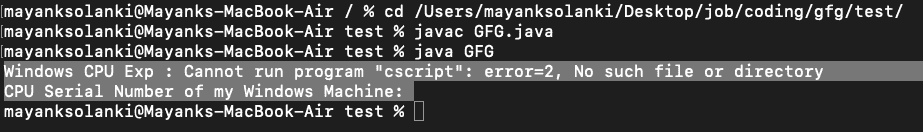

# 获取 Windows 机器 CPU 序列号的 Java 程序

> 原文:[https://www . geesforgeks . org/Java-program-to-get-CPU-serial-number-for-windows-machine/](https://www.geeksforgeeks.org/java-program-to-get-cpu-serial-number-for-windows-machine/)

**CPU 序列号**(或**处理器序列号**)是一个软件可读的唯一序列号，英特尔已将其压印到奔腾 3 微处理器中。英特尔将此作为一项功能提供，可选择用于提供某些网络管理和电子商务优势。基本上，它让程序识别个人电脑。

我们可以通过两种方式获得 Windows 机器的 CPU 序列号:

1.  通过在 Windows PowerShell 上运行该命令。
2.  在 java 中使用 FileWriter 类

**方式一:**运行 [PowerShell 命令](https://www.geeksforgeeks.org/linux-vs-windows-commands/)

这是一种类似于我们所说的在苹果电脑终端上运行命令的方式。对于 windows，它是 CMD，我们在下面有一个一行预定义的命令。你只需要把它写成城市或从这里复制，如下所示:

**语法:**

```
WMIC BIOS GET SERIALNUMBER 
```



将出现这个弹出窗口，让我们显示 windows 机器的 CPU 序列号。

**方式二:** [使用 FileWriter 类](https://www.geeksforgeeks.org/filewriter-class-in-java/)

**Java FileWriter** 类的 java.io 包用于将**字符形式的数据写入**文件。

*   这个类继承自 [OutputStreamWriter 类](https://www.geeksforgeeks.org/java-io-outputstreamwriter-class-methods/)，后者又继承自 Writer 类。
*   这个类的构造函数假设默认字符编码和默认字节缓冲区大小是可以接受的。要自己指定这些值，请在[文件输出流](https://www.geeksforgeeks.org/fileoutputstream-in-java/)上构建一个输出流编写器。
*   FileWriter 用于编写字符流。要写入原始字节流，请考虑使用文件输出流。
*   如果输出文件尚不存在，则 FileWriter 会创建输出文件。

**例**

## Java 语言(一种计算机语言，尤用于创建网站)

```
// Java Program to get CPU Serial Number of Windows Machine
// using FileWriter class

// Importing required classes
import java.io.BufferedReader;
import java.io.File;
import java.io.FileWriter;
import java.io.InputStreamReader;

// Main class
// WindowsCpuSerialNumber
public class GFG {

    // Method 1
    // To get CPU serial number
    private static String getWindowsCPU_SerialNumber()
    {

        // Initially declaring and initializing an empty
        // string
        String result = "";

        // Try block to check for exceptions
        try {

            // Creating an object of File class
            File file
                = File.createTempFile("realhowto", ".vbs");

            // Deleting file while exiting
            file.deleteOnExit();

            // Creating an object of FileWriter class to
            // write on
            FileWriter fw = new java.io.FileWriter(file);

            // Remember the command
            String vbs1
                = "Set objWMIService = GetObject(\"winmgmts:\\\\.\\root\\cimv2\")\n"
                  + "Set colItems = objWMIService.ExecQuery _ \n"
                  + "   (\"Select * from Win32_Processor\") \n"
                  + "For Each objItem in colItems \n"
                  + "    Wscript.Echo objItem.ProcessorId \n"
                  + "    exit for  ' do the first cpu only! \n"
                  + "Next \n";

            // Writing on file
            fw.write(vbs1);

            // Closing all file connections to
            // release memory spaces
            fw.close();

            Process p = Runtime.getRuntime().exec(
                "cscript //NoLogo " + file.getPath());

            BufferedReader input = new BufferedReader(
                new InputStreamReader(p.getInputStream()));

            String line;

            while ((line = input.readLine()) != null) {
                result += line;
            }

            input.close();
        }

        // Catch block to handle the exceptions
        catch (Exception E) {

            // Print the exception along with the message
            System.err.println("Windows CPU Exp : "
                               + E.getMessage());
        }

        return result.trim();
    }

    // Method 2
    // Main driver method
    public static void main(String[] args)
    {

        String cpuSerialNumber
            = getWindowsCPU_SerialNumber();

        // Calling the method1 to retrieve CPU serial number
        // and printing the same
        System.out.println(
            "CPU Serial Number of my Windows Machine: "
            + cpuSerialNumber);
    }
}
```

**输出:**

下面是在文件编写器类的帮助下在 Windows 机器上运行时的硬编码输出。



> **注意:**除此之外，如果这些程序是特定于窗口的，不应该在其他操作系统上运行。方法 1 不起作用，对于方法 2，如果在 Mac 上输出如下，则上述方法是通过 FileWriter 类实现的。这是因为“cscript”不能在终端上运行。

