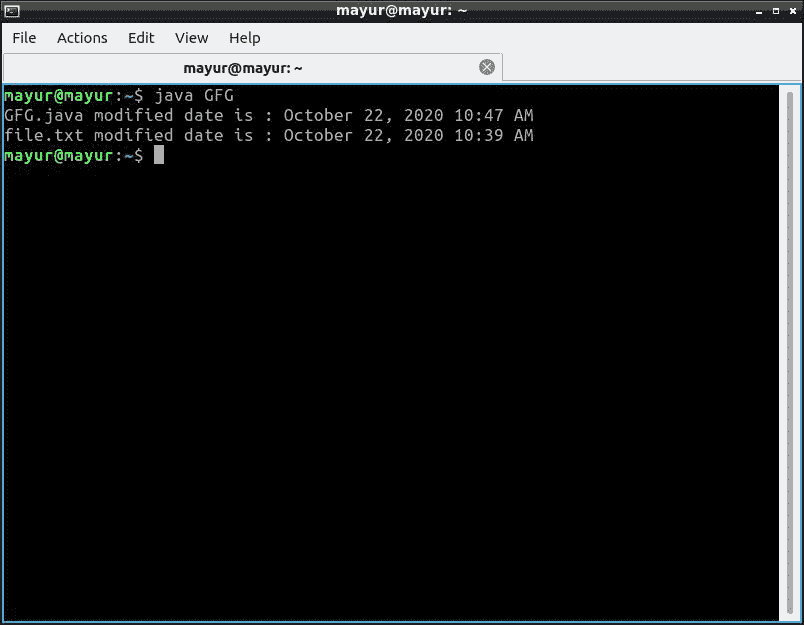

# 获取文件最后修改日期的 Java 程序

> 原文:[https://www . geesforgeks . org/Java-程序获取文件最后修改日期/](https://www.geeksforgeeks.org/java-program-to-get-last-modification-date-of-a-file/)

文件的最后修改日期可以使用 Java 的**文件**类即**文件通过 Java 获取。**方法**。**

**Java 文件类**

[文件类是 Java 对文件或目录路径名的](https://www.geeksforgeeks.org/file-class-in-java/)表示。文件类包含几种方法，用于处理路径名、删除和重命名文件、创建新目录、列出目录内容以及确定文件和目录的几种常见属性。

**lastModified()方法:**

java.io 包中名为 File 的类代表了系统中的文件和目录。这个类提供了对文件和目录进行操作的各种方法。它包含一个名为 *lastModified()* 的方法，该方法以长毫秒纪元值的形式返回文件或目录的最后修改日期，可以使用 SimpleDateFormat 类的 *format()* 方法使其可读。输出可以使用[简单日期格式](https://www.geeksforgeeks.org/java-simpledateformat-set-1/)类以任何期望的格式显示。这个方法可以在所有的 Java 版本中使用。 *lastModified()* 如果文件不存在，方法返回 0l。 *0* l 表示长型的数字零。它使用*这个构造函数*来实例化一个日期，该日期指的是“纪元”之后的零毫秒，即 1970 年 1 月 1 日，格林尼治时间 00:00:00 或 IST 时间 1970 年 1 月 1 日凌晨 05:30。

**功能签名:**

```
public long lastModified()

```

**现在要获取文件的最后修改日期，请按照给定的步骤操作。**

1.  首先，使用 SimpleDateFormat("mm/dd/yyyy ")构造函数创建一个新的 SimpleDateFormat 类实例。
2.  然后，用“mm/dd/yyyy”格式构造一个 String 对象。
3.  使用 SimpleDateFormat 类的 parse(String)方法，用我们创建的字符串的日期值创建一个新的 Date 对象。
4.  最后，使用文件。方法来设置我们文件的新的“上次修改”日期。

**注意:程序不在在线 IDE 中运行。请使用离线 IDE，然后设置文件的路径**。

## Java 语言(一种计算机语言，尤用于创建网站)

```
// Java program to demonstrate
// last modified time of a file
// using lastModified() method
import java.io.File;
import java.text.DateFormat;
import java.text.SimpleDateFormat;

class GFG {

    public static void main(String[] args)
    {
        // Creating two instances of file class
        // file1.txt exists in the system
        File file1 = new File("/home/mayur/GFG.java");

        // file2.txt does not exist in the system
        File file2 = new File("/home/mayur/file.txt");

        // last modified returns date in milliseconds
        long time1 = file1.lastModified();
        long time2 = file2.lastModified();

        // Convert milliseconds into readable date time
        // format any desirable format can be achived using
        // SimpleDateFormat
        DateFormat sdf
            = new SimpleDateFormat("MMMM dd, yyyy hh:mm a");

        System.out.println("GFG.java modified date is : "
                           + sdf.format(time1));

        System.out.println("file.txt modified date is : "
                           + sdf.format(time2));
    }
}
```

**输出:**



文件 1 存在于系统中，而文件 2 不在系统中。因此，在文件 2 的情况下，返回 *0l* ，而在文件 1 的情况下，返回最后修改的日期。