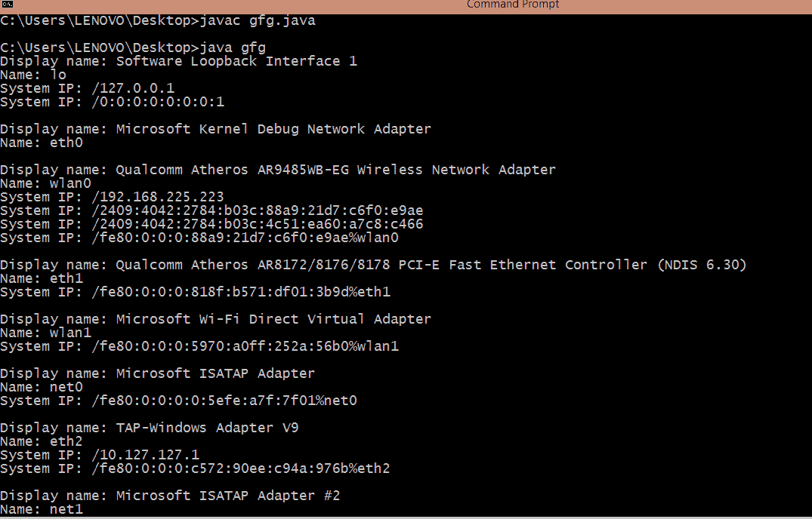
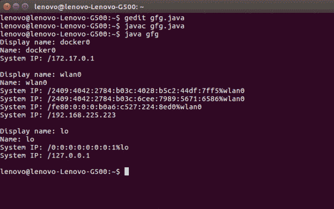

# 在 Windows 和 Linux 机器中获取系统 IP 地址的 Java 程序

> 原文:[https://www . geesforgeks . org/Java-program-to-get-system-IP-address-in-windows-and-Linux-machine/](https://www.geeksforgeeks.org/java-program-to-get-system-ip-address-in-windows-and-linux-machine/)

**IP 地址:**互联网协议地址是分配给连接到使用互联网协议进行通信的计算机网络的每个设备的数字标签。

**使用的包装:**

1.  [**io(输入输出)** :](https://www.geeksforgeeks.org/java-io-packag/) 这个包通过数据流、序列化和文件系统提供系统输入和输出。
2.  [**网络(网络)** :](https://www.geeksforgeeks.org/java-net-networkinterface-class-java/) 这个包提供了实现网络应用的类。
3.  [**util (utility)** :](https://www.geeksforgeeks.org/java-util-package-java/) 它包含收集框架、遗留收集类、事件模型、日期和时间设施、国际化和杂项实用程序类

**使用的方法:**

**1 .getinetddress()**

**语法:**

```java
public Enumeration getInetAddresses()
```

**返回类型:**返回一个 InetAddress 的枚举。

**2 .getInterfaceAddresses()**

**语法:**

```java
public List getInterfaceAddresses()
```

**返回类型:**它返回一个 java.net.InterfaceAddress 实例列表。

下面是问题陈述的实现:

## Java 语言(一种计算机语言，尤用于创建网站)

```java
// Java Program to Get System IP Address
// in Windows and Linux Machine
import static java.lang.System.out;

import java.io.*;
import java.net.*;
import java.util.*;

public class gfg {
    public static void main(String args[]) // main method
        throws SocketException
    {
        // fetching network interface
        Enumeration<NetworkInterface> nets
            = NetworkInterface.getNetworkInterfaces();

        for (NetworkInterface netint :
             Collections.list(nets))
            displayInterfaceInformation(netint);
    }

    // Display Internet Information method
    static void
    displayInterfaceInformation(NetworkInterface netint)
        throws SocketException
    {
        out.printf("Display name: %s\n",
                   netint.getDisplayName());
        out.printf("Name: %s\n", netint.getName());
        Enumeration<InetAddress> inetAddresses
            = netint.getInetAddresses();
        // Output System IP
        for (InetAddress inetAddress :
             Collections.list(inetAddresses)) {
            out.printf("System IP: %s\n", inetAddress);
        }
        out.printf("\n");
    }
}
```

**Output**

```java
Display name: eth0
Name: eth0

Display name: lo
Name: lo
System IP: /127.0.0.1
```

**窗口输出:**



**Linux 中的输出:**

