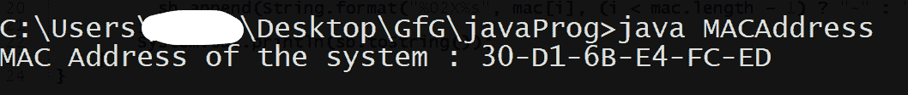
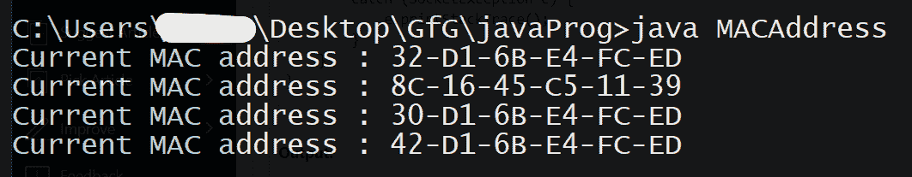

# 获取 Windows 和 Linux 机器系统 MAC 地址的 Java 程序

> 原文:[https://www . geesforgeks . org/Java-program-to-get-system-MAC-address-of-windows-and-Linux-machine/](https://www.geeksforgeeks.org/java-program-to-get-system-mac-address-of-windows-and-linux-machine/)

**媒体访问控制地址(MAC 地址)**是分配给**网络接口控制器(NIC)** 的唯一十六进制标识符，用作网段内通信的网络地址。这种用法在大多数 IEEE 802 网络技术中很常见，包括以太网、无线网络和蓝牙。在**开放系统互连(OSI)** 网络模型中，媒体访问控制地址用于数据链路层的媒体访问控制协议子层。通常，媒体访问控制地址可以识别为六组两个十六进制数字，由连字符、冒号分隔，或者没有分隔符。

媒体访问控制地址主要由设备制造商分配，因此通常被称为内置地址，或以太网硬件地址、硬件地址或物理地址。


**例 1**

## Java 语言(一种计算机语言，尤用于创建网站)

```java
// Java program to access the MAC address of the
// localhost machine
import java.net.InetAddress;
import java.net.NetworkInterface;
import java.net.SocketException;
import java.net.UnknownHostException;
import java.util.Enumeration;
public class MACAddress {

    // method to get the MAC Address
    void getMAC(InetAddress addr) throws SocketException
    {
        // create a variable of type NetworkInterface and
        // assign it with the value returned by the
        // getByInetAddress() method
        NetworkInterface iface
            = NetworkInterface.getByInetAddress(addr);

        // create a byte array and store the value returned
        // by the NetworkInterface.getHardwareAddress()
        // method
        byte[] mac = iface.getHardwareAddress();

        // convert the obtained byte array into a printable
        // String
        StringBuilder sb = new StringBuilder();
        for (int i = 0; i < mac.length; i++) {
            sb.append(String.format(
                "%02X%s", mac[i],
                (i < mac.length - 1) ? "-" : ""));
        }

        // print the final String containing the MAC Address
        System.out.println(sb.toString());
    }

    // Driver method
    public static void main(String[] args) throws Exception
    {
        // a variable of type InetAddress to store the
        // address of the local host
        InetAddress addr = InetAddress.getLocalHost();

        // instantiate the MACAddress class
        MACAddress obj = new MACAddress();
        System.out.print("MAC Address of the system : ");

        // call the getMAC() method on the current object
        // passing the localhost address as the parameter
        obj.getMAC(addr);
    }
}
```

**输出**



**示例 2(** *当设备有多个 MAC 地址时* **)**

## Java 语言(一种计算机语言，尤用于创建网站)

```java
// Java program to access all the MAC addresses of the
// localhost machine

import java.net.InetAddress;
import java.net.NetworkInterface;
import java.net.SocketException;
import java.net.UnknownHostException;
import java.util.Enumeration;
public class MACAddress {
    public static void main(String[] args) throws Exception
    {
        // instantiate the MACAddress class
        MACAddress obj = new MACAddress();

        // call the getMAC() method on the current object
        // passing the localhost address as the parameter
        obj.getMAC();
    }

    // method to get the MAC addresses of the
    // localhost machine
    void getMAC()
    {
        try {

            // create an Enumeration of type
            // NetworkInterface and store the values
            // returned by
            // NetworkInterface.getNetworkInterfaces()
            // method
            Enumeration<NetworkInterface> networks
                = NetworkInterface.getNetworkInterfaces();

            // for every network in the networks Enumeration
            while (networks.hasMoreElements()) {
                NetworkInterface network
                    = networks.nextElement();

                // call getHardwareAddress() method on each
                // network and store the returned value in a
                // byte array
                byte[] mac = network.getHardwareAddress();

                if (mac != null) {
                    System.out.print(
                        "Current MAC address : ");

                    // convert the obtained byte array into
                    // a printable String
                    StringBuilder sb = new StringBuilder();
                    for (int i = 0; i < mac.length; i++) {
                        sb.append(String.format(
                            "%02X%s", mac[i],
                            (i < mac.length - 1) ? "-"
                                                 : ""));
                    }

                    // print the final String containing the
                    // MAC Address
                    System.out.println(sb.toString());
                }
            }
        }
        catch (SocketException e) {
            e.printStackTrace();
        }
    }
}
```

**输出**

