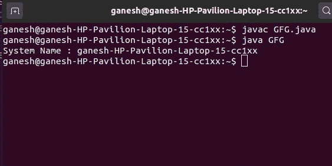

# 获取 Windows 和 Linux 机器系统名的 Java 程序

> 原文:[https://www . geesforgeks . org/Java-program-to-get-system-name-for-windows-and-Linux-machine/](https://www.geeksforgeeks.org/java-program-to-get-system-name-for-windows-and-linux-machine/)

在使用同一个类的 getLocalHost()方法获取系统的 IP 地址后，我们可以使用**java.net 包的 [InetAddress](https://www.geeksforgeeks.org/networking-class-in-java/) 类的 [getHostName()](https://www.geeksforgeeks.org/java-program-to-determine-hostname-from-ip-address/) 方法获取 Windows 或 Linux 机器的系统名称。类 InetAddress 获取任何主机名的 IP 地址。InetAddress 类的 getLocalHost()方法获取本地主机的地址。getHostName()获取给定 IP 地址的主机名，或者如果安全管理器不允许该操作，则返回该 IP 地址的文本表示形式。**

**语法**

```java
public String getHostName()
```

**返回:**给定 IP 地址的主机地址，如果不允许操作，则返回 IP 地址的文本表示。

**示例:**

## Java 语言(一种计算机语言，尤用于创建网站)

```java
// Java program to demonstrate getting
// the System name of the user

import java.net.InetAddress;
public class GFG {
    public static void main(String[] args)
    {
        try {

            // get system name
            String SystemName
                = InetAddress.getLocalHost().getHostName();

            // SystemName stores the name of the system
            System.out.println("System Name : "
                               + SystemName);
        }
        catch (Exception E) {
            System.err.println(E.getMessage());
        }
    }
}
```

**输出:**

