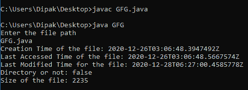
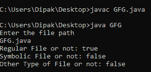

# 获取文件属性的 Java 程序

> 原文:[https://www . geesforgeks . org/Java-program-to-get-attributes-a-file/](https://www.geeksforgeeks.org/java-program-to-get-the-attributes-of-a-file/)

在 Java 中，有几个包和 API 来执行许多不同的功能。一个这样的包是 [java.nio.file](https://www.geeksforgeeks.org/file-class-in-java/) 。这个包包含各种支持文件的方法。一个包是 java.nio.file.attribute，它可以用来访问 path 对象中指定的文件的属性。

所以基本上我们使用上面提到的两个包来访问文件的属性。

*   **java.nio.file:** 这个包用来访问 FIless 类，使用了内置的方法“getpath()”有助于获取 path 对象。
*   **java.nio.file.attribute:** 这个包包含了很多类，这些类有预定义的方法来读取和访问文件的属性。首先使用 getFileAttributeView()方法获取文件的属性，然后使用 readAttributes()方法获取文件的属性。然后最后使用类“BasicFileAttributes”的几种方法来显示文件的各种属性。

下面展示了这些方法的基本实现，以显示文件的所有属性。

## Java 语言(一种计算机语言，尤用于创建网站)

```
// Java program to get the attributes of a file
import java.nio.file.*;
import java.nio.file.attribute.*;
public class GFG {
    public static void main(String[] args) throws Exception
    {

        // reading the file path from the system.
        Scanner sc = new Scanner(System.in);
        System.out.println("Enter the file path");
        String s = sc.next();

        // setting the path
        Path path = FileSystems.getDefault().getPath(s);

        // setting all the file data to the attributes
        // in class file of BasicFileAttributeView.
        BasicFileAttributeView view
            = Files.getFileAttributeView(
                path, BasicFileAttributeView.class);

        // method to read the file attributes.
        BasicFileAttributes attribute
            = view.readAttributes();

        // method to check the creation time of the file.
        System.out.print("Creation Time of the file: ");
        System.out.println(attribute.creationTime());
        System.out.print(
            "Last Accessed Time of the file: ");
        System.out.println(attribute.lastAccessTime());

        // method to check the last
        // modified time for the file
        System.out.print(
            "Last Modified Time for the file: ");
        System.out.println(attribute.lastModifiedTime());

        // method to access the check whether
        // the file is a directory or not.
        System.out.println("Directory or not: "
                           + attribute.isDirectory());

        // method to access the size of the file in KB.
        System.out.println("Size of the file: "
                           + attribute.size());
    }
}
```

**输出:**



其他一些属性如下所示:

## Java 语言(一种计算机语言，尤用于创建网站)

```
// Java program to get the attributes of a file
import java.util.Scanner;
import java.nio.file.attribute.*;
import java.nio.file.*;

public
class GFG {
public
    static void main(String[] args) throws Exception
    {

        // reading the file path from the system.
        Scanner sc = new Scanner(System.in);

        System.out.println("Enter the file path");

        String s = sc.next();

        // setting the path
        Path path = FileSystems.getDefault().getPath(s);

        // setting all the file data to the attributes in
        // class file of BasicFileAttributeView.
        BasicFileAttributeView view
            = Files.getFileAttributeView(
                path, BasicFileAttributeView.class);

        // method to read the file attributes.
        BasicFileAttributes attribute
            = view.readAttributes();

        // check for regularity
        System.out.print("Regular File or not: ");
        System.out.println(attribute.isRegularFile());

        // check whether it is a symbolic file or not
        System.out.print("Symbolic File or not: ");
        System.out.println(attribute.isSymbolicLink());

        // type of file
        System.out.print("Other Type of File or not: ");
        System.out.println(attribute.isOther());
    }
}
```

**输出:**

