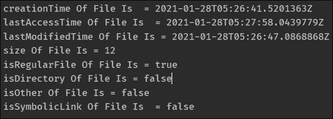

# 获取基本文件属性的 Java 程序

> 原文:[https://www . geesforgeks . org/Java-program-to-get-basic-file-attributes/](https://www.geeksforgeeks.org/java-program-to-get-the-basic-file-attributes/)

基本文件属性是与文件系统中的文件相关联的属性，这些属性是许多文件系统所共有的。为了获得基本的文件属性，我们必须使用 basic file attributes 接口。该接口于 2007 年推出，是 [nio 包](https://www.geeksforgeeks.org/introduction-to-java-nio-with-examples/#:~:text=Java%20NIO%20is%20a%20buffer,of%20the%20other%20NIO%20packages.)的一部分。

基本文件属性包含一些与文件相关的信息，如创建时间、上次访问时间、上次修改时间、文件大小(以字节为单位)，这些属性还告诉我们文件是否是常规文件、目录或符号链接之外的东西。

**获取基本文件属性的方法有:**

<figure class="table">

| 返回类型 | 方法名称和描述 |
| --- | --- |
| 档案时间 | creation time()–此方法用于获取文件的创建时间。 |
| 档案时间 | lastpaccesstime()–此方法用于获取文件的上次访问时间 |
| 档案时间 | lastpmodifiedtime()–此方法用于获取文件的上次修改时间。 |
| 长的 | size()–此方法用于获取文件的大小。 |
| 布尔 | isDirectory()–此方法用于检查文件是否是目录。 |
| 布尔 | issymbolilink()–此方法用于检查文件是否是符号链接。 |
| 布尔 | isruginalfile()–此方法用于检查文件是否正常。 |
| 布尔 | isOther()–此方法用于检查文件是否不是常规文件、目录或符号链接。 |

</figure>

下面是获取基本文件属性的 Java 程序:

## Java 语言(一种计算机语言，尤用于创建网站)

```
// Java Program to get the basic file attributes of the file
import java.io.IOException;
import java.nio.file.Files;
import java.nio.file.Path;
import java.nio.file.Paths;
import java.nio.file.attribute.BasicFileAttributes;
import java.sql.Timestamp;
import java.util.Date;
public class GFG {
    public static void main(String args[])
        throws IOException
    {
        // path of the file
        String path = "C:/Users/elavi/Desktop/GFG_File.txt";

        // creating a object of Path class
        Path file = Paths.get(path);

        // creating a object of BasicFileAttributes
        BasicFileAttributes attr = Files.readAttributes(
            file, BasicFileAttributes.class);
        System.out.println("creationTime Of File Is  = "
                           + attr.creationTime());
        System.out.println("lastAccessTime Of File Is  = "
                           + attr.lastAccessTime());
        System.out.println("lastModifiedTime Of File Is = "
                           + attr.lastModifiedTime());

        System.out.println("size Of File Is = "
                           + attr.size());
        System.out.println("isRegularFile Of File Is = "
                           + attr.isRegularFile());
        System.out.println("isDirectory Of File Is = "
                           + attr.isDirectory());
        System.out.println("isOther Of File Is = "
                           + attr.isOther());

        System.out.println("isSymbolicLink Of File Is  = "
                           + attr.isSymbolicLink());
    }
}
```

### **输出:**



**注意:**以上程序只会在系统 IDE 上运行，不会在在线 IDE 上运行。