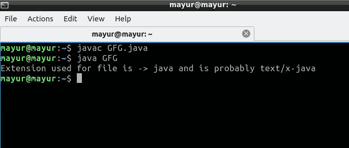

# 获取文件扩展名的 Java 程序

> 原文:[https://www . geesforgeks . org/Java-program-to-get-the-file-extension/](https://www.geeksforgeeks.org/java-program-to-get-the-file-extension/)

文件的扩展名是其名称在句点(.)之后的最后一部分。).例如，java 源文件扩展名为“Java”，您会注意到文件名总是以”结尾。爪哇”。用 Java 获取文件扩展名是使用 Java 的[文件类](https://www.geeksforgeeks.org/file-class-in-java/)完成的，即 **probeContentType()** 方法。文件类是文件或目录路径名的 Java 表示。文件类包含几个处理路径名、删除和重命名文件、创建新目录、列出目录内容以及确定文件和目录的几个常见属性的过程。

### **探针内容类型()方法**

probeContentType()是一个在 Java 文件类中预定义的方法。此方法的参数通过文件路径传递。

*   **参数:**文件的路径。
*   **返回值:**返回字符串(扩展名)。

**语法:**在 Java 中，我们可以通过–

```
File file = new File("/home/mayur/GFG.java");
String fileName = file.getName();

fileType = Files.probeContentType(f.toPath());
```

下面是问题陈述的实现:

## Java 语言(一种计算机语言，尤用于创建网站)

```
// Java Program to Get the File Extension

import java.io.*;
import java.nio.file.Files;

public class GFG {
    public static void main(String[] args)
    {
        // File location
        File f = new File("/home/mayur/GFG.java");

        // If file exists
        if (f.exists()) {
            String fileType = "Undetermined";
            String fileName = f.getName();
            String extension = "";
            int i = fileName.lastIndexOf('.');

            if (i > 0) {
                extension = fileName.substring(i + 1);
            }
            try {
                fileType
                    = Files.probeContentType(f.toPath());
            }
            catch (IOException ioException) {
                System.out.println(
                    "Cannot determine file type of "
                    + f.getName()
                    + " due to following exception: "
                    + ioException);
            }

            // Print Extension
            System.out.println(
                "Extension used for file is -> " + extension
                + " and is probably " + fileType);
        }
        else {
            System.out.println("File does not exist!");
        }
    }
}
```

**输出:**



在上面的例子中，

*   **file . getname()**–返回文件的名称并将其存储在 String 变量中。
*   **fileName.lastIndexOf(' . ')**–返回字符的最后一次出现。因为所有文件扩展名都以**开头**，我们用**这个字**。
*   **filename . substring()**–返回字符**' '后的字符串**。