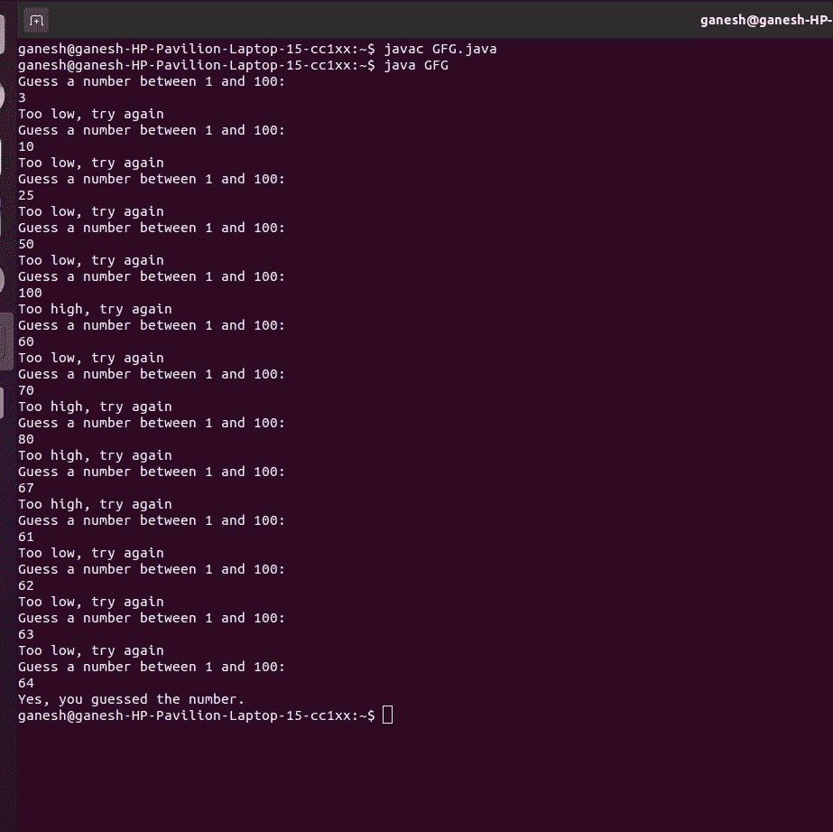

# Java 程序猜测一个范围内的随机数

> 原文:[https://www . geesforgeks . org/Java-程序猜测范围内的随机数/](https://www.geeksforgeeks.org/java-program-to-guess-a-random-number-in-a-range/)

编写一个程序，生成一个随机数，并要求用户猜测这个数字是什么。如果用户的猜测高于随机数，程序应显示**过高，再次尝试**。如果用户的猜测低于随机数，程序应显示**过低，再试一次**。程序应该使用一个循环，重复直到用户正确猜测随机数。

```
Input: 15 (a random value that is not known before)
Output: Guess a number between 1 and 100: 
1
Too low, try again
Guess a number between 1 and 100: 
10
Too low, try again
Guess a number between 1 and 100: 
25
Too high, try again
Guess a number between 1 and 100: 
20
Too high, try again
Guess a number between 1 and 100: 
15
Yes, you guessed the number.
```

**例**

## Java 语言(一种计算机语言，尤用于创建网站)

```
// Java Program to guess a Random Number Generation

import java.util.Random;
import java.util.Scanner;

public class GFG {
    public static void main(String[] args)
    {

        // stores actual and guess number
        int answer, guess;

          // maximum value is 100
        final int MAX = 100;

        // takes input using scanner
        Scanner in = new Scanner(System.in);

        // Random instance
        Random rand = new Random();

        boolean correct = false;

        // correct answer
        answer = rand.nextInt(MAX) + 1;

        // loop until the guess is correct
        while (!correct) {

            System.out.println(
                "Guess a number between 1 and 100: ");

            // guess value
            guess = in.nextInt();

            // if guess is greater than actual
            if (guess > answer) {
                System.out.println("Too high, try again");
            }

            // if guess is less than actual
            else if (guess < answer) {
                System.out.println("Too low, try again");
            }

            // guess is equal to actual value
            else {

                System.out.println(
                    "Yes, you guessed the number.");

                correct = true;
            }
        }
        System.exit(0);
    }
}
```

**输出**

