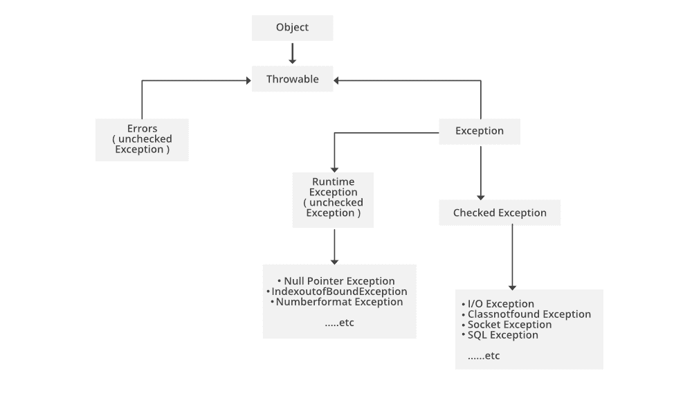
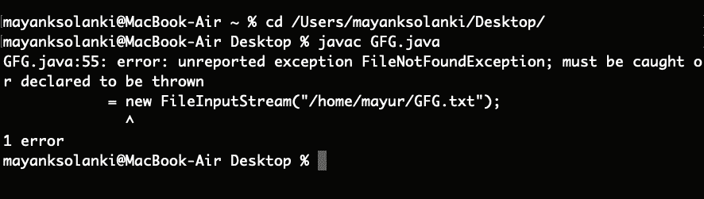

# 处理检查异常的 Java 程序

> 原文:[https://www . geesforgeks . org/Java-程序到句柄-已检查-异常/](https://www.geeksforgeeks.org/java-program-to-handle-checked-exception/)

**选中的异常**是异常类的子类。这些类型的异常发生在程序编译期间。这些异常可以由 try-catch 块处理，否则程序会给出编译错误。

> ClassNotFoundException、IOException、SQLException 等都是被检查异常的例子。



**I/O 异常:**这个程序抛出 I/O 异常是因为 due FileNotFoundException 是 Java 中的一个选中的异常。无论何时，当我们想从文件系统中读取一个文件时，Java 都会强制我们处理文件不在给定位置的错误情况。

**实现:**考虑 myfile.txt 文件不存在。

**实施例 1-A**

## Java 语言(一种计算机语言，尤用于创建网站)

```java
// Java Program to Handle Checked Exception
// Where FileInputStream Exception is thrown

// Importing required classes
import java.io.*;

// Main class
class GFG {

    // Main driver method
    public static void main(String args[]) {

        // Reading content from file by passing local directory path
        // where file should exists
        FileInputStream GFG
            = new FileInputStream("/Desktop/GFG.txt");

        // This file does not exist in the location
        // This constructor FileInputStream
        // throws FileNotFoundException which
        // is a checked exception
    }
}
```

**输出:**



现在让我们讨论如何处理**文件未发现异常。**答案很简单，我们可以借助[试抓块](https://www.geeksforgeeks.org/try-catch-throw-and-throws-in-java/)来处理

*   使用****抛出**关键字来声明函数，以避免编译错误。**
*   **所有异常都在发生时抛出对象 try 语句允许您定义一个代码块来测试错误，catch 块捕获给定的异常对象并执行所需的操作。**
*   **将显示使用 try-catch 块定义的输出。**

****例 1-B:****

## **Java 语言(一种计算机语言，尤用于创建网站)**

```java
// Java Program to Illustrate Handling of Checked Exception

// Importing required classes
import java.io.*;
import java.util.*;

// Main class
class GFG {

    // Main driver method
    public static void main(String[] args)
        throws FileNotFoundException
    {

        // Assigning null value to object of FileInputStream
        FileInputStream GFG = null;

        // Try block to check for exceptions
        try {

            // Giving path where file should exists to read
            // content
            GFG = new FileInputStream(
                "/home/mayur/GFG.txt");
        }

        // Catch block to handle exceptions
        catch (FileNotFoundException e) {

            // Display message when exception occurs
            System.out.println("File does not exist");
        }
    }
}
```

****Output****

```java
File does not exist
```