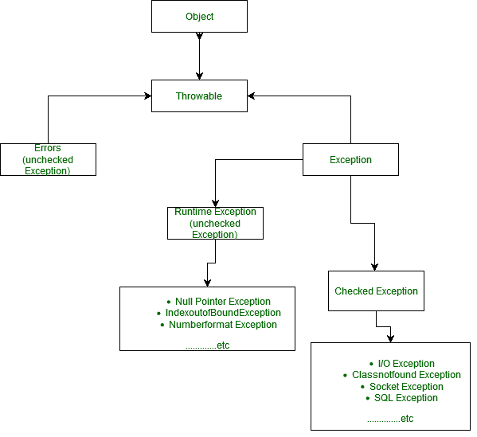
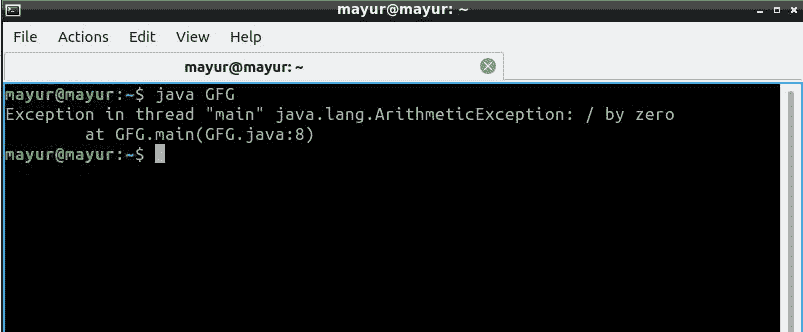
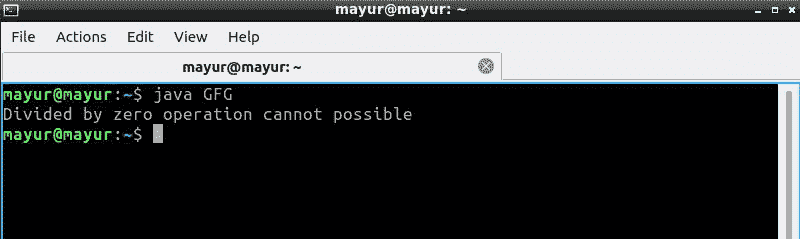
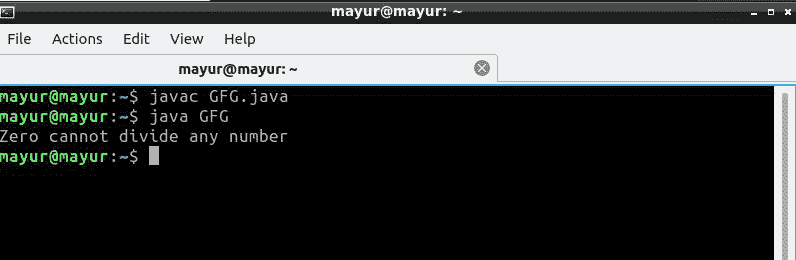
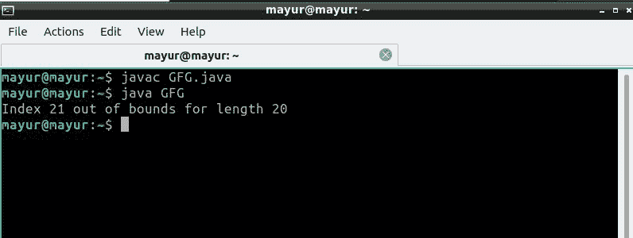

# 处理除零和多重异常的 Java 程序

> 原文:[https://www . geesforgeks . org/Java-程序到句柄被零除和多重异常/](https://www.geeksforgeeks.org/java-program-to-handle-divide-by-zero-and-multiple-exceptions/)

**异常**这些是由于程序员错误或机器错误导致程序正常执行流程受到干扰而发生的事件。

**处理多个异常:**Java 中有两种方法可以处理多个异常。

1.  使用 Single try-catch block try 语句允许您定义一个代码块来测试错误，我们可以给 catch blow 提供异常对象，因为这是由 exception 类继承的所有异常。
2.  第二种方法是为不同的异常处理程序创建单独的 catch 块。

**例外等级:**



**被零除:**这个程序抛出算术异常，因为任何被 0 除的数在数学中都是未定义的。

## Java 语言(一种计算机语言，尤用于创建网站)

```
// Java Program to Handle Divide By Zero Exception
import java.io.*;
class GFG {
    public static void main(String[] args)
    {
        int a = 6;
        int b = 0;
        System.out.print(a / b);
        // this line Throw  ArithmeticException: / by zero
    }
}
```

**输出:**



**使用试捕块处理除零异常:**

## Java 语言(一种计算机语言，尤用于创建网站)

```
// Java Program to Handle Divide By Zero Exception
import java.io.*;
class GFG {
    public static void main(String[] args)
    {
        int a = 5;
        int b = 0;
        try {
            System.out.println(a / b); // throw Exception
        }
        catch (ArithmeticException e) {
            // Exception handler
            System.out.println(
                "Divided by zero operation cannot possible");
        }
    }
}
```

**输出:**



**多个异常**(算术异常和索引异常)

1.  Java 中允许使用|运算符组合两个异常。
2.  一旦第一个异常发生，它就会被抛出 catch 块。
3.  表达式的检查由表达式从右到左的优先编译器检查规则完成。

## Java 语言(一种计算机语言，尤用于创建网站)

```
// Java Program to Handle multiple exception
import java.io.*;

class GFG {
    public static void main(String[] args)
    {
        try {
            int number[] = new int[10];
            number[10] = 30 / 0;
        }
        catch (ArithmeticException e) {
            System.out.println(
                "Zero cannot divide any number");
        }
        catch (ArrayIndexOutOfBoundsException e) {
            System.out.println(
                "Index out of size of the array");
        }
    }
}
```

**输出:**



**说明:**这里出现 ArrayIndexOutOfBounds 和算术异常的组合，但是只抛出算术异常，为什么？

根据优先级编译器从右到左检查**数[10]=30/0** 。这就是为什么 30/0 抛出 ArithmeticException 对象，并且这个异常的处理程序执行 Zero 不能除任何数字。

**多重异常的另一种方法:**我们可以使用|运算符组合两个异常，其中任何一个都会根据异常的发生而执行。

## Java 语言(一种计算机语言，尤用于创建网站)

```
// Java Program to Handle multiple exception
import java.io.*;

class GFG {
    public static void main(String[] args)
    {
        try {
            int number[] = new int[20];
            number[21] = 30 / 9;
            // this statement will throw
            // ArrayIndexOutOfBoundsException e
        }
        catch (ArrayIndexOutOfBoundsException
               | ArithmeticException e) {
            System.out.println(e.getMessage());
            // print the message
        }
    }
}
```

**输出:**

