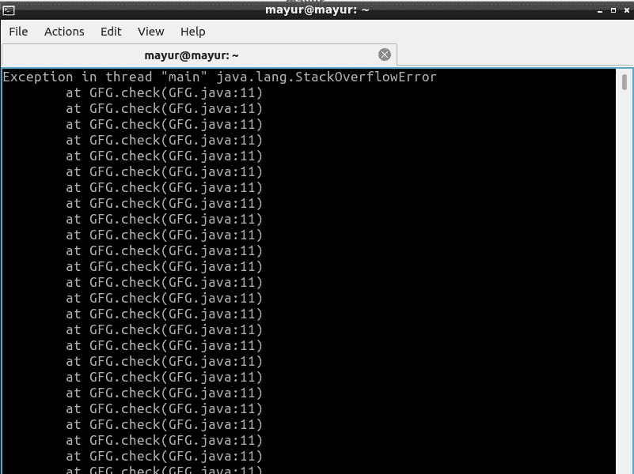

# 处理异常层次结构的 Java 程序

> 原文:[https://www . geesforgeks . org/Java-程序处理异常层次结构/](https://www.geeksforgeeks.org/java-program-to-handle-the-exception-hierarchies/)

[**异常**](https://www.geeksforgeeks.org/exceptions-in-java/) 是由于程序员错误或机器错误导致程序执行的正常流程受到干扰并终止程序而发生的事件。

[**异常处理**](https://www.geeksforgeeks.org/java-gq/exception-handling-2-gq/) :处理异常的过程称为异常处理。

**异常的层次:** Object 类是 java 所有类的父类，是可抛出类继承的所有错误或异常对象。可抛出类有两个子类错误和异常。


**错误类:**该类包含那些难以处理的错误。它们发生在程序运行时，例如堆栈溢出错误、内存溢出错误等。

*   **StackOverflowError** :该错误是由于递归中的入站条件和在程序中使用无限循环而发生的。这个原因超出了堆栈内存，导致程序中出现堆栈溢出错误。

**堆叠溢出错误：**

## Java 语言(一种计算机语言，尤用于创建网站)

```
// Java Program to Handle the exception hierarchies

import java.io.*;

class GFG {
    static void check(int n)
    {
        if (n == 0) {
            return;
        }
        check(n + 1);
    }
    public static void main(String[] args) { check(3); }
}
```



### 异常类别:

这个类包含了所有可以轻松处理的异常，有两个子类继承了它一个是**运行时异常(未选中异常)和选中异常。**

**1。选中异常**:这些异常是异常类的子类。这些类型的异常发生在 javac 编译程序的时候。这些异常可以由 try-catch 块处理，否则程序会给出编译错误。ClassNotFoundException、IOException、SQLException 等都是被检查异常的例子。

**I/O 异常**:由于 FileNotFoundException 的原因，这个程序抛出 I/O 异常，是 Java 中的一个勾选异常。无论何时，当我们想从文件系统中读取一个文件时，Java 都会强制我们处理文件不在给定位置的错误情况。

```
Assumption: consider myfile.txt file does not exit 
```

**实施:**

## Java 语言(一种计算机语言，尤用于创建网站)

```
// Java Program to Handle the exception hierarchies
import java.io.*;
class GFG {
    public static void main(String args[])
    {
        // this file does not exist in the location
        try {
            FileInputStream GFG
                = new FileInputStream("C:/myfile.txt");
        }
        catch (Exception e) {
            System.out.println("File not found");
        }
    }
}
```

**Output**

```
File not found
```

**2。未选中异常**:

这些类型的异常发生在程序运行时。编译器在编译时不会检查这些异常。在 Java 中，“错误”和“运行时异常”类下的异常是未检查的异常，这种异常是由于编程错误而发生的。像 IndexoutOfBoundException、Nullpointer Exception 等运行时异常可以在 Try-Catch 块
**(数组)IndexoutOfBoundException** 的帮助下处理:由于访问大于等于数组长度大小的索引而发生此异常。出现此异常后，程序将自动终止。

**实施:**

## Java 语言(一种计算机语言，尤用于创建网站)

```
// Java Program to Handle the exception hierarchies
import java.io.*;

class GFG {
    public static void main(String[] args)
    {
        int a[] = { 1, 2, 3, 4, 5 };
        try {
            System.out.println(
                a[5]); // accessing the elements of the out
                       // of index of the array
        }
        catch (ArrayIndexOutOfBoundsException e) {
            // executes when index out of bound occurs
            System.out.println(
                "Out of index  please check your code");
        }
    }
}
```

**Output**

```
Out of index  please check your code
```

**多个 catch 块:**有时在一个程序中，特定的代码可以抛出多个 Exceptions 对象，这些对象可以在单个 try 块下使用多个 Catch 块来处理

**格式:**

## Java 语言(一种计算机语言，尤用于创建网站)

```
try {
    // Code where exception can occur
}
catch (ExceptionA e1) {
    // code that executes if Exception of  A occurs
}
catch (ExceptionB e2) {
    // code that executes if Exception of B occurs.
}
```

**使用多个捕获块处理算术异常和索引异常。**

## Java 语言(一种计算机语言，尤用于创建网站)

```
import java.io.*;

class GFG {
    public static void main (String[] args) {
         try {
      int number[] = new int[10];
      number[10] = 30 / 0;
    } catch (ArithmeticException e) {
      System.out.println("Zero cannot divide any number");
    } catch (ArrayIndexOutOfBoundsException e) {
      System.out.println("Index out of size of the array");
    }
  }

}
```

**Output**

```
Zero cannot divide any number
```