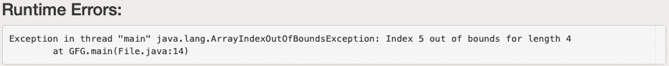
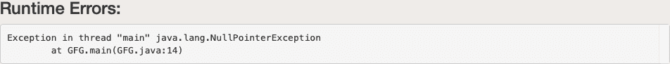

# 处理未检查异常的 Java 程序

> 原文:[https://www . geesforgeks . org/Java-程序到句柄-未检查-异常/](https://www.geeksforgeeks.org/java-program-to-handle-unchecked-exception/)

异常是运行时出现的导致程序工作突然中断的问题。请记住，异常从来不会在编译时抛出，而是总是在运行时抛出，无论它是什么类型。编译时不会引发异常。[可投掷](https://www.geeksforgeeks.org/throwable-class-in-java-with-examples/)是所有例外中的[特级](https://www.geeksforgeeks.org/super-keyword/)，也是[失误](https://www.geeksforgeeks.org/types-of-errors-in-java-with-examples/)。现在迫切需要解决这些问题，在 Java 语言中有一个概念被定义为“异常处理技术”

有两种类型的例外定义如下

*   **检查异常**
*   **未检查的异常**

**真实世界图解:异常**

> 考虑一个员工离家去办公室。他被家长监视，拿走身份证和他们能想到的所有东西。虽然员工知道一切，但仍被监控。现在员工出门还是莫名其妙地被耽搁了，因为他的车胎被扎破了，结果是他上班迟到了。现在，这些扰乱他日常生活的想要的东西在 Java 中被称为异常。虽然他检查了那些东西，但父母的行为帮助了他，但如果有一天不知何故错过了，员工在家里正确地得到了东西，这本身在 Java 中被称为“检查异常”。家长访问没有任何控制的操作称为“未检查的例外”在这里，在编程语言中，父权限或监控权限被称为“编译器”。编译器可以检测到的异常称为检查异常，检测不到的称为未检查异常。

**方法:**现在，为了处理异常，提出的概念是异常处理技术。直接跳到概念上进行未检查的异常。


**未检查异常**

这些类型的[异常](https://www.geeksforgeeks.org/exceptions-in-java/)发生在程序运行期间。编译器在编译时不会检查这些异常。在 Java 中，“错误”和“运行时异常”类下的异常是未检查的异常，这种异常是由于不良编程引起的。

1.  **错误类异常如** StackOverflow、OutOfMemoryError 异常等很难处理
2.  **运行时异常，如** IndexoutOfBoundException、Nullpointer 异常等，可以在 try-Catch 块的帮助下处理

程序员通常面临两个主要的未检查异常，即下面借助示例实现讨论它们，并讨论如何处理它们。两种主要方法的建议如下:

1.  [**【index outofboundsexception】**](https://www.geeksforgeeks.org/understanding-array-indexoutofbounds-exception-in-java/)
2.  [**空指针异常**](https://www.geeksforgeeks.org/null-pointer-exception-in-java/)

**情况 1:** [**(数组)IndexoutOfBoundException**](https://www.geeksforgeeks.org/understanding-array-indexoutofbounds-exception-in-java/)**:**由于访问大于等于数组长度大小的索引，出现此异常。出现此异常后，程序将自动终止。简单来说，试图访问的内存不是当前数据结构本身所拥有的。这里这个异常是在数据结构上定义的，即“[数组](https://www.geeksforgeeks.org/arrays-in-java/)”。

## Java 语言(一种计算机语言，尤用于创建网站)

```java
// Importing Classes/Files
import java.io.*;

class GFG {

    // Main Driver Function
    public static void main(String[] args)
    {
        // Array containing 4 elements
        int a[] = { 1, 2, 3, 4 };

        // Try to access elements greater than
        // index size of the array
        System.out.println(a[5]);
    }
}
```

**输出:**



[**处理 arrayindextofboundexception**](https://www.geeksforgeeks.org/understanding-array-indexoutofbounds-exception-in-java/)**:**Try-catch Block 我们可以处理这个异常 **try 语句**允许您定义一个要测试错误的代码块， **catch block** 捕获给定的异常对象并执行所需的操作**。** **程序不会终止。**

## Java 语言(一种计算机语言，尤用于创建网站)

```java
// Importing Classes/Files
import java.io.*;

public class GFG {

    // Main Driver Method
    public static void main(String[] args)
    {
        // Inserting elements into Array
        int a[] = { 1, 2, 3, 4, 5 };

        // Try block for exceptions
        try {

            // Forcefully trying to access and print
            // element/s beyond indexes of the array

            System.out.println(a[5]);
        }

        // Catch block for catching exceptions
        catch (ArrayIndexOutOfBoundsException e) {

            // Printing display message when index not
            // present in a array is accessed
            System.out.println(
                "Out of index  please check your code");
        }
    }
}
```

**输出:**


**情况 2:**[**null pointerexception:**](https://www.geeksforgeeks.org/null-pointer-exception-in-java/)**试图访问具有 null 值的对象引用时出现此异常。**

## **Java 语言(一种计算机语言，尤用于创建网站)**

```java
// Importing Classes/Files
import java.io.*;

public class GFG {
    // Main Driver Method
    public static void main(String[] args)
    {

        // Instance of string a has null value
        String a = null;

        // Comparing null value with the string value
        // throw exception and Print
        System.out.println(a.equals("GFG"));
    }
}
```

****输出:****

** **

****空指针异常的处理技术****

## **Java 语言(一种计算机语言，尤用于创建网站)**

```java
// Importing Files/Classes
import java.io.*;

public class GFG {

    // Driver Main Method
    public static void main(String[] args)
    {
        // Assigning NULL to string
        String m = null;

        // Try-Catch Block
        try {

            // Checking the null value with GFG string
            // and throw exception
            if (m.equals("GFG")) {
                // Print String
                System.out.println("YES");
            }
        }

        // Try-Catch Block
        catch (NullPointerException e) {

            // Handles the exception
            System.out.println(
                "Object reference cannot be null");
        }
    }
}
```

****输出:****

****