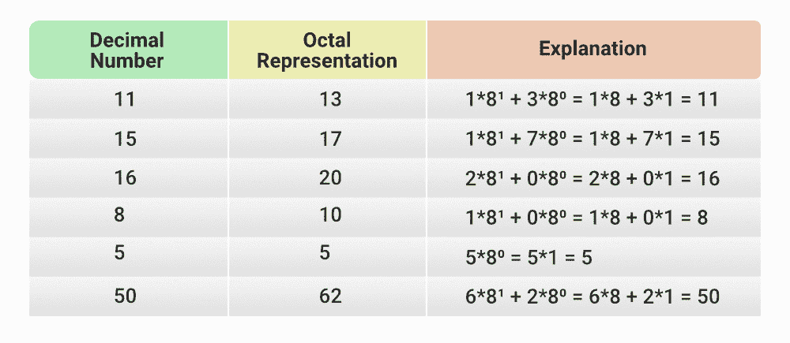

# Java 程序演示八进制整数的用法

> 原文:[https://www . geesforgeks . org/Java-program-to-instruction-of-octal-integer/](https://www.geeksforgeeks.org/java-program-to-illustrate-the-usage-of-octal-integer/)

八进制是一个数字系统，其中一个数字用 8 的幂表示。所以所有的整数都可以用一个八进制数来表示。此外，八进制数中的所有数字都在 0 和 7 之间。在 java 中，我们可以在初始化时通过添加 0 来存储八进制数。它们被称为八进制文字。用于存储的数据类型是 int。



将十进制转换为八进制的方法是[integer . tooctalstring(int num)](https://www.geeksforgeeks.org/integer-tooctalstring-method-in-java/)

**语法:**

```java
public static String toOctalString(*int num*)
```

**参数:**该方法接受需要转换为字符串的整数类型的单个参数*数*。

**返回值:**该函数返回整数参数的字符串表示形式，以 8 为基数。

**例 1**

## Java 语言(一种计算机语言，尤用于创建网站)

```java
import java.io.*;

class GFG {
    public static void main(String[] args)
    {
        // Variable Declaration
        int a;

        // storing normal integer value
        a = 20;
        System.out.println("Value of a: " + a);

        // storing octal integer value
        // just add 0 followed octal representation
        a = 024;
        System.out.println("Value of a: " + a);

        // convert octal representation to integer
        String s = "024";
        int c = Integer.parseInt(s, 8);
        System.out.println("Value of c: " + a);

        // get octal representation of a number
        int b = 50;
        System.out.println(
            "Octal Representation of the number " + b
            + " is: " + Integer.toOctalString(b));
    }
}
```

**Output**

```java
Value of a: 20
Value of a: 20
Value of c: 20
Octal Representation of the number 50 is: 62
```

**例 2:** 也可以对这个八进制整数进行不同的算术运算。操作与对 int 数据类型执行的操作相同。

## Java 语言(一种计算机语言，尤用于创建网站)

```java
// Arithmetic operations on Octal numbers

import java.io.*;

class GFG {
    public static void main(String[] args)
    {
        int a, b;

        // 100
        a = 0144;

        // 20
        b = 024;

        System.out.println("Value of a: " + a);
        System.out.println("Value of b: " + b);
        System.out.println("Addition: " + (a + b));
        System.out.println("Subtraction: " + (a - b));
        System.out.println("Multiplication: " + (a * b));
        System.out.println("Division: " + (a / b));
    }
}
```

**Output**

```java
Value of a: 100
Value of b: 20
Addition: 120
Subtraction: 80
Multiplication: 2000
Division: 5
```