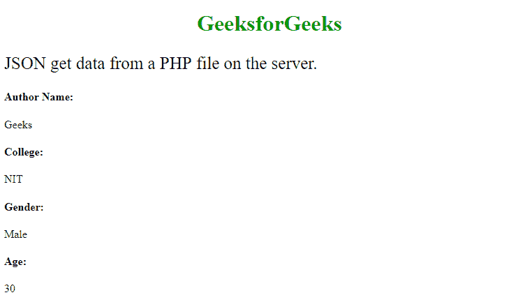

# 实现 JSON 解析器的 Java 程序

> 原文:[https://www . geesforgeks . org/Java-program-to-implement-a-JSON-parser/](https://www.geeksforgeeks.org/java-program-to-implement-a-json-parser/)

JSON 通常用于在网络服务器之间来回交换数据。这里的关键点是，当我们从 web 服务器获取数据时，它总是作为一个字符串返回，所以我们在 java 程序中需要小心吗？



插图:

```
{"Geeks", "NIT", "Male", "30"}
```

这个数据由 JSON 解析器作为一个 JavaScript 对象返回，因此它变成如下所示:

```
const object = JSON.parse({"Geeks", "NIT", "Male", "30"}) ;
```

在 JSON 解析数据时，对数组进行同样的处理。让我们编写一个 java 程序调用方法，以便更容易理解 JSON 解析器是如何实现的。

**例**

## Java 语言(一种计算机语言，尤用于创建网站)

```
// Java Program to Implement JSON Parser

// Importing required classes
import java.util.ArrayList;
import java.util.Collections;
import java.util.HashMap;

// Defining constants for json parsers
enum CONSTANTS {

    CURLY_OPEN_BRACKETS('{'),
    CURLY_CLOSE_BRACKETS('}'),
    SQUARE_OPEN_BRACKETS('['),
    SQUARE_CLOSE_BRACKETS(']'),
    COLON(':'),
    COMMA(','),
    SPECIAL('|');

    private final char constant;

    // Constructor
    CONSTANTS(char constant) { this.constant = constant; }

    // Method
    // Overriding exiting toString() method
    @Override public String toString()
    {
        return String.valueOf(constant);
    }
}

// Class 1
// To parse json object
class JSONObject {

    private final static char specialChar;
    private final static char commaChar;
    private HashMap<String, String> objects;

    static
    {
        specialChar = String.valueOf(CONSTANTS.SPECIAL)
                          .toCharArray()[0];
        commaChar = String.valueOf(CONSTANTS.COMMA)
                        .toCharArray()[0];
    }

    // Constructor if this class
    public JSONObject(String arg) { getJSONObjects(arg); }

    // Method 1
    // Storing json objects as key value pair in hash map
    public void getJSONObjects(String arg)
    {

        objects = new HashMap<String, String>();

        if (arg.startsWith(String.valueOf(
                CONSTANTS.CURLY_OPEN_BRACKETS))
            && arg.endsWith(String.valueOf(
                CONSTANTS.CURLY_CLOSE_BRACKETS))) {

            StringBuilder builder = new StringBuilder(arg);
            builder.deleteCharAt(0);
            builder.deleteCharAt(builder.length() - 1);
            builder = replaceCOMMA(builder);

            for (String objects : builder.toString().split(
                     String.valueOf(CONSTANTS.COMMA))) {

                String[] objectValue = objects.split(
                    String.valueOf(CONSTANTS.COLON), 2);

                if (objectValue.length == 2)
                    this.objects.put(
                        objectValue[0]
                            .replace("'", "")
                            .replace("\"", ""),
                        objectValue[1]
                            .replace("'", "")
                            .replace("\"", ""));
            }
        }
    }

    // Method 2
    public StringBuilder replaceCOMMA(StringBuilder arg)
    {

        boolean isJsonArray = false;

        for (int i = 0; i < arg.length(); i++) {
            char a = arg.charAt(i);

            if (isJsonArray) {

                if (String.valueOf(a).compareTo(
                        String.valueOf(CONSTANTS.COMMA))
                    == 0) {
                    arg.setCharAt(i, specialChar);
                }
            }

            if (String.valueOf(a).compareTo(String.valueOf(
                    CONSTANTS.SQUARE_OPEN_BRACKETS))
                == 0)
                isJsonArray = true;
            if (String.valueOf(a).compareTo(String.valueOf(
                    CONSTANTS.SQUARE_CLOSE_BRACKETS))
                == 0)
                isJsonArray = false;
        }

        return arg;
    }

    // Method 3
    // Getting json object value by key from hash map
    public String getValue(String key)
    {
        if (objects != null) {
            return objects.get(key).replace(specialChar,
                                            commaChar);
        }
        return null;
    }

    // Method 4
    // Getting json array by key from hash map
    public JSONArray getJSONArray(String key)
    {
        if (objects != null)
            return new JSONArray(
                objects.get(key).replace('|', ','));
        return null;
    }
}

// Class 2
// To parse json array
class JSONArray {

    private final static char specialChar;
    private final static char commaChar;

    private ArrayList<String> objects;

    static
    {
        specialChar = String.valueOf(CONSTANTS.SPECIAL)
                          .toCharArray()[0];
        commaChar = String.valueOf(CONSTANTS.COMMA)
                        .toCharArray()[0];
    }

    // Constructor of this class
    public JSONArray(String arg) { getJSONObjects(arg); }

    // Method 1
    // Storing json objects in array list
    public void getJSONObjects(String arg)
    {

        objects = new ArrayList<String>();

        if (arg.startsWith(String.valueOf(
                CONSTANTS.SQUARE_OPEN_BRACKETS))
            && arg.endsWith(String.valueOf(
                CONSTANTS.SQUARE_CLOSE_BRACKETS))) {

            StringBuilder builder = new StringBuilder(arg);

            builder.deleteCharAt(0);
            builder.deleteCharAt(builder.length() - 1);

            builder = replaceCOMMA(builder);

            // Adding all elements
            // using addAll() method of Collections class
            Collections.addAll(
                objects,
                builder.toString().split(
                    String.valueOf(CONSTANTS.COMMA)));
        }
    }

    // Method 2
    public StringBuilder replaceCOMMA(StringBuilder arg)
    {
        boolean isArray = false;

        for (int i = 0; i < arg.length(); i++) {
            char a = arg.charAt(i);
            if (isArray) {

                if (String.valueOf(a).compareTo(
                        String.valueOf(CONSTANTS.COMMA))
                    == 0) {
                    arg.setCharAt(i, specialChar);
                }
            }

            if (String.valueOf(a).compareTo(String.valueOf(
                    CONSTANTS.CURLY_OPEN_BRACKETS))
                == 0)
                isArray = true;

            if (String.valueOf(a).compareTo(String.valueOf(
                    CONSTANTS.CURLY_CLOSE_BRACKETS))
                == 0)
                isArray = false;
        }

        return arg;
    }

    // Method  3
    // Getting json object by index from array list
    public String getObject(int index)
    {
        if (objects != null) {
            return objects.get(index).replace(specialChar,
                                              commaChar);
        }

        return null;
    }

    // Method 4
    // Getting json object from array list
    public JSONObject getJSONObject(int index)
    {

        if (objects != null) {
            return new JSONObject(
                objects.get(index).replace('|', ','));
        }

        return null;
    }
}

// Class 3
// To parse json string
public class Parser {

    // json string with user data
    // Custom data been passed as in arguments
    private final static String jsonString
        = "{'name':'user','id':1234,'marks':[{'english':85,'physics':80,'chemistry':75}]}";

    // Main driver method
    public static void main(String[] args)
    {

        // Parse json object for user data
        JSONObject user = new JSONObject(jsonString);

        // Get json array for user's marks
        JSONArray marks = user.getJSONArray("marks");

        // Get json object for subject's marks
        JSONObject subjects = marks.getJSONObject(0);

        // Print and display commands
        System.out.println(
            String.format("English marks - %s",
                          subjects.getValue("english")));
        System.out.println(
            String.format("Physics marks - %s",
                          subjects.getValue("physics")));
        System.out.println(
            String.format("Chemistry marks - %s",
                          subjects.getValue("chemistry")));
    }
}
```

**Output**

```
English marks - 85
Physics marks - 80
Chemistry marks - 75
```