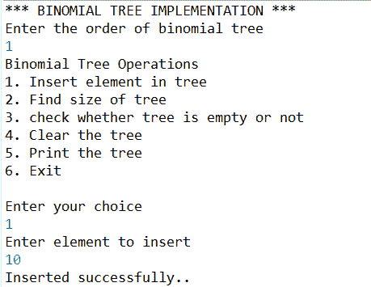
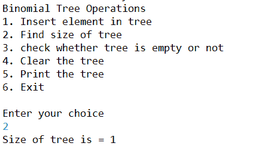
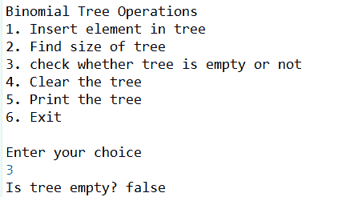
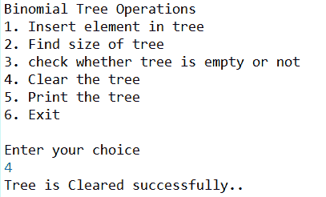
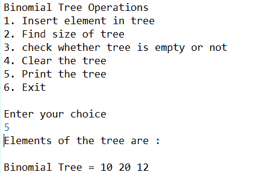
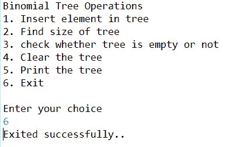

# 实现二叉树的 Java 程序

> 原文:[https://www . geesforgeks . org/Java-程序到实现-二叉树/](https://www.geeksforgeeks.org/java-program-to-implement-binomial-tree/)

二叉树是内置值的拟人化，选项可以在不同的时间段进行选择。

在任何节点上，期权的价值取决于基础资产的价格，在任何给定节点上，价格都有可能下降或上升。

**二叉树的实现:**

## Java 语言(一种计算机语言，尤用于创建网站)

```
// Java Program to Implement Binomial Tree

import java.util.Scanner;

public class BinomialTreeTest {
    public static void main(String[] args)
    {
        Scanner sc = new Scanner(System.in);

        System.out.println("*** BINOMIAL TREE IMPLEMENTATION ***");

        // Input for order of binomial tree
        System.out.println("Enter the order of binomial tree");
        int order = sc.nextInt();

        // Creating the object of binary tree
        BinomialTreeExample tree = new BinomialTreeExample(order);

        // variable to toggle condition of loop
        boolean exit = false;

        // while loop
        while (!exit) {

            // menu for the user
            System.out.println("\nBinomial Tree Operations\n");
            System.out.println("1\. Insert element in tree ");
            System.out.println("2\. Find size of tree");
            System.out.println("3\. check whether tree is empty or not");
            System.out.println("4\. Clear the tree");
            System.out.println("5\. Print the tree");
            System.out.println("6\. Exit");

            // taking choice of user
            int choice = sc.nextInt();

            switch (choice) {
            case 1:
                System.out.println("Enter element to insert");
                tree.insert(sc.nextInt());
                break;

            case 2:
                System.out.println("Size of tree is = "
                                   + tree.getSize());
                break;

            case 3:
                System.out.println("Is tree empty? "
                                   + tree.isEmpty());
                break;

            case 4:
                tree.clear();
                System.out.println("Tree is Cleared successfully..");
                break;
            case 5:
                System.out.println("Elements of the tree are : ");
                tree.printTree();
                break;

            case 6:
                System.out.println("Exited successfully..");
                exit = true;
                break;
            }
        }
        sc.close();
    }
}

class BinomialTreeExample {

    // class binomial tree node

    class BinoTreeNode {
        int data;
        int numNodes;
        BinoTreeNode arr[];

        // constructor of binomial tree node

        public BinoTreeNode(int n)
        {
            // initializing the values
            data = -1;

            numNodes = n;
            arr = new BinoTreeNode[numNodes];
        }
    }

    private BinoTreeNode root;
    private int order, size;

    // constructor of binomial tree example
    public BinomialTreeExample(int n)
    {
        size = 0;
        order = n;
        root = new BinoTreeNode(order);
        createTree(root);
    }

    // method to create a tree
    private void createTree(BinoTreeNode bt)
    {
        int n = bt.numNodes;
        if (n == 0)
            return;

        for (int i = 0; i < n; i++)
        {
            bt.arr[i] = new BinoTreeNode(i);
            createTree(bt.arr[i]);
        }
    }

    // method to clear tree
    public void clear()
    {
        size = 0;
        root = new BinoTreeNode(order);
        createTree(root);
    }

    // method to check tree is empty or not
    public boolean isEmpty() { return size == 0; }

    // method to get the size of tree
    public int getSize() { return size; }

    // public method to insert an element in tree which is
    // called by tester class publically
    public void insert(int val)
    {
        try {
            insert(root, val);
        }
        catch (Exception e) {
            System.out.println("Inserted successfully..");
        }
    }

    // private method to insert a tree which is called
    // internally by method insert
    private void insert(BinoTreeNode bt, int val)
        throws Exception
    {
        if (bt.data == -1)
        {
            bt.data = val;
            size++;

            throw new Exception("inserted !");
        }
        int n = bt.numNodes;
        for (int i = 0; i < n; i++)
            insert(bt.arr[i], val);
    }

    // public method to print a tree which is called by
    // tester publically
    public void printTree()
    {
        System.out.print("\nBinomial Tree = ");
        printTree(root);
        System.out.println();
    }

    // method to print a tree which is called internally by
    // printTree method
    private void printTree(BinoTreeNode bt)
    {
        if (bt.data != -1)
            System.out.print(bt.data + " ");

        int n = bt.numNodes;

        if (n == 0)
            return;

        for (int i = 0; i < n; i++)
            printTree(bt.arr[i]);
    }
}
```

**输出:**

     