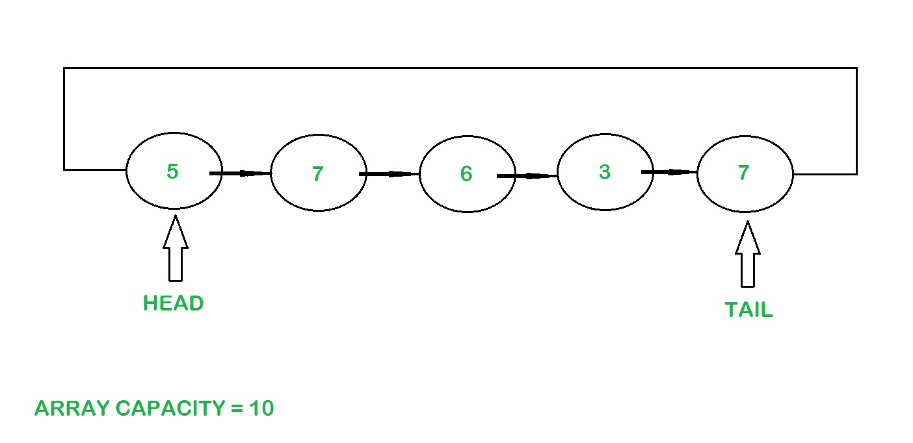

# 实现循环缓冲的 Java 程序

> 原文:[https://www . geesforgeks . org/Java-程序到实现-循环缓冲区/](https://www.geeksforgeeks.org/java-program-to-implement-circular-buffer/)

当数据不断地从一个地方移动到另一个地方，或者从一个进程移动到另一个进程，或者经常被访问时，数据不能存储在永久的存储位置，例如硬盘，因为它们需要时间来检索数据。这种类型的数据需要快速访问，并存储在临时存储位置，如称为缓冲区的内存中。

**缓冲液示例:**

*   当任何视频在线流式传输时，数据(音频和视频)会在视频播放前进行缓冲。在这个缓冲过程中，数据被下载并存储在内存中，并在需要时被访问。
*   Word 文档在保存之前会将内容和用户所做的更改存储在缓冲区中。

**什么是循环缓冲区？**

循环缓冲区或环形缓冲区是允许以连续方式使用内存的循环队列。循环缓冲区遵循先进先出原则。

> *循环缓冲区可以通过两种方式实现，使用数组或链表。*

**方法 1:使用数组**

由于添加的元素类型未知，空的**对象**数组及其容量将在构造函数中初始化。保持两个指针，即头和尾，用于元素的插入和删除。头部指向第一个元素，尾部指向最后一个元素。


使用数组的循环缓冲区

**插入元件**

最初，头部为 0，尾部为-1，大小为 0。

需要插入元素的索引是使用公式计算的:–

```
int index = (tail + 1) % capacity
array[index] = element;
```

插入元素后，尾指针和大小增加 1。当数组的大小等于其容量时，缓冲区已满，无法容纳更多的元素。

**删除元素:**

头指针处的元素被检索，头指针增加 1，如果缓冲区的大小减少 1。

```
int index = head % capacity;
E element = (E) array[index];
```

**示例:**

```
Input : [5, 6, 7, 1 ,4]

Output : The elements are printed in the order :-
          5
          6
          7
          1
          4
```

下面是上述方法的实现

## Java 语言(一种计算机语言，尤用于创建网站)

```
// Java program to implement a
// Circular Buffer using an array

import java.io.*;
import java.lang.*;
class CircularBuffer {

    // Initial Capacity of Buffer
    private int capacity = 0;
    // Initial Size of Buffer
    private int size = 0;
    // Head pointer
    private int head = 0;
    // Tail pointer
    private int tail = -1;
    private Object[] array;

    // Constructor
    CircularBuffer(int capacity)
    {
        // Initializing the capacity of the array
        this.capacity = capacity;

        // Initializing the array
        array = new Object[capacity];
    }

    // Addition of elements
    public void add(Object element) throws Exception
    {

        // Calculating the index to add the element
        int index = (tail + 1) % capacity;

        // Size of the array increases as elements are added
        size++;

        // Checking if the array is full
        if (size == capacity) {
            throw new Exception("Buffer Overflow");
        }

        // Storing the element in the array
        array[index] = element;

        // Incrementing the tail pointer to point
        // to the element added currently
        tail++;
    }

    // Deletion of elements
    public Object get() throws Exception
    {

        // Checking if the array is empty
        if (size == 0) {
            throw new Exception("Empty Buffer");
        }

        // Calculating the index of the element to be
        // deleted
        int index = head % capacity;

        // Getting the element
        Object element = array[index];

        // Incrementing the head pointer to point
        // to the next element
        head++;

        // Decrementing the size of the array as the
        // elements are deleted
        size--;

        // Returning the first element
        return element;
    }

    // Retrieving the first element without deleting it
    public Object peek() throws Exception
    {

        // Checking if the array is empty
        if (size == 0) {
            throw new Exception("Empty Buffer");
        }

        // Calculating the index of the
        // element to be deleted
        int index = head % capacity;

        // Getting the element
        Object element = array[index];

        // Returning the element
        return element;
    }

    // Checking if the array is empty
    public boolean isEmpty() { return size == 0; }

    // Size of the array
    public int size() { return size; }
}

class Main {
    public static void main(String[] args) throws Exception
    {

        // Creating the Circular Buffer
        CircularBuffer cb = new CircularBuffer(10);

        // Adding elements to the circular Buffer
        cb.add(5);
        cb.add(6);
        cb.add(7);
        cb.add(1);
        cb.add(4);

        // Printing the elements
        System.out.println(
            "The elements are printed in the order :-");
        System.out.println(cb.get());
        System.out.println(cb.get());
        System.out.println(cb.get());
        System.out.println(cb.get());
        System.out.println(cb.get());
    }
}
```

**Output**

```
The elements are printed in the order :-
5
6
7
1
4
```

**时间复杂度:** O(1)，用于插入和删除。

**方法 2:使用链表**

创建了一个通用节点类，作为创建循环缓冲区的助手类。

保持两个指针，即头和尾，用于元素的插入和删除。头部指向第一个元素，尾部指向最后一个元素。



使用链表的循环缓冲区

**插入元素:**

*   最初头部和尾部为空，大小为 0。
*   元素被添加到链表的尾部，尾部的引用被更改为头部指针。
*   当元素被添加到链表中时，缓冲区的大小增加。
*   当数组的大小等于其容量时，缓冲区已满，无法容纳更多的元素。

**删除元素:**

头指针处的元素被检索，并且头指针的引用改变到下一个元素，并且缓冲区的大小如果减 1。

**示例:**

```
Input : [5, 6, 7, 1 ,4]
Output: The elements are printed in the order :
          5
          6
          7
          1
          4
```

下面是上述方法的实现:

## Java 语言(一种计算机语言，尤用于创建网站)

```
// Java program to implement a Circular
// Buffer using a Linked List

// A Generic Node class is used to create a Linked List
class Node<E> {
    // Data Stored in each Node of the Linked List
    E data;
    // Pointer to the next node in the Linked List
    Node<E> next;

    // Node class constructor used to initializes
    // the data in each Node
    Node(E data) { this.data = data; }
}

class CircularBufferLL<E> {

    // Head node
    Node<E> head;

    // Tail Node
    Node<E> tail;
    int size = 0;
    int capacity = 0;

    // Constructor
    CircularBufferLL(int capacity)
    {
        this.capacity = capacity;
    }

    // Addition of Elements
    public void add(E element) throws Exception
    {

        // Size of buffer increases as elements
        // are added to the Linked List
        size++;

        // Checking if the buffer is full
        if (size == capacity) {
            throw new Exception("Buffer Overflow");
        }

        // Checking if the buffer is empty
        if (head == null) {
            head = new Node<>(element);
            tail = head;
            return;
        }

        // Node element to be linked
        Node<E> temp = new Node<>(element);

        // Referencing the last element to the head node
        temp.next = head;

        // Updating the tail reference to the
        // latest node added
        tail.next = temp;

        // Updating the tail to the latest node added
        tail = temp;
    }

    // Retrieving the head element
    public E get() throws Exception
    {

        // Checking if the buffer is empty
        if (size == 0) {
            throw new Exception("Empty Buffer");
        }
        // Getting the element
        E element = head.data;

        // Updating the head pointer
        head = head.next;

        // Updating the tail reference to
        // the new head pointer
        tail.next = head;

        // Decrementing the size
        size--;
        if (size == 0) {
            // Removing any references present
            // when the buffer becomes empty
            head = tail = null;
        }
        return element;
    }

    // Retrieving the head element without deleting
    public E peek() throws Exception
    {

        // Checking if the buffer is empty
        if (size == 0) {
            throw new Exception("Empty Buffer");
        }
        // Getting the element
        E element = head.data;
        return element;
    }

    // Checking if the buffer is empty
    public boolean isEmpty() { return size == 0; }

    // Retrieving the size of the buffer
    public int size() { return size; }
}

class GFG {
    public static void main(String[] args) throws Exception
    {

        // Creating the Circular Buffer
        CircularBufferLL<Integer> cb
            = new CircularBufferLL<>(10);

        // Adding elements to the circular Buffer
        cb.add(5);
        cb.add(6);
        cb.add(7);
        cb.add(1);
        cb.add(4);

        // Printing the elements
        System.out.println(
            "The elements are printed in the order :-");
        System.out.println(cb.get());
        System.out.println(cb.get());
        System.out.println(cb.get());
        System.out.println(cb.get());
        System.out.println(cb.get());
    }
}
```

**Output**

```
The elements are printed in the order :-
5
6
7
1
4
```

**时间复杂度:** O(1)，用于插入和删除。