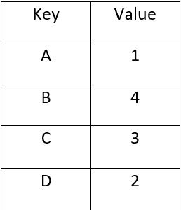

# 用 Java 实现控制表的 Java 程序

> 原文:[https://www . geesforgeks . org/Java-程序到实现-控制-java 中的表/](https://www.geeksforgeeks.org/java-program-to-implement-control-table-in-java/)

控制表是控制控制流或对程序控制有重要影响的表。关于控制表的结构或实质没有固定的指导方针——它的传递特性是它通过处理器或中介的“执行”以某种方式协调控制流的能力。这种表的计划现在又被称为表驱动计划。

在其最不困难的执行中，控制表可以是这里和那里的一维表，用于合法地解密原始信息激励到比较子例程余额、记录或指针，利用原始信息直接作为列表展示，或者通过对先前的信息进行一些基本的数字处理。控制表减少了对一次又一次编程类似结构或程序解释的需求。大多数表的二维特性使得它们比程序代码的一维特性更容易查看和刷新。

在 Java 程序下面展示了用于改变 ASCII 码的控制表的用法。我们使用了**populatable()**方法，该方法使用 [HashMap](https://www.google.com/url?client=internal-element-cse&cx=009682134359037907028:tj6eafkv_be&q=https://www.geeksforgeeks.org/java-util-hashmap-in-java-with-examples/&sa=U&ved=2ahUKEwi0pviEkY7tAhUljOYKHSujDyEQFjAAegQIARAC&usg=AOvVaw3InGk8Vq3NKuOwg06A_eqb) 来存储新的 ASCII 码。它不需要任何争论。



存储新 ASCII 码的控制表。

## Java 语言(一种计算机语言，尤用于创建网站)

```java
// Java Program to Implement Control Table in Java

import java.util.*;

public class ControlTables {
    private Map<String, Integer> controlTable;

    public ControlTables()
    {
        // ControlTables Constructor
        controlTable = new HashMap<String, Integer>();
        populateTable();
    }

    public int[] controlTable(int[] asciiCodes)
    {
        // Returns the Index of the Desired ASCII Code
        // present in the Map controlTables
        int[] index = new int[asciiCodes.length];
        for (int val = 0; val < asciiCodes.length; val++) {
            index[val] = controlTable.get(
                Integer.toHexString(asciiCodes[val]));
        }
        return index;
    }

    private void populateTable()
    {
        // Method inserts the new ASCII codes to HashMap
        // controlTable

        /*The Java.lang.Integer.toHexString() is a built-in
         * function in Java which returns a string
         * representation of the integer argument as an
         * unsigned integer in base 16\. The function accepts
         * a single parameter as an argument in Integer
         * data-type.
         */
        controlTable.put(Integer.toHexString(65), 01);
        controlTable.put(Integer.toHexString(66), 04);
        controlTable.put(Integer.toHexString(67), 03);
        controlTable.put(Integer.toHexString(68), 02);
    }
    public static void main(String[] args)
    {

        int[] asciiCodes = new int[4];
        int[] tableOutput;
        asciiCodes[0] = (int)'A';
        asciiCodes[1] = (int)'B';
        asciiCodes[2] = (int)'C';
        asciiCodes[3] = (int)'D';

        ControlTables controlTable = new ControlTables();
        tableOutput = controlTable.controlTable(asciiCodes);

        System.out.println("Input values ");
        System.out.print("( ");
        for (int i = 0; i < asciiCodes.length; i++) {
            System.out.print((char)asciiCodes[i] + " ");
        }
        System.out.println(")");

        System.out.println("New Index from Control table");
        System.out.print("( ");
        for (int i = 0; i < tableOutput.length; i++) {
            System.out.print(tableOutput[i] + " ");
        }
        System.out.print(")");
    }
}
```

**Output**

```java
Input values 
( A B C D )
New Index from Control table
( 1 4 3 2 )
```