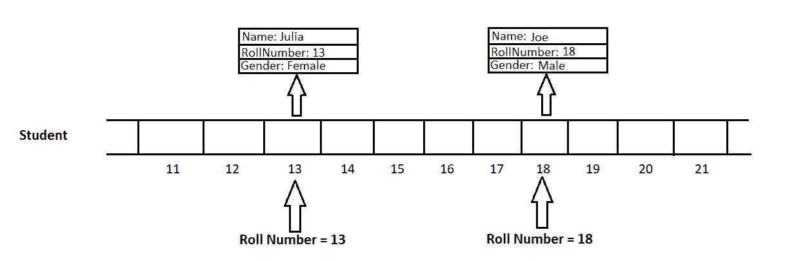

# 实现直接寻址表的 Java 程序

> 原文:[https://www . geesforgeks . org/Java-程序到实现-直接寻址-表/](https://www.geeksforgeeks.org/java-program-to-implement-direct-addressing-tables/)

数据结构主要用于存储数据和管理大量数据，高效的数据结构有助于开发更好的算法。对数据结构执行的主要操作是插入、搜索、更新和删除。随着数据量的增加，所有这些操作都需要花费大量时间。

可能会有这样的场景，我们希望所有这些操作都在 O(1)时间(即恒定时间)内执行。为了实现这一点，我们有一个称为直接寻址表的数据结构。

[直接寻址表](https://www.geeksforgeeks.org/direct-address-table/)是一种随机数据结构，使用数组将记录与其对应的唯一键进行映射。在直接地址表中，记录的键直接用作索引。这有助于快速高效地执行插入、搜索和删除操作。

**可以在 O(1)时间内完成以下操作:**

1.  **插入:**在数组的索引处插入一个元素需要 O(1)个时间。这里，对于元素的插入，键也用作索引。
2.  **搜索:**使用键值作为索引可以更快地查找任何记录。
3.  **删除:**要从直接地址表中删除元素，请将索引/位置设置为空。

**例**

让我们考虑一下，我们的任务是创建和维护一个特定部门的大学生数据目录，每个部门最多可容纳 70 名学生。每个学生都有一个分配给他/她的唯一的学号。任务是高效地存储每个学生的完整信息。现在，我们可以使用学生的学号作为一个键，将他/她的数据放在那个索引中。首先，我们创建一个大小为 70 的数组 arr，它将作为我们的直接地址表。

假设我们插入的学生数据中有卷号 13，我们使用 13 作为索引，并在 arr[13]处插入该学生的数据。插入卷号为 18 的另一个学生的数据，我们使用 18 作为索引，并在 arr[18]处插入该学生的数据。下图显示了正在执行的插入操作。



使用数组的直接寻址表

现在，考虑到我们想要检索具有卷号 18 的学生的信息，我们可以直接使用 18 作为索引，并在 arr[18]处获得该学生的数据。这种地址表查找方法可以在 O(1)时间内访问数据。假设我们想删除学号为 13 的学生的信息(可能是因为他离开了学院)，使用 13 作为索引，并通过将 arr[13]设置为 null 来删除该学生的数据。

但是使用这种数据结构有一些**限制**:

1.  密钥必须是整数/可以转换为整数。
2.  所有的键都必须是唯一的。
3.  整数键的范围应该相对较小(否则我们将需要大量的内存)
4.  整数键应该足够接近(否则会有更多的空槽，并且会浪费内存)

**实施:**

让我们看看上面例子的实现:

## Java 语言(一种计算机语言，尤用于创建网站)

```
// Java program to implement Direct Addressing Table 

import java.util.*;

class Student {
    int rollNumber;
    String name, gender;

    Student(int rollNumber, String name, String gender)
    {
        this.rollNumber = rollNumber;
        this.name = name;
        this.gender = gender;
    }
}

class DirectAddressingTable {
    public static void main(String[] args)
    {
        // We want to create a catalogue of college students of some division 
          // Each division has atmost 70 students and roll number starts from 1 
        // Create "Direct Addressing Table" (catalogue) for the students' data 

        Student[] catalogue = new Student[71];

        // Insert some students' data into the catalogue
        insert(catalogue, new Student(11, "Rahul", "Male"));
        insert(catalogue, new Student(18, "Joe", "Male"));
        insert(catalogue, new Student(15, "Kavya", "Female"));
        insert(catalogue, new Student(13, "Julia", "Female"));

        // if the student with given rollnumber exists,
        // then "search" function returns the record
        // else returns null

        Student student = search(catalogue, 18);
        printInformation(18, student);

        // delete student record with roll number 36
        delete(catalogue, 13);

        student = search(catalogue, 13);

        // This will print "No student found" as we deleted
        // the record
        printInformation(13, student);
    }

    // Insert function to add student in the catalogue
    public static void insert(Student[] catalogue,
                              Student student)
    {
        catalogue[student.rollNumber] = student;
    }

    // Search function to get the record of student from the
    // catalogue
    public static Student search(Student[] catalogue,
                                 int rollNumber)
    {
        return catalogue[rollNumber];
    }

    // Delete function to remove the record of student from
    // the catalogue
    public static void delete(Student[] catalogue,
                              int rollNumber)
    {
        // As we are using arrays, we just will this
        // location to point to null
        catalogue[rollNumber] = null;
    }

    // Function to print student's information
    public static void printInformation(int rollNumber,
                                             Student student)
    {
        // print student information if record exists
        if (student != null)
            System.out.println( "Student with roll number " + rollNumber
                + " - Name: " + student.name
                + ", Gender: " + student.gender);
        else
            System.out.println( "No student found with roll number "
                + rollNumber);
    }
}
```

**Output**

```
Student with roll number 18 - Name: Joe, Gender: Male
No student found with roll number 13
```