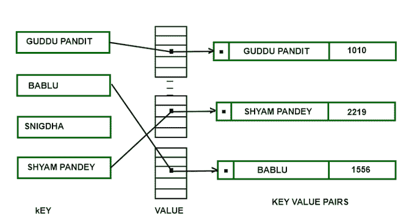
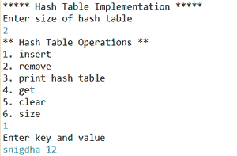
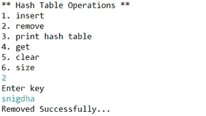
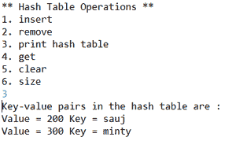
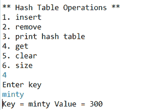
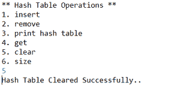
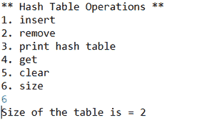

# 用列表头实现哈希表链接的 Java 程序

> 原文:[https://www . geesforgeks . org/Java-程序到实现-哈希表-用列表头链接/](https://www.geeksforgeeks.org/java-program-to-implement-hash-table-chaining-with-list-heads/)

一个[哈希表](https://www.geeksforgeeks.org/hashtable-in-java/)是一个执行连接数组的数据结构，它是一个将键映射到其值的结构。它使用哈希函数来计算键的索引位置，也称为哈希代码。它将把键和值对存储在一个桶数组中，从这个桶中，可以很容易地在键的帮助下找到值。为了找到该值，将对该键进行哈希运算，其结果将给出该值所在的位置。



**进场:**

**insert:**要在哈希表中插入一个键，将对一个键进行简单的哈希运算，以找到它将要插入的位置，之后，该键将被插入列表的头部。

**删除:**只需在哈希函数的帮助下遍历列表，直到找到密钥，然后简单地从列表中删除该密钥

**实施:**

## Java 语言(一种计算机语言，尤用于创建网站)

```java
// Java program which implement Hash Tables chaining with
// List Heads

import java.util.Scanner;

public class TestHashTables {

    public static void main(String[] args)
    {
        Scanner sc = new Scanner(System.in);
        System.out.println(
            "***** Hash Table Implementation *****");
        System.out.println("Enter size of hash table");

        // create object of hash table
        HashTablesExample table
            = new HashTablesExample(sc.nextInt());
        boolean exit = false;

        //  Perform HashTable operations
        while (!exit) {
            System.out.println(
                "** Hash Table Operations **");
            System.out.println("1\. insert ");
            System.out.println("2\. remove");
            System.out.println("3\. print hash table");
            System.out.println("4\. get");
            System.out.println("5\. clear");
            System.out.println("6\. size");

            int choice = sc.nextInt();
            switch (choice) {
            case 1:
                System.out.println("Enter key and value");
                String key = sc.next();
                int value = sc.nextInt();
                table.insert(key, value);
                break;

            case 2:
                System.out.println("Enter key");
                String key2 = sc.next();
                table.remove(key2);
                System.out.println(
                    "Removed Successfully...");
                break;

            case 3:
                System.out.println(
                    "Key-value pairs in the hash table are : ");
                table.printHashTable();
                break;

            case 4:
                System.out.println("Enter key");
                String key3 = sc.next();
                System.out.println("Key = " + key3
                                   + " Value = "
                                   + table.get(key3));
                break;

            case 5:
                table.makeEmpty();
                System.out.println(
                    "Hash Table Cleared Successfully..");
                break;

            case 6:
                System.out.println("Size of the table is = "
                                   + table.getSize());
                break;

            default:
                exit = true;
                System.out.println(
                    "Exited Successfully...");
            }
        }
        sc.close();
    }
}

class HashTablesExample {
    // class linked hash
    class LinkedHash {
        String key;
        int value;
        LinkedHash next;

        // constructor of linked hash
        LinkedHash(String key, int value)
        {
            this.key = key;
            this.value = value;
            this.next = null;
        }
    }

    private int tableSize;
    private int size;
    private LinkedHash[] table;

    // constructor of HashTableExample
    public HashTablesExample(int ts)
    {
        size = 0;
        tableSize = ts;
        table = new LinkedHash[tableSize];

        // initializing the hash table with null values
        for (int i = 0; i < tableSize; i++)
            table[i] = null;
    }

    // method to get the number of key-value pairs in the
    // hash table
    public int getSize() { return size; }

    // method to clear the hash table entry
    public void makeEmpty()
    {
        for (int i = 0; i < tableSize; i++)
            table[i] = null;
    }

    // method to get value of a key
    public int get(String key)
    {
        int value = (myhash(key) % tableSize);
        if (table[value] == null)
            return -1;
        else {
            LinkedHash current = table[value];
            while (current != null
                   && !current.key.equals(key)) {
                current = current.next;
            }
            if (current == null) {
                return -1;
            }
            else {
                return current.value;
            }
        }
    }

    // method to insert a value in a hash table
    public void insert(String key, int value)
    {
        int hash = (myhash(key) % tableSize);
        if (table[hash] == null) {
            table[hash] = new LinkedHash(key, value);
        }
        else {
            LinkedHash entry = table[hash];
            while (entry.next != null
                   && !entry.key.equals(key)) {
                entry = entry.next;
            }
            if (entry.key.equals(key)) {
                entry.value = value;
            }
            else {
                entry.next = new LinkedHash(key, value);
            }
        }
        size++;
    }

    // method to remove the value with the specified key
    public void remove(String key)
    {
        int value = (myhash(key) % tableSize);
        if (table[value] != null) {
            LinkedHash prev = null;
            LinkedHash current = table[value];
            while (current.next != null
                   && !current.key.equals(key)) {
                prev = current;
                current = current.next;
            }
            if (current.key.equals(key)) {
                if (prev == null) {
                    table[value] = current.next;
                }
                else {
                    prev.next = current.next;
                }
                size--;
            }
        }
    }

    // method which gives a hash value from a given
    // specified string
    private int myhash(String x)
    {
        int value = x.hashCode();
        value %= tableSize;
        if (value < 0) {
            value = value + tableSize;
        }
        return value;
    }

    // method to print the value of hash table
    public void printHashTable()
    {
        for (int i = 0; i < tableSize; i++) {
            LinkedHash current = table[i];
            while (current != null) {
                System.out.println(
                    "Value = " + current.value + " "
                    + "Key = " + current.key);
                current = current.next;
            }
        }
        System.out.println();
    }
}
```

**输出:**



插入哈希表



从哈希表中删除



打印哈希表的键值对



从指定的键中获取值



清除哈希表



哈希表的大小