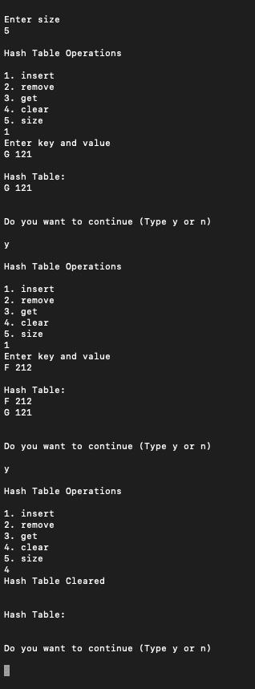

# 用线性探测实现哈希表的 Java 程序

> 原文:[https://www . geesforgeks . org/Java-程序到实现-哈希表-带线性探测/](https://www.geeksforgeeks.org/java-program-to-implement-hashtables-with-linear-probing/)

[哈希](https://www.geeksforgeeks.org/hashing-data-structure/)是一种用于从一组相似对象中唯一识别特定对象的技术。假设要为一个对象分配一个密钥，以便于搜索。为了存储键/值对，可以使用像数据结构这样的简单数组，其中键(整数)可以直接用作存储值的索引。但是，在密钥很大并且不能直接用作索引的情况下，应该使用哈希。在哈希中，通过使用哈希函数将大密钥转换为小密钥。然后，这些值被存储在一个名为哈希表的数据结构中。[线性探测](https://www.geeksforgeeks.org/hashing-set-3-open-addressing/)**可能会使用哈希技术来创建已经使用过的数组索引。在这种情况下，我们可以通过查看下一个单元格来搜索数组中的下一个空位置，直到找到一个空单元格。这种技术被称为线性探测。**

**与线性探测相关的三个基本操作如下:**

*   **搜索**
*   **插入**
*   **删除**

****实现:**通过创建一个辅助类并在主类中进行测试，实现具有线性探测的哈希表。**

****例****

## **Java 语言(一种计算机语言，尤用于创建网站)**

```
// Java Program to Implement Hash Tables with Linear Probing

// Importing all classes from
// java.util package
// Importing all input output classes
import java.io.*;
import java.util.*;
// Importing Scanner class as in do-while
// inputs are entered at run-time when
// menu is popped to user to perform desired action
import java.util.Scanner;

// Helper class - LinearProbingHashTable
class LinearProbingHashTable {
    // Member variables of this class
    private int currentSize, maxSize;
    private String[] keys;
    private String[] vals;

    // Constructor of this class
    public LinearProbingHashTable(int capacity)
    {
        currentSize = 0;
        maxSize = capacity;
        keys = new String[maxSize];
        vals = new String[maxSize];
    }

    // Method 1
    // Function to clear hash table
    public void makeEmpty()
    {
        currentSize = 0;
        keys = new String[maxSize];
        vals = new String[maxSize];
    }

    // Method 2
    // Function to get size of hash table
    public int getSize() { return currentSize; }

    // Method 3
    // Function to check if hash table is full
    public boolean isFull()
    {
        return currentSize == maxSize;
    }

    // Method 4
    // Function to check if hash table is empty
    public boolean isEmpty() { return getSize() == 0; }

    // Method 5
    // Function to check if hash table contains a key
    public boolean contains(String key)
    {
        return get(key) != null;
    }

    // Method 6
    // Function to get hash code of a given key
    private int hash(String key)
    {
        return key.hashCode() % maxSize;
    }

    // Method 7
    // Function to insert key-value pair
    public void insert(String key, String val)
    {
        int tmp = hash(key);
        int i = tmp;

        // Do-while loop
        // Do part for performing actions
        do {
            if (keys[i] == null) {
                keys[i] = key;
                vals[i] = val;
                currentSize++;
                return;
            }

            if (keys[i].equals(key)) {
                vals[i] = val;
                return;
            }

            i = (i + 1) % maxSize;

        }

        // Do-while loop
        // while part for condition check
        while (i != tmp);
    }

    // Method 8
    // Function to get value for a given key
    public String get(String key)
    {
        int i = hash(key);
        while (keys[i] != null) {
            if (keys[i].equals(key))
                return vals[i];
            i = (i + 1) % maxSize;
        }
        return null;
    }

    // Method 9
    // Function to remove key and its value
    public void remove(String key)
    {
        if (!contains(key))
            return;

        // Find position key and delete
        int i = hash(key);
        while (!key.equals(keys[i]))
            i = (i + 1) % maxSize;
        keys[i] = vals[i] = null;

        // rehash all keys
        for (i = (i + 1) % maxSize; keys[i] != null;
             i = (i + 1) % maxSize) {
            String tmp1 = keys[i], tmp2 = vals[i];
            keys[i] = vals[i] = null;
            currentSize--;
            insert(tmp1, tmp2);
        }
        currentSize--;
    }

    // Method 10
    // Function to print HashTable
    public void printHashTable()
    {
        System.out.println("\nHash Table: ");
        for (int i = 0; i < maxSize; i++)
            if (keys[i] != null)
                System.out.println(keys[i] + " " + vals[i]);
        System.out.println();
    }
}

// Main testing class
// Main Class for LinearProbingHashTableTest
public class GFG {
    // Main driver method
    public static void main(String[] args)
    {
        // Creating a scanner object
        // to take input from user
        Scanner scan = new Scanner(System.in);

        // Display messages
        System.out.println("Hash Table Test\n\n");
        System.out.println("Enter size");

        // maxSizeake object of LinearProbingHashTable
        LinearProbingHashTable lpht
            = new LinearProbingHashTable(scan.nextInt());

        char ch;

        // Do-while loop
        // Do part for performing actions
        do
        // Menu is displayed
        // LinearProbingHashTable operations performed as
        // per keys Users enter 'y' to continue 'n' if
        // entered by user , the program terminates

        {
            // Menu
            // Display messages
            System.out.println("\nHash Table Operations\n");
            System.out.println("1\. insert ");
            System.out.println("2\. remove");
            System.out.println("3\. get");
            System.out.println("4\. clear");
            System.out.println("5\. size");

            // Reading integer using nextInt()
            int choice = scan.nextInt();

            // Switch case
            switch (choice) {

            // Case 1
            case 1:

                // Display message
                System.out.println("Enter key and value");
                lpht.insert(scan.next(), scan.next());
                // Break statement to terminate a case
                break;

            // Case 2
            case 2:

                // Display message
                System.out.println("Enter key");
                lpht.remove(scan.next());
                // Break statement to terminate a case
                break;

            // Case 3
            case 3:

                // Print statements
                System.out.println("Enter key");
                System.out.println("Value = "
                                   + lpht.get(scan.next()));
                // Break statement to terminate a case
                break;

            // Case 4
            case 4:

                lpht.makeEmpty();
                // Print statement
                System.out.println("Hash Table Cleared\n");
                // Break statement to terminate a case
                break;

            // Case 5
            case 5:

                // Print statement
                System.out.println("Size = "
                                   + lpht.getSize());
                break;

            // Default case
            // Executed when mentioned switch cases are not
            // matched
            default:
                // Print statement
                System.out.println("Wrong Entry \n ");
                // Break statement
                break;
            }

            // Display hash table
            lpht.printHashTable();

            // Display message asking the user whether
            // he/she wants to continue
            System.out.println(
                "\nDo you want to continue (Type y or n) \n");

            // Reading character using charAt() method to
            // fetch
            ch = scan.next().charAt(0);
        } while (ch == 'Y' || ch == 'y');
    }
}
```

****输出:****

> **哈希表上执行的随机操作**
> 
> *   **尺寸输入为:5**
> *   **插入了两个键值对
>     
>     *   G 121
>     *   F 212** 
> *   **稍后哈希表被清除**

****