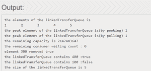

# 实现 LinkedTransferQueue API 的 Java 程序

> 原文:[https://www . geesforgeks . org/Java-程序到实现-linkedtransferqueue-api/](https://www.geeksforgeeks.org/java-program-to-implement-linkedtransferqueue-api/)

[LinkedTransferQueue](https://www.geeksforgeeks.org/linkedtransferqueue-in-java-with-examples/) 是相对于任何给定的生产者对元素进行先进先出排序的队列。[队列](https://www.geeksforgeeks.org/queue-interface-java/)的头部是某个制作人在队列中时间最长的元素。对于某些生产者来说，队列的尾部是在队列中时间最短的元素。

**建造师总结**

**1。LinkedTransferQueue ():** 创建一个初始为空的 LinkedTransferQueue。

**2。** **链接传输队列(集合<？扩展 E>c:**创建一个 LinkedTransferQueue，最初包含给定集合的元素，按照集合迭代器的遍历顺序添加。

## Java 语言(一种计算机语言，尤用于创建网站)

```
// Java Program to Implement LinkedTransferQueue API

import java.util.Collection;
import java.util.Iterator;
import java.util.concurrent.LinkedTransferQueue;
import java.util.concurrent.TimeUnit;

public class LinkedTransferQueueImpl<E> {
    private LinkedTransferQueue<E> linkedTransferQueue;

    // Create an empty LinkedTransferQueue
    public LinkedTransferQueueImpl()
    {
        linkedTransferQueue = new LinkedTransferQueue<E>();
    }

    // Creates a LinkedTransferQueue containing
    // the elements of the given collection
    public LinkedTransferQueueImpl(
        Collection<? extends E> c)
    {
        linkedTransferQueue = new LinkedTransferQueue<E>(c);
    }

    // add the given element at the end or tail
    // of queue
    public boolean add(E e)
    {
        return linkedTransferQueue.add(e);
    }

    // remove all the elements from queue
    public void clear() { linkedTransferQueue.clear(); }

    // return true if the given object is present
    public boolean contains(Object o)
    {
        return linkedTransferQueue.contains(o);
    }

    // Returns an estimate of the number of consumers
    // waiting to receive elements via BlockingQueue.take()
    // or timed poll.
    public int getWaitingConsumerCount()
    {
        return linkedTransferQueue
            .getWaitingConsumerCount();
    }

    // Returns true if there is at least one consumer
    // waiting to receive an element via
    // BlockingQueue.take() or timed poll.
    public boolean hasWaitingConsumer()
    {
        return linkedTransferQueue.hasWaitingConsumer();
    }

    // remove all the elements from the queue and add them
    // to the provided Collection
    public int drainTo(Collection<? super E> c)
    {
        return linkedTransferQueue.drainTo(c);
    }

    // Removes at most the given number of available
    // elements from this queue and adds them to the given
    // collection.
    public int drainTo(Collection<? super E> c,
                       int maxElements)
    {
        return linkedTransferQueue.drainTo(c, maxElements);
    }

    // Returns an iterator over the elements in this queue
    // in proper sequence.
    public Iterator<E> iterator()
    {
        return linkedTransferQueue.iterator();
    }

    // Inserts the specified element at the tail of this
    // queue if it is possible to do so immediately without
    // exceeding the queue's capacity, returning true upon
    // success and false if this queue is full.
    public boolean offer(E e)
    {
        return linkedTransferQueue.offer(e);
    }

    // Inserts the specified element at the tail of this
    // queue, waiting up to the specified wait time for
    // space to become available if the queue is full.
    public boolean offer(E e, long timeout, TimeUnit unit)
        throws InterruptedException
    {
        return linkedTransferQueue.offer(e, timeout, unit);
    }

    // Retrieves, but does not remove, the head of this
    // queue, or returns null if this queue is empty.
    public E peek() { return linkedTransferQueue.peek(); }

    // Retrieves and removes the head of this queue, or
    // returns null if this queue is empty.
    public E poll() { return linkedTransferQueue.poll(); }

    // Retrieves and removes the head of this queue, waiting
    // up to the specified wait time if necessary for an
    // element to become available.
    public E poll(long timeout, TimeUnit unit)
        throws InterruptedException
    {
        return linkedTransferQueue.poll(timeout, unit);
    }

    // Inserts the specified element at the tail of this
    // queue, waiting for space to become available if the
    // queue is full.
    public void put(E e) throws InterruptedException
    {
        linkedTransferQueue.put(e);
    }

    // Returns the number of additional elements that this
    // queue can ideally (in the absence of memory or
    // resource constraints) accept without blocking.
    public int remainingCapacity()
    {
        return linkedTransferQueue.remainingCapacity();
    }

    // Removes a single instance of the specified element
    // from this queue, if it is present.
    public boolean remove(Object o)
    {
        return linkedTransferQueue.remove(o);
    }

    // Returns the number of elements in this queue. **/
    public int size() { return linkedTransferQueue.size(); }

    // Retrieves and removes the head of this queue, waiting
    // if necessary until an element becomes available
    public E take() throws InterruptedException
    {
        return linkedTransferQueue.take();
    }

    // Returns an array containing all of the elements in
    // this queue, in proper sequence.
    public Object[] toArray()
    {
        return linkedTransferQueue.toArray();
    }

    // Returns an array containing all of the elements in
    // this queue, in proper sequence; the runtime type of
    //  the returned array is that of the specified array.
    public <T> T[] toArray(T[] a)
    {
        return linkedTransferQueue.toArray(a);
    }

    // Returns a string representation of this collection.
    public String toString()
    {
        return linkedTransferQueue.toString();
    }

    // Transfers the element to a consumer, waiting if
    // necessary to do so.
    public void transfer(E e) throws InterruptedException
    {
        linkedTransferQueue.transfer(e);
    }

    public static void main(String[] args)
    {
        // create a linkedtransfer queue
        LinkedTransferQueueImpl<String> linkedTransferQueue
            = new LinkedTransferQueueImpl<String>();

        try {

            // add elements
            linkedTransferQueue.put("1");
            linkedTransferQueue.put("2");
            linkedTransferQueue.put("3");
        }
        catch (InterruptedException e) {
            e.printStackTrace();
        }
        linkedTransferQueue.add("4");
        linkedTransferQueue.add("5");
        System.out.println(
            "the elements of the linkedTransferQueue is ");

        // iterate and print elements
        Iterator<String> itr
            = linkedTransferQueue.iterator();
        while (itr.hasNext()) {
            System.out.print(itr.next() + "\t");
        }
        System.out.println();
        linkedTransferQueue.offer("6");
        linkedTransferQueue.offer("7");
        System.out.println(
            "the peak element of the linkedTransferQueue is(by peeking) "
            + linkedTransferQueue.peek());
        System.out.println(
            "the peak element of the linkedTransferQueue is(by polling) "
            + linkedTransferQueue.poll());
        System.out.println(
            "the remaining capacity is "
            + linkedTransferQueue.remainingCapacity());
        System.out.println(
            "the remaining consumer waiting count : "
            + linkedTransferQueue
                  .getWaitingConsumerCount());
        System.out.println(
            "element 300 removed "
            + linkedTransferQueue.remove("3"));
        System.out.println(
            "the linkedTransferQueue contains 400 :"
            + linkedTransferQueue.contains("4"));
        System.out.println(
            "the linkedTransferQueue contains 100 :"
            + linkedTransferQueue.contains("1"));
        System.out.println(
            "the size of the linkedTransferQueue is "
            + linkedTransferQueue.size());
        System.out.println(linkedTransferQueue);
    }
}
```

