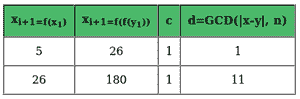

# 实现波拉德ρ算法的 Java 程序

> 原文:[https://www . geesforgeks . org/Java-程序到实现-pollard-rho-algorithm/](https://www.geeksforgeeks.org/java-program-to-implement-pollard-rho-algorithm/)

[**波拉德的ρ算法**](https://www.geeksforgeeks.org/pollards-rho-algorithm-prime-factorization/) 是一种进行整数分解的算法。它在拆分具有小因子的复合数时特别有效。Rho 算法最显著的成功是第八个费马数的因式分解:1238926361552897 * 9346163971535797776916358199606896584051237541638580280321。这个算法对 F8 来说是个不错的选择，因为质因数 p = 1238926361552897 比另一个因数小得多。

**示例:**

```java
Input: n = 315
Output: 3 [OR 3 OR 5 OR 7]

Input: n = 10
Output: 2 [OR 5 ]
```

**进场:**

1.  该算法以 n 为输入。
2.  要分解的整数 N 和 g(x)。
3.  以 n 为模计算的 x 中的多项式。
    **g(x) = (x^2 + 1) % n**
    输出不是 n 的非平凡因子就是失败。

**例**:假设 n = 187，y = x = 2，c = 1，因此，我们的 g(x) = x^2 + 1。



**11** 是 **187 的一个不可小视的因素。**

下面是一个实现波拉德ρ算法的 Java 程序:

## Java 语言(一种计算机语言，尤用于创建网站)

```java
// Java Program to implement Pollard’s Rho Algorithm
import java.io.*;

class GFG {

    int n = 315;
    // function to return gcd of a and b
    public int gcd(int a, int b)
    {

        // initialise gcd = 0
        int gcd = 0;
        for (int i = 1; i <= a || i <= b; i++) {
            if (a % i == 0 && b % i == 0) {
                gcd = i;
            }
        }
        return gcd;
    }

    /* Function to calculate (base^exponent)%modulus */
    int g(int x, int n) { return ((x * x) - 1) % n; }

    public static void main(String args[])
    {

        GFG gfg = new GFG();

        int n = 315;
        int x = 2, y = 2, d = 1;

        while (d == 1) {

            // Tortoise Move
            x = gfg.g(x, n);

            // Hare Move:
            y = gfg.g(gfg.g(y, n), n);

            /* check gcd of |x-y| and n */
            d = gfg.gcd((x - y), gfg.n);
        }

        // if the algorithm fails to find prime factor
        if (d == gfg.n) {
            System.out.println(
                "GCD cannot be found for this element");
        }
        else {
            System.out.println("One of the prime factor of "
                               + n + " is " + d);
        }
    }
}
```

**Output**

```java
One of the prime factor of 315 is 5

```

**时间复杂度:** O(sqrt(n))