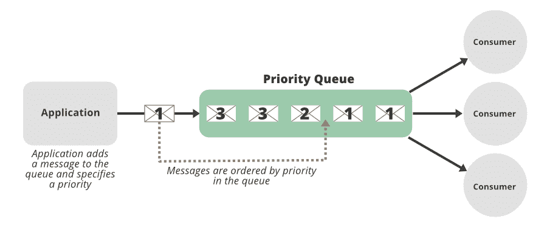
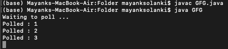

# 实现优先级阻塞队列应用编程接口的 Java 程序

> 原文:[https://www . geesforgeks . org/Java-程序到实现-priorityblockingqueue-api/](https://www.geeksforgeeks.org/java-program-to-implement-priorityblockingqueue-api/)

[优先级阻塞队列](https://www.geeksforgeeks.org/priorityblockingqueue-class-in-java/)是一个无界阻塞队列，它使用与类[优先级队列](https://www.geeksforgeeks.org/priority-queue-class-in-java-2/)相同的排序规则，并提供阻塞检索操作。添加名称的“阻塞”部分是为了暗示线程将阻塞等待，直到队列中有可用的项目。此类不允许空元素。依赖于自然排序的优先级队列也不允许插入不可比较的对象(这样做会导致 ClassCastException)。

它实现了可序列化、可迭代<e>、集合<e>、阻塞队列<e>、队列<e>接口，并扩展了抽象队列<e>类。</e></e></e></e></e>

**申报:**

```java
public class PriorityBlockingQueue<E> extends AbstractQueue<E> implements BlockingQueue<E>, Serializable
// Here, E is the type of elements held in this collection
```

```java
java.lang.Object
   java.util.AbstractCollection<E>
       java.util.AbstractQueue<E>
          java.util.concurrent.PriorityBlockingQueue<E>
```



**实施:**

**例**

## Java 语言(一种计算机语言，尤用于创建网站)

```java
// Java Program to Implement PriorityBlockingQueue API

// Importing concurrent classes from
// java.util package
import java.util.concurrent.PriorityBlockingQueue;
import java.util.concurrent.TimeUnit;

// Class for PriorityQueue
public class GFG {
    // Main driver method
    public static void main(String[] args)
        throws InterruptedException
    {
        // Creating a new object of PriorityBlockingQueue
        // Declaring Integer type object
        PriorityBlockingQueue<Integer> priorityBlockingQueue
            = new PriorityBlockingQueue<>();

        // Creation of a thread
        new Thread(() -> {
            // Display message
            System.out.println("Waiting to poll ...");

            // Try block to check for exceptions
            try {

                // Condition check
                while (true) {

                    // Return (integer) value at head of
                    // queue of PriorityBlockingQueue
                    Integer poll
                        = priorityBlockingQueue.take();

                    // Display and print element returned in
                    // PriorityBlockingQueue
                    System.out.println("Polled : " + poll);

                    // Pause the execution of current thread
                    // for certain amount of time using
                    // toMills() method() to showcase
                    // working of PriorityBlockingQueue
                    Thread.sleep(
                        TimeUnit.SECONDS.toMillis(1));
                }
            }

            // Catch block to handle exceptions if any
            catch (InterruptedException e) {

                // Print and display the line number
                // where exception/s occured
                e.printStackTrace();
            }

            // Execution of thread begins with
            // use of start() method
        }).start();

        // Custom elememts inputs
        // 1, 2, 3 to priorityBlockingQueue

        // Pausing execution of first thread
        Thread.sleep(TimeUnit.SECONDS.toMillis(2));

        // Insert parameter element-> 1 to method
        // at the tail of priority queue
        priorityBlockingQueue.add(1);

        // Pausing execution of second thread
        Thread.sleep(TimeUnit.SECONDS.toMillis(2));

        // Insert parameter element-> 2 to method
        // at the tail of priority queue
        priorityBlockingQueue.add(2);

        // pausing execution of third thread
        Thread.sleep(TimeUnit.SECONDS.toMillis(2));

        // Insert parameter element-> 3 to method
        // at the tail of priority queue
        priorityBlockingQueue.add(3);
    }
}
```

**输出:**

