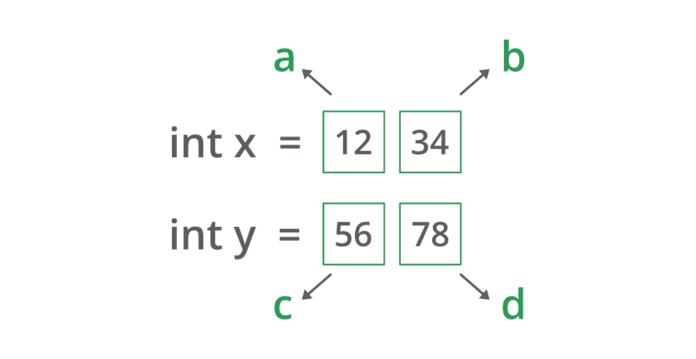

# 实现 Karatsuba 乘法算法的 Java 程序

> 原文:[https://www . geesforgeks . org/Java-实现-karatsuba-乘法-算法的程序/](https://www.geeksforgeeks.org/java-program-to-implement-the-karatsuba-multiplication-algorithm/)

它是小学乘法算法的替代品。更大的数字。阿纳托利·阿列克谢耶维奇·卡拉瑟巴于 1960 年开发的[卡拉瑟巴算法](https://www.geeksforgeeks.org/karatsuba-algorithm-for-fast-multiplication-using-divide-and-conquer-algorithm/)，用于使用[分治法](https://www.geeksforgeeks.org/divide-and-conquer-introduction/)的快速乘法算法。首先击中头部的是它是什么，为什么设计它。虽然有 3 种方法可以相乘:

1.  小学三年级算法法(标准方法)
2.  递归算法方法
3.  卡拉津巴乘法

**为什么是 Karatsuba 算法？**

设计算法的目标是因为设计空间出奇的丰富。它的时间复杂性如下，不要这样做，因为时间复杂性非常重要，有时会在面试问题中被问到。

> **O(n^log2(3))时间(~ O(n^1.585))**
> 
> 其中 n 是数字相乘的位数。讨论用两个大整数相乘来逐步显示内部工作。目标是降低空间复杂度，整数项将以这样一种方式分解，即 x 和 y 被分解成一组数字，因为其背后的逻辑是分治。如果数字较小，则不需要相乘，两个整数的标准分割是优选的。

为了便于理解，算法被标准化为 4 位数。一个人可以将任意多的数字相乘。

**算法步骤:**

1.  计算起始集(a*c)
2.  开始集之后的计算集可能是结束集(b*d)
3.  用结束集计算开始集
4.  从步骤 1 减去步骤 2 的步骤 3 的值
5.  在步骤 1 获得的数字上加 4 个零，步骤 2 的值不变，在步骤 4 获得的值上加 2 个零。

现在，让我们提出上面的步骤，并在进入实现部分之前用一个示例展示它

插图:

```java
Input: x = 1234, y = 5678
```



```java
Processing: As per above inputs

x = 1234
y = 5678

a = 12, b = 34
c = 56, d = 78

Step 1: a * c = 172     
Step 2: b * d = 2652          
Step 3: (a+b)(c+d) = 134 * 36 = 6164
Step 4: 6164 - 2652 - 172 = 2840
Step 5: 1720000 + 2652 + 284000 = 7006652
```

```java
Output: 7006652
```

从步骤 5 得到的值实际上是如果在这两个数字“x”和“y”之间进行标准学校乘法运算得到的乘积。

```java
1720000 + 2652 + 284000 = 7006652
```

**实现** : 注意不要掌握为该算法制定的公式，而是以这种方式理解它会让它变得更好。

## Java 语言(一种计算机语言，尤用于创建网站)

```java
/// Java Program to Implement Karatsuba Algorithm

// Importing Random class from java.util packahge
import java.util.Random;

// MAin class
class GFG {

    // Main driver method
    public static long mult(long x, long y) {

        // Checking only if input is within range 
        if (x < 10 && y < 10) {

            // Multiplying the inputs entered
            return x * y;
        }

        // Declaring variables in order to 
        // Find length of both integer
        // numbers x and y
        int noOneLength = numLength(x);
        int noTwoLength = numLength(y);

        // Finding maximum length from both numbers
        // using math library max function
        int maxNumLength
            = Math.max(noOneLength, noTwoLength);

        // Rounding up the divided Max length
        Integer halfMaxNumLength
            = (maxNumLength / 2) + (maxNumLength % 2);

        // Multiplier
        long maxNumLengthTen
            = (long)Math.pow(10, halfMaxNumLength);

        // Compute the expressions
        long a = x / maxNumLengthTen;
        long b = x % maxNumLengthTen;
        long c = y / maxNumLengthTen;
        long d = y % maxNumLengthTen;

        // Compute all mutilpying variables
        // needed to get the multiplication   
        long z0 = mult(a, c);
        long z1 = mult(a + b, c + d);
        long z2 = mult(b, d);

        long ans = (z0 * (long)Math.pow(10, halfMaxNumLength * 2) +
                   ((z1 - z0 - z2) * (long)Math.pow(10, halfMaxNumLength) + z2));

        return ans;

    }

      // Method 1
    // To calculate length of the number
    public static int numLength(long n)
    {
        int noLen = 0;
        while (n > 0) {
            noLen++;
            n /= 10;
        }

        // Returning length of number n
        return noLen;
    }

     // Method 2
    // Main driver function
    public static void main(String[] args)
    {
        // Showcasing karatsuba multiplication

      // Case 1: Big integer lengths
        long expectedProduct = 1234 * 5678;
        long actualProduct = mult(1234, 5678);

        // Printing the expected and corresponding actual product
        System.out.println("Expected 1 : " + expectedProduct);
        System.out.println("Actual 1 : " + actualProduct + "\n\n");

        assert(expectedProduct == actualProduct);

        expectedProduct = 102 * 313;
        actualProduct = mult(102, 313);

        System.out.println("Expected 2 : " + expectedProduct);
        System.out.println("Actual 2 : " + actualProduct + "\n\n");

      assert(expectedProduct == actualProduct);

        expectedProduct = 1345 * 63456;
        actualProduct = mult(1345, 63456);

        System.out.println("Expected 3 : " + expectedProduct);
        System.out.println("Actual 3 : " + actualProduct + "\n\n");

      assert(expectedProduct == actualProduct);       

        Integer x = null;
        Integer y = null;
        Integer MAX_VALUE = 10000;

        // Boe creating an object of random class
        // inside main() method
        Random r = new Random();

        for (int i = 0; i < MAX_VALUE; i++) {
            x = (int) r.nextInt(MAX_VALUE);
            y = (int) r.nextInt(MAX_VALUE);

            expectedProduct = x * y;

            if (i == 9999) {

              // Prove assertions catch the bad stuff.
                expectedProduct = 1;   
            }
            actualProduct = mult(x, y);

             // Again printing the expected and
            // corresponding actual product
            System.out.println("Expected: " + expectedProduct);
            System.out.println("Actual: " + actualProduct + "\n\n");

            assert(expectedProduct == actualProduct);       
        }
    }
}
```

**Output**

```java
Product 1 : 85348320
Product 2 : 21726
```