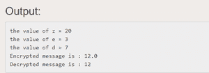

# 实现 RSA 算法的 Java 程序

> 原文:[https://www . geesforgeks . org/Java-实现 rsa 算法的程序/](https://www.geeksforgeeks.org/java-program-to-implement-the-rsa-algorithm/)

**RSA** 或**Rivest–Shamir–Adleman**是现代计算机用来加密和解密消息的算法。它是一种非对称密码算法。不对称意味着有两个不同的密钥。这也被称为公钥密码术，因为密钥中的一个通常给任何人。另一个是保密的**私钥**。该算法是基于这样一个事实，即找到一个超大数的因子是困难的:当因子是素数时，这个问题被称为质因数分解。它也是一个密钥对(公钥和私钥)生成器。

**示例:**

```java
Generating Public Key

1\. Select two prime no's. Suppose P = 53 and Q = 59.
Now First part of the Public key  : n = P*Q = 3127.

2\. We also need a small exponent say e : 
   But e Must be 

    -An integer.

    -Not be a factor of n.

    -1 < e < Φ(n) [Φ(n) is discussed below], 
     Let us now consider it to be equal to 3.

The public key has been made of n and e

Generating Private Key

1\. We need to calculate Φ(n) :
   Such that Φ(n) = (P-1)(Q-1)     
      so,  Φ(n) = 3016

2\. Now calculate Private Key, d : 
   d = (k*Φ(n) + 1) / e for some integer k
3\. For k = 2, value of d is 2011.

The private key has been made of d
```

**RSA 算法的实现:**

1.  考虑两个质数 p 和 q。
2.  计算 n = p*q
3.  计算ϕ(n =(p–1)*(q–1)
4.  选择 e 这样的 gcd(e，ϕ(n) ) = 1
5.  计算 d，例如 e*d 模ϕ(n) = 1
6.  公钥{e，n}私钥{d，n}
7.  密文 C = Pe mod n 其中 P =明文
8.  对于解密，D = Dd mod n，其中 D 将退还明文。

下面是上述方法的实现:

## Java 语言(一种计算机语言，尤用于创建网站)

```java
// Java Program to Implement the RSA Algorithm
import java.math.*;
import java.util.*;

class RSA {
    public static void main(String args[])
    {
        int p, q, n, z, d = 0, e, i;

        // The number to be encrypted and decrypted
        int msg = 12;
        double c;
        BigInteger msgback;

        // 1st prime number p
        p = 3;

        // 2nd prime number q
        q = 11;
        n = p * q;
        z = (p - 1) * (q - 1);
        System.out.println("the value of z = " + z);

        for (e = 2; e < z; e++) {

            // e is for public key exponent
            if (gcd(e, z) == 1) {
                break;
            }
        }
        System.out.println("the value of e = " + e);
        for (i = 0; i <= 9; i++) {
            int x = 1 + (i * z);

            // d is for private key exponent
            if (x % e == 0) {
                d = x / e;
                break;
            }
        }
        System.out.println("the value of d = " + d);
        c = (Math.pow(msg, e)) % n;
        System.out.println("Encrypted message is : " + c);

        // converting int value of n to BigInteger
        BigInteger N = BigInteger.valueOf(n);

        // converting float value of c to BigInteger
        BigInteger C = BigDecimal.valueOf(c).toBigInteger();
        msgback = (C.pow(d)).mod(N);
        System.out.println("Decrypted message is : "
                           + msgback);
    }

    static int gcd(int e, int z)
    {
        if (e == 0)
            return z;
        else
            return gcd(z % e, e);
    }
}
```

